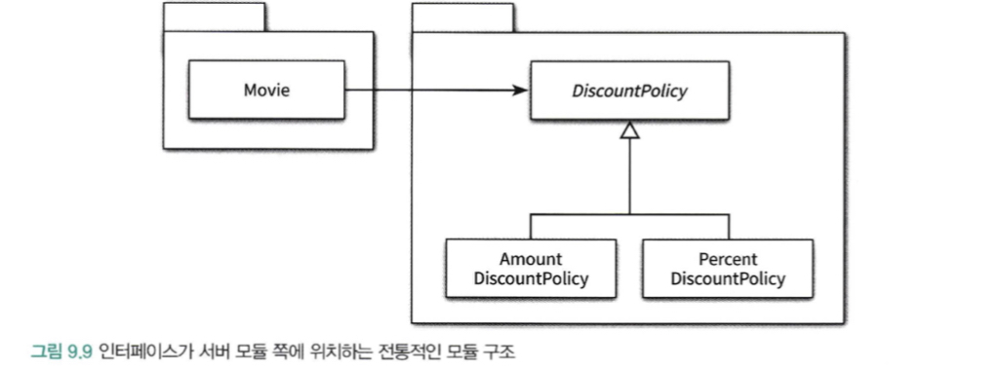

# 📚 9장 유연한 설계

## 📖 9.1 개방-폐쇄 원칙

> 소프트웨어 개체(클래스, 모듈, 함수 등등)는 확장에 대해 열려 있어야 하고, 수정에 대해서는 닫혀 있어야 한다.

- 확장에 대해 열려 있다: 애플리케이션의 요구사항이 변경될 때 이 변경에 맞게 새로운 '동작'을 추가해서 애플리케이션의 기능을 확장할 수 있다.
- 수정에 대해 닫혀 있다: 기존의 '코드'를 수정하지 않고도 애플리케이션의 동작을 추가하거나 변경할 수 있다.

### 🔖 9.1.1 컴파일타임 의존성을 고정시키고 런타임 의존성을 변경하라


- 기존 클래스는 전혀 수정하지 않은 채 애플리케이션의 동작을 확장했다.
- 단순히 새로운 클래스를 추가하는 것만으로 `Movie`를 새로운 컨텍스트에 사용되도록 확장할 수 있었던 것

OCP를 수용하는 코드는 컴파일타임 의존성을 수정하지 않고도 런타임 의존성을 쉽게 변경할 수 있다. 의존성 관점에서 OCP를 따르는 설계란 컴파일타임 의존성은 유지하면서 런타임 의존성의 가능성을 확장하고 수정할 수 있는 구조라고 할 수 있다.

### 🔖 9.1.2 추상화가 핵심이다

OCP의 핵심은 **추상화에 의존하는 것**

- 추상화란 핵심적인 부분만 남기고 불필요한 부분은 생략함으로써 복잡성을 극복하는 기법
- OCP의 관점에서 생략되지 않고 남겨지는 부분은 다양한 상황에서의 공통점을 반영한 추상화의 결과물

```java
public abstract class DiscountPolicy {
    private final List<DiscountCondition> conditions;
    
    protected DiscountPolicy(DiscountCondition... conditions) {
        this.conditions = Arrays.asList(conditions);
    }
    
    public Money calculateDiscountAmount(Screening screening) {
        for (DiscountCondition condition : conditions) {
            if (condition.isSatisfiedBy(screening)) {
                return getDiscountAmount(screening);
            }
        }
        return screening.getMovieFee();
    }
    protected abstract Money getDiscountAmount(Screening screening);
}
```

- 언제라도 추상화의 생략된 부분을 채워넣음으로써 새로운 문맥에 맞게 기능을 확장할 수 있다.
- OCP에서 폐쇄를 가능하게 하는 것은 의존성의 방향이다.
- 수정에 대한 영향을 최소화하기 위해서는 모든 요소가 추상화에 의존해야 한다.

```java
@AllArgsConstructor
public class Movie {

    private String title;

    private Duration runningTime;

    @Getter
    private Money fee;

    private DiscountPolicy discountPolicy;
    
    public Money calculateMovieFee(Screening screening) {
        return fee.minus(discountPolicy.calculateDiscountAmount(screening));
    }
}
```

- `Movie`는 안정된 추상화인 `DiscountPolicy`에 의존하기 때문에 할인 정책을 추가하기 위해 `DiscountPolicy`의 자식 클래스를 추가하더라도 영향을 받지 않는다. 따라서 수정에 대해 닫혀 있다.

추상화를 했다고 해서 모든 수정에 대해 설계가 폐쇄되는 것은 아니다. 추상화가 수정에 대해 닫혀 있을 수 있는 이유는 변경되지 않을 부분을 신중하게 결정하고 올바른 추상화를 주의 깊게 선택했기 때문이다.

## 📖 9.2 생성 사용 분리

결합도가 높아질수록 개방-폐쇄 원칙을 따르는 구조를 설계하기가 어려워진다.

- 알아야 하는 지식이 많으면 결합도도 높아진다.
- 객체 생성에 대한 지식은 과도한 결합도를 초래하는 경향이 있다.
  - 부적절한 곳에서 객체를 생성한다는 것이 문제❗️

유연하고 재사용 가능한 설계를 원한다면 **객체에 대한 생성과 사용을 분리(seperating use from creation)** 해야 한다.

사용으로부터 생성을 분리하는 데 사용되는 가장 보편적인 방법은 **객체를 생성할 책임을 클라이언트로 옮기는 것**

### 🔖 9.2.1 FACTORY 추가하기

> 생성과 사용을 분리하기 위해 객체 생성에 특화된 객체를 FACTORY라고 부른다.

```java
public class Factory {
    public Movie createAvatarMovie() {
        return new Movie("아바타", Duration.ofMinutes(120), Money.wons(10000), new AmountDiscountPolicy(...));
    }
}
```

```java
@AllArgsConstructor
public class Client {
    private Factory factory;

    public Money getAvatarFee() {
        Movie avatar = factory.createAvatarMovie();
        return avatar.getFee();
    }
}
```

- Client는 오직 사용과 관련된 책임만 지고 생성과 관련된 어떤 지식도 가지지 않을 수 있다.

### 🔖 9.2.2 순수한 가공물에게 책임 할당하기

도메인 모델은 Information expert를 찾기 위해 참조할 수 있는 일차적인 재료다.

시스템을 객체로 분해하는 데는 크게 두 가지 방식이 존재

1. 표현적 분해
   - 도메인에 존재하는 사물 또는 개념을 표현하는 객체들을 이용해 시스템을 분해하는 것
   - 도메인 모델에 담겨 있는 개념과 관계를 따르며 도메인과 소프트웨어 사잉의 표현적 차이를 최소화하는 것을 목적으로 함.

2. 행위적 분해
   - 순수한 가공물(pure fabrication): 책임을 할당하기 위해 창조되는 도메인과 무관한 인공적인 객체

도메인 개념이 만족스럽지 못하다면 주저하지 말고 인공적인 객체를 창조하라. 객체지향이 실세계의 모방이라는 말은 옳지 않다.

## 📖 9.3 의존성 주입

의존성 주입: 사용하는 객체가 아닌 외부의 독립적인 객체가 인스턴스를 생성한 후 이를 전달해서 의존성을 해결하는 방법

- 생성자 주입: 객체를 생성하는 시점에 생성자를 통한 의존성 해결
- setter 주입: 객체 생성 후 setter 메서드를 통한 의존성 해결
- 메서드 주입: 메서드 실행 시 인자를 이용한 의존성 해결

```java
Movie avatar = new Movie("아바타", Duration.ofMinutes(120), Money.wons(10000), new AmountDiscountPolicy(...));
```

- 생성자 주입

```java
avatar.setDiscountPolicy(new AmountDiscountPolicy(...));
```

- setter 주입
- 장점: 언제라도 의존 대상을 교체할 수 있다.
- 단점: 객체가 올바로 생성되기 위해 어떤 의존성이 필수적인지를 명시적으로 표현할 수 없다.

```java
avatar.calculateDiscountAmount(screening, new AmountDiscountPolicy(...));
```

- 메서드 주입(메서드 호출 주입)
- 메서드가 의존성을 필요로하는 유일한 경우일 때 사용할 수 있다.

### 🔖 9.3.1 숨겨진 의존성은 나쁘다

Service Locator 패턴

- 의존성을 해결할 수 있는 방법
- Service Locator는 의존성을 해결할 객체들을 보관하는 일종의 저장소
- 객체가 직접 Service Locator에게 의존성을 해결해줄 것을 요청
- 서비스를 사용하는 코드로부터 서비스가 누구인지(서비스를 구현한 구체 클래스의 타입이 무엇인지), 어디에 있는지(클래스 인스턴스를 어떻게 얻을지)를 몰라도 되게 해준다.

```java
@NoArgsConstructor(access = AccessLevel.PRIVATE)
public class ServiceLocator {
    
    private static final ServiceLocator soleInstance = new ServiceLocator();
    private DiscountPolicy discountPolicy;
    
    public static DiscountPolicy discountPolicy() {
        return soleInstance.discountPolicy;
    }
    
    public static void provide(DiscountPolicy discountPolicy) {
        soleInstance.discountPolicy = discountPolicy;
    }
}
```

```java
ServiceLocator.provide(new AmountDiscountPolicy(...));
Movie avatar = new Movie("아바타", Duration.ofMinutes(120), Money.wons(10000));
```

- 위 패턴의 가장 큰 단점은 의존성을 감춘다는 것
  
의존성을 구현 내부로 감출 경우

- 의존성과 관련된 문제가 컴파일타임이 아닌 런타임에 가서야 발견된다.
- 단위 테스트 작성이 어렵다.
  - 각 단위 테스트는 서로 고립돼야 한다는 기본 원칙 위반
- 의존성을 이해하기 위해 코드의 내부 구현을 이해할 것을 강요한다.
- 의존성의 대상을 설정하는 시점과 의존성이 해결되는 시점을 멀리 떨어트려 놓는다.
  - 코드를 이해하고 디버깅하기 어렵게 만든다.

의존성 주입을 지원하는 프레임워크를 사용하지 못하는 경우나 깊은 호출 계층에 걸쳐 동일한 객체를 계속해서 전달해야 하는 고통을 견디기 어려운 경우에는 어쩔 수 없이 Service Locator 패턴을 사용하는 것을 고려하라.

## 📖 9.4 의존성 역전 원칙

### 🔖 9.4.1 추상화와 의존성 역전

```java
public class Movie {
    private AmountDiscountPolicy discountPolicy;
}
```

의존성은 변경의 전파와 관련된 것이기 때문에 설계는 변경의 영향을 최소화하도록 의존성을 관리해야 한다.

- 상위 수준의 클래스는 어떤 식으로든 하위 수준의 클래스에 의존해서는 안 된다.
- 대부분의 경우 우리가 재사용하려는 대상은 상위 수준의 클래스다.

가장 중요한 것은 추상화에 의존하는 것이다.

- 모든 의존성의 방향이 추상 클래스나 인터페이스와 같은 추상화를 따라야 한다.

의존성 역전 원칙(Dependency Inversion Principle, DIP)

1. 상위 수준의 모듈은 하위 수준의 모듈에 의존해서는 안 된다. 둘 모두 추상화에 의존해야 한다.
2. 추상화는 구체적인 사항에 의존해서는 안 된다. 구체적인 사항은 추상화에 의존해야 한다.
3. 역전이라는 단어를 사용한 이유는 DIP를 따르는 설계는 의존성의 방향이 전통적인 절차형 프로그래밍과는 반대 방향으로 나타나기 때문

### 🔖 9.4.2 의존성 역전 원칙과 패키지

역전은 의존성의 방향뿐만 아니라 인터페이스의 소유권에도 적용된다.



- `Movie`를 다양한 컨텍스트에서 재사용하기 위해서는 불필요한 클래스들이 `Movie`와 함께 배포해야한 한다.
- 불필요한 클래스들을 같은 패키지에 두는 것은 전체적인 빌드 시간을 가파르게 상승시킨다.

Separated interface 패턴

- 추상화를 별도의 독립적인 패키지가 아니라 클라이언트가 속한 패키지에 포함시켜야 한다.
- 함게 재사용될 필요가 없는 클래스들은 별도의 독립적인 패키지에 모아햐 한다.

의존성 역전 원칙에 따라 상위 수준의 협력 흐름을 재사용하기 위해서는 추상화가 제공하는 인터페이스의 소유권 역시 역전시켜야 한다.

## 📖 9.5 유연성에 대한 조언

### 🔖 9.5.1 유연한 설계는 유연성이 필요할 때만 옳다

유연하고 재사용 가능한 설계가 항상 좋은 것은 아니다.

- 설계의 미덕은 단순함과 명확함으로부터 나온다.
- 아직 일어나지 않은 변경은 변경이 아니다.
- 유연성은 항상 복잡성을 수반한다.
- 불필요한 유연성은 불필요한 복잡성을 낳는다.

복잡성에 대한 걱정보다 유연하고 재사용 가능한 설계의 필요성이 더 크다면 코드의 구조와 실행 구조를 다르게 만들어라.

### 🔖 9.5.2 협력과 책임이 중요하다

설계를 유연하게 만들기 위해서는 먼저 역할, 책임, 협력에 초점을 맞춰야 한다.

- 다양한 컨텍스트에서 협력을 재사용할 필요가 없다면 설계를 유연하게 만들 당위성도 함께 사라진다.
- 객체들이 메시지 전송자의 관점에서 동일한 책임을 수행하는지 여부를 판단할 수 없다면 공통의 추상화를 도출할 수 없다.
- 동일한 역할을 통해 객체들을 대체 가능하게 만들지 않았다면 협력에 참여하는 객체들을 교체할 필요가 없다.
- 중요한 비즈니스 로직을 처리하기 위해 책임을 할당하고 협력의 균형을 맞추는 것이 객체 생성에 관한 책임을 할당하는 것보다 우선이다.

불필요한 Singleton 패턴은 객체 생성에 관해 너무 이른 시기에 고민하고 결정할 때 도입되는 경향이 있다.

이번 장에서 설명한 다양한 기법들을 적용하기 전에 역할, 책임, 협력의 모습이 선명하게 그려지지 않는다면 의존성을 관리하는 데 들이는 모든 노력이 물거품이 될 수도 있다는 사실을 명심하라.
