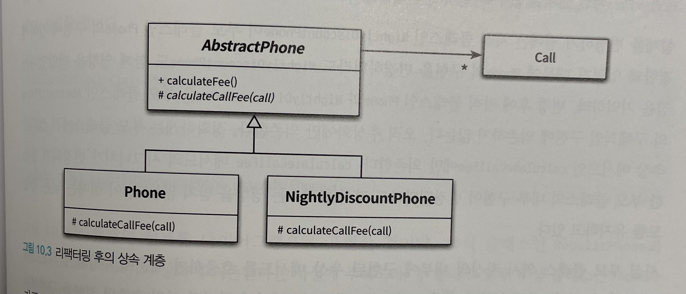

# Object (코드로 이해하는 객체지향 설계)

이 내용은 [오브젝트]을 읽으면서 정리한 내용을 포함하고 있습니다.

이번 주차의 정리할 내용은 다음과 같습니다.

- CHAPTER 10 상속과 코드 재사용
  - 01. 상속과 중복 코드
  - 02. 취약한 기반 클래스 문제
  - 03. Phone 다시 살펴보기
  - 04. 차이에 의한 프로그래밍

## CHAPTER 10 상속과 코드 재사용

- 코드를 재사용하려는 강력한 동기
  - 중복 코드 제거

### 01. 상속과 중복 코드

- `중복 코드는 우리를 주저하게 만들뿐만 아니라 동료들을 의심하게 만든다.`

#### DRY 원칙

- 중복 코드는 변경을 방해한다.
  - 코드가 중복인지를 찾아야 한다.
  - 모든 코드를 일관되게 수정해야 한다.
  - 모든 중복 코드를 개별적으로 테스트해서 동일한 결과를 내놓는지 확인해야 한다.

신뢰할 수 있고 수정하기 쉬운 소프트웨어를 만드는 효과적인 방법 중 하나를 중복을 제거하는 것이다.

DRY 원칙

- 반복하지 마라 : Don't Repeat Yourself
- 모든 지식은 시스템 내에서 단일하고, 애매하지 않고, 정말로 믿을 만한 표현 양식을 가져야 한다.

#### 중복과 변경

##### 중복 코드 살펴보기

- `Call` : 개별 통과 기간을 저장하는 클래스
- `Phone` : `Call` 의 목록을 관리할 정보 전문가
  - 통화 요금 계산 책임

심야 할인 요금제를 추가해야 한다는 요구사항 발생

가장 빠른 방법은 다음과 같다.

- `NightlyDicountPhone` : 심야 할인을 담당하는 정보 전문가
  - 통화 요금 계산 책임

중복 코드가 존재한다.

##### 중복 코드 수정하기

- 민첩하게 변경하기 위해서는 중복 코드를 추가하는 대신 제거해야 한다.
- 기회가 생길 때마다 코드를 DRY하게 만들기 위해 노력해야 한다.

##### 타입 코드 사용하기

- enum 활용

#### 상속을 이용해서 중복 코드 제거하기

- 상속의 기본 아이디어
  - 이미 존재하는 클래스와 유사한 클래스가 필요하다면 코드를 복사하지 말고 상속을 이용해 재사용하는 것

#### 강하게 결합된 Phone과 NightlyDiscountPhone

Phone과 NightlyDiscountPhone의 상속 계층이 가지는 문제점

- 세금 부과하는 로직을 추가하기 위해 Phone을 수정할 때 유사한 코드를 NightlyDiscountPhone에도 추가

### 02. 취약한 기반 클래스 문제

- 부모 클래스의 변경에 의해 자식 클래스 영향을 받는 현상
- 취약한 기반 클래스 문제
- 상속 관계를 추가할수록 전체 시스템의 결합도가 높아진다는 사실을 알아야 한다.

#### 불필요한 인터페이스 상속 문제

- 대표적인 사례
  - java.util.Stack
    - Stack을 Vector의 자식 클래스로 구현
  - java.util.Properties
    - Hashtable을 상속

`상속받은 부모 클래스의 메서드가 자식 클래스의 내부 구조에 대한 규칙을 깨뜨릴 수 있다.`

#### 메서드 오버라이딩의 오작용 문제


`자식 클래스가 부모 클래스의 메서드를 오버라이딩할 경우 부모 클래스가 자식의 메서드를 사용하는 방법에 자식 클래스가 결합될 수 있다.`

클래스가 상속되기를 원한다면 상속을 위해 클래스를 설계하고 문서화해야 하며, 그렇지 않은 경우에는 상속을 금지시켜야 한다.

#### 부모 클래스와 자식 클래스의 동시 수정 문제

`클래스를 상속하면 결합도로 인해 자식 클래스와 부모 클래스의 구현을 영원히 변경하지 않거나, 자식 클래스와 부모 클래스를 동시에 변경하거나 둘 중 하나를 선택할 수 밖에 없다.`

### 03. Phone 다시 살펴보기

- 상속으로 인한 피해를 최소화할 수 있는 방법을 안화 시키는 방법

#### 추상화에 의존하자

- 자식 클래스가 부모 클래스의 구현이 아닌 추상화에 의존하도록 만드는 것
- 정확하게 말하면 부모 클래스와 자식 클래스 모두 추상화에 의존하도록 수정

상속을 도입할 때 따르는 두 가지 원칙

- 두 메서드가 유사하게 보인다면 차이점을 메서드로 추출하라. 메서드 추출을 통해 두 메서드를 동일한 형태로 보이도록 만들 수 있다.
- 부모 클래스의 코드를 하위로 내리지 말고 자식 클래스의 코드를 상위로 올려라. 부모 클래스의 구체적인 메서드를 자식 클래스로 내리는 것보다 자식 클래스의 추상적인 메서드를 부모 클래스로 올리는 것이 재사용성과 응집도 측면에서 더 뛰어난 결과를 얻을 수 있다.

#### 차이를 메서드로 추출하라

- 변하는 것으로부터 변하지 않는 것을 분리하라
- 변하는 부분을 찾고 이를 캡슐화하라

#### 중복 코드를 부모 클래스로 올려라



- 공통 코드를 모두 AbstractPhone 로 올린다.
- Phone에는 일반 요금제를 처리하는 데 필요한 인스턴스 변수와 메서드만 존재

#### 추상화가 핵심이다

- 상속 계층이 코드를 진화시키는 데 걸림돌이 된다면 추상화를 찾아내고
- 상속 계층 안의 클래스들이 그 추상화에 의존하도록 코드를 리팩터링한다.

#### 의도를 드러내는 이름 선택하기

- 자식 클래스인 RegularPhone과 NightlyDiscountPhone
- 좋은 상속 계층을 구성하기 위해서는 상속 계층 안에 속한 클래스들이 구현이 아닌 추상화에 의존해야 하는 사실

```java
public abstract class Phone {

}

public class RegularPhone extends Phone {

}

public class NightlyDiscountPhone extends Phone {

}
```

#### 세금 추가하기

- 책임을 아무리 잘 분리해도 인스턴스의 변수의 추가는 종종 상속 계층 전반에 걸친 변경을 유발

### 04. 차이에 의한 프로그래밍

- 기존 코드와 다른 부분만을 추가함으로써 애플리케이션의 기능을 확장하는 방법
- 상속은 코드 재사용과 관련된 대부분의 경우에 우아한 해결 방법이 아님
  - 객체지향에 능숙한 개발자들은 상속의 단점을 피하면서도 코드를 재사용할 수 있는 더 좋은 방법이 존재하는 확인