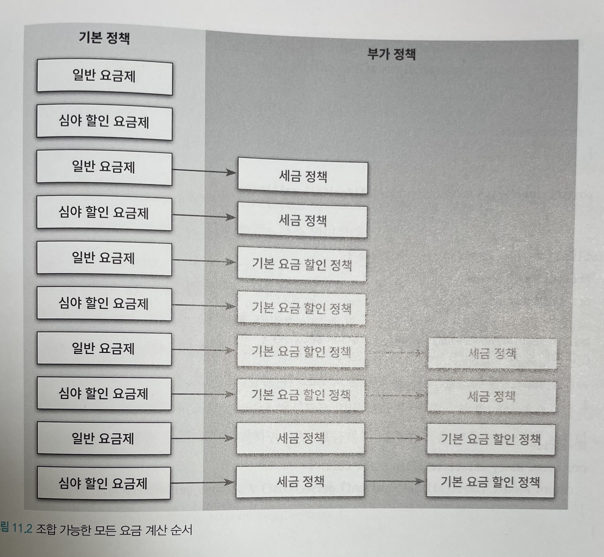
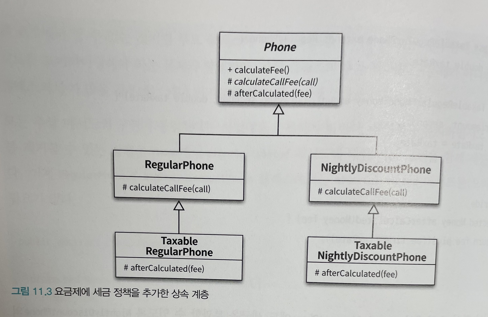
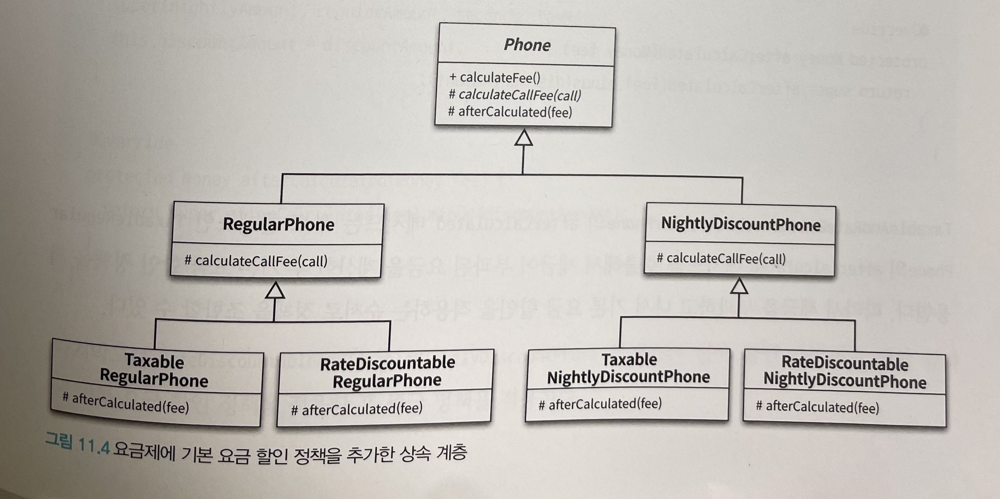
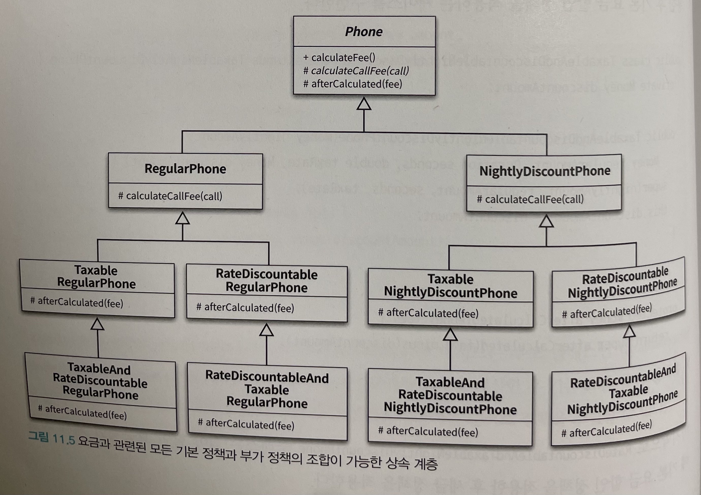
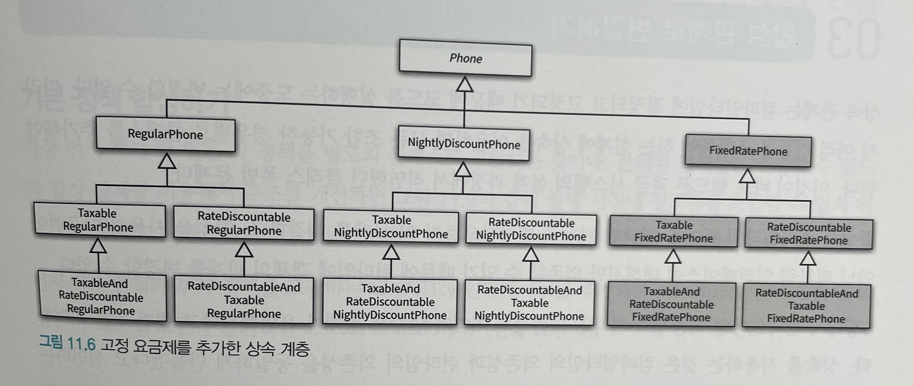
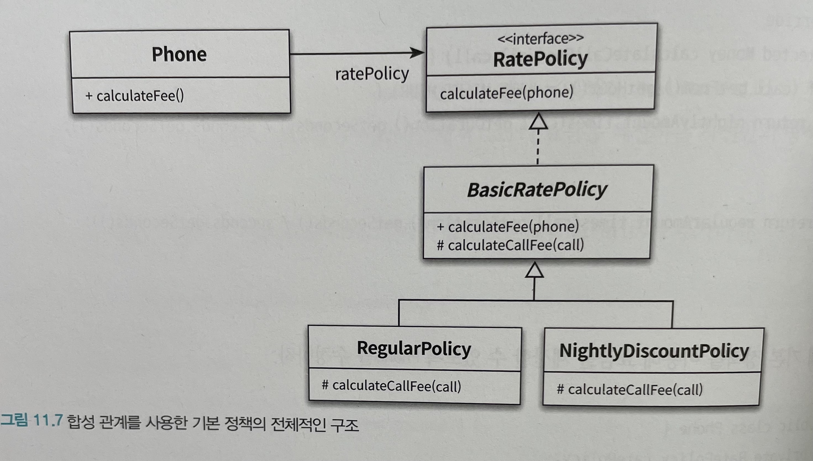
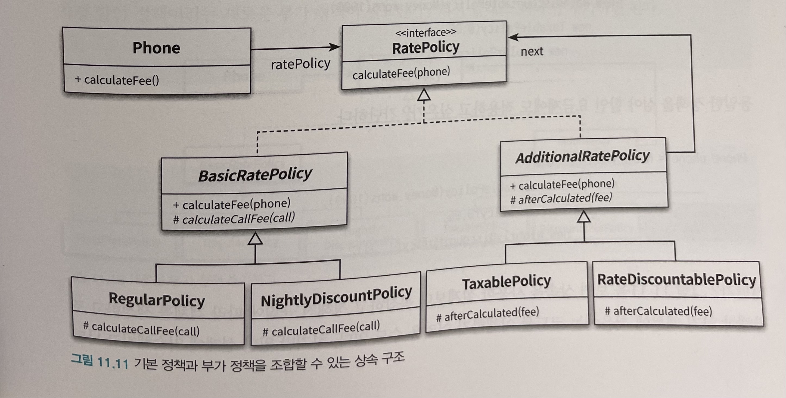
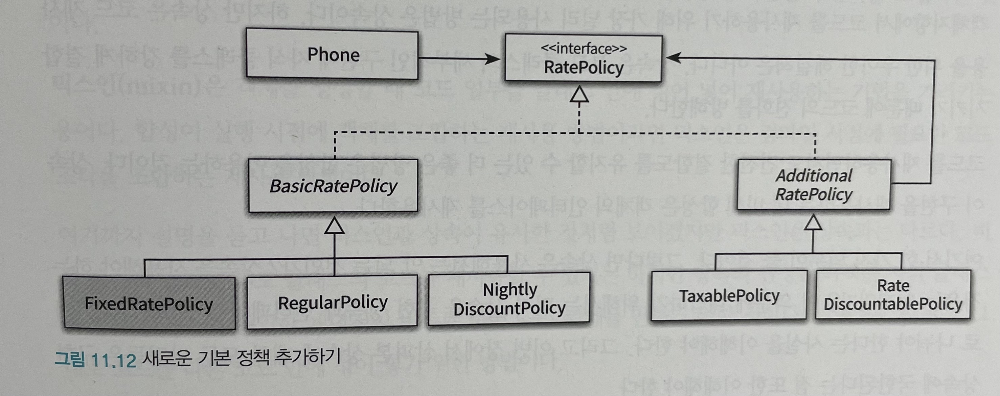
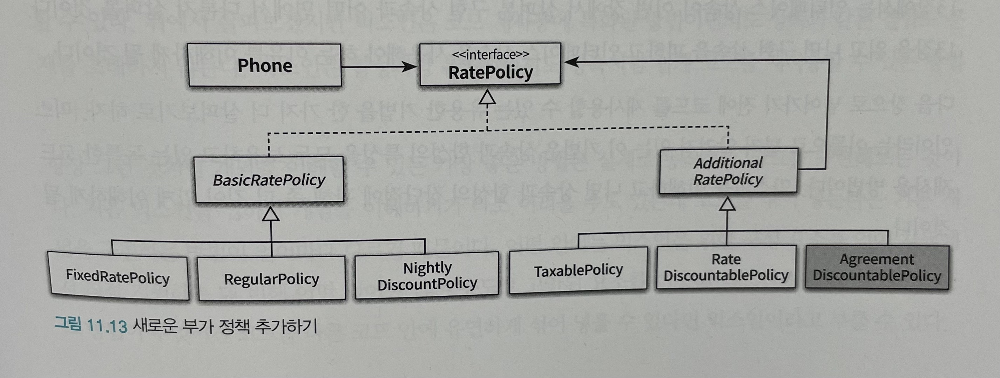

# Object (코드로 이해하는 객체지향 설계)

이 내용은 [오브젝트]을 읽으면서 정리한 내용을 포함하고 있습니다.

이번 주차의 정리할 내용은 다음과 같습니다.

- CHAPTER 11 합성과 유연한 설계
  - 상속을 합성으로 변경하기
  - 상속으로 인한 조합의 폭발적인 증가
  - 합성 관계로 변경하기
  - 믹스인

## CHAPTER 11 합성과 유연한 설계

### 상속

- 부모 클래스와 자식 클래스를 연결해서 부모 클래스의 코드를 재사용한다
- 컴파일 타임 의존성을 가진다 (정적인 관계)
- is-a 관계
- 부모 클래스의 내부 구현에 대해 상세히 알아야하기 때문에 자식 클래스와 부모 클래스 사이의 결합도가 높아진다.
- 부모 클래스에 구현된 코드를 재사용한다

### 합성

- 전체를 표현하는 객체가 부분을 표현하는 객체를 포함해서 부분 객체의 코드를 재사용한다
- 런타임 의존성을 가진다 (동적인 관계)
- has-a 관계
- 클래스와 클래스간의 퍼블릭 인터페이스에 의존하여 결합도가 낮다.
- 내부 구현의 변경의 영향이 최소화 된다
- 객체의 퍼블릭 인터페이스를 재사용한다

### 01. 상속을 합성으로 변경하기

합성을 사용하면 상속이 초래하는 다음 3가지 문제를 해결 가능

- 불필요한 인터페이스 상속 문제
- 메서드 오버라이딩의 오작용 문제
- 부모 클래스와 자식 클래스으 동시 수정 문제

#### 불필요한 인터페이스 상속 문제 : java.util.Properties와 java.util.Stack

- Hashtable 클래스와 Properties 클래스 사이의 상속 관계를 합성 관계로 변경
- Properties 클래스에서 상속 관계를 제거하고 Hashtable을 Properties의 인스턴스 변수로 포함시키면 합성 관계로 변경
- Stack의 경우도 비슷한 케이스
- Properties와 Stack을 합성으로 변경한 이유
  - 불필요한 오퍼레이션들이 퍼블릭 인터페이스에 스며드는 것을 방지하기 위함

#### 메서드 오버라이딩의 오작용 문제 : InstrumentedHashSet

- InstrumentedHashSet의 경우 HashSet이 제공하는 퍼블릭 인터페이스를 그대로 제공해야 한다.
- InstrumentedHashSet이 Set 인터페이스를 실체화하면서 내부에 HashSet의 인스턴스를 합성하면 HashSet에 대한 구현 결합도는 제거하면서도 퍼블릭 인터페이스는 그대로 유지

#### 부모 클래스와 자식 클래스의 동시 수정 문제 : PersonalPlayList

- 대부분의 경우 구현에 대한 결합보다는 인터페이스에 대한 결합이 더 좋다.

### 02. 상속으로 인한 조합의 폭발적인 증가

상속으로 인한 결합도 증가 -> 코드 수정 시 작업의 양이 과도하게 증가

- 하나의 기능을 추가하거나 수정하기 위해 불필요하게 많은 수의 클래스를 추가하거나 수정해야 한다.
- 단일 상속만 지원하는 언어에서는 상속으로 인해 오히려 중복 코드의 양이 늘어날 수 있다.

#### 기본 정책과 부가 정책 조합하기

기본 정책

- 가입자의 통화 정보를 기반
- 가입자의 한달 통화량을 기준으로 부과할 요금을 계산

부가 정책

- 통화량과 무관하게 기본 정책에 선택적으로 추가할 수 있는 요금 방식을 의미
  - ex) 세금을 부과하는 정책
- 세금 정책 외에도 최종 계산된 요금에서 일정 금액을 할인해 주는 기본 요금 할인 정책 존재

부가 정책의 특성

- 기본 정책의 계산 결과에 적용된다.
- 선택적으로 적용할 수 있다.
- 조합 가능하다.
- 부가 정책은 임의의 순서로 적용 가능하다.

현재의 기본 정책과 부가 정책을 조합해서 만들 수 있는 모든 요금 정책의 종류

- 조합 가능한 모든 요금 계산 순서

#### 상속을 이용해서 기본 정책 구현하기

- 추상 클래스 : `Phone`
- 일반 요금 : `RegularPhone`
- 심야 요금 : `NightlyDiscountPhone`

#### 기본 정책에 세금 정책 조합하기

결합도는 낮추는 방법

- 자식 클래스가 부모 클래스의 메서드를 호출하지 않도록 부모 클래스에 추상 메서드를 제공하는 것
- 부모 클래스가 자신이 정의한 추상 메서드를 호출하고 자식 클래스가 이 메서드를 오버라이딩해서 부모 클래스가 원하는 로직을 제공하도록 수정하면 부모 클래스와 자식 클래스 사이의 결합도를 느슨하게 만들 수 있음
- 자식 클래스가 부모 클래스의 구체적인 구현이 아니라 필요한 동작의 명세를 기술하는 추상화에 의존

- 요금제에 세금 정책을 추가한 상속 계층

#### 기본 정책에 기본 요금 할인 정책 조합하기

- 요금제에 기본 요금 할인 정책을 추가한 상속 계층

#### 중복 코드의 덫에 걸리다

- 상속을 이용한 해결 방법은 모든 가능한 조합별로 자식 클래스를 하나씩 추가하는 것이다.
  - 만약 일반 요금제의 계산 결과에 세금 정책을 조합한 후 기본 요금 할인 정책을 추가하고 싶다면 `TaxableRegularPhone` 을 상속받는 새로운 자식 클래스인 `TaxableAndRateDiscountableRegularPhone` 을 추가해야 한다.

- 요금과 관련된 모든 기본 정책과 부가 정책의 조합이 가능한 상속 계층

- 고정 요금제를 추가한 상속 계층

##### 상속의 폭발

- 상속으로 인해 결합도가 높아지면 코드를 수정하는 데 필요한 작업의 양이 과도하게 늘어나는 경향이 있다.
- 하나의 기능을 추가하거나 수정하기 위해 불필요하게 많은 수의 클래스를 추가하거나 수정해야 한다. 
- 단일 상속만 지원하는 언어에서는 상속으로 인해 오히려 중복 코드의 양이 늘어날 수 있다.
- 합성을 사용하면 상속에서 발생하는 클래스 증가와 중복 코드 문제를 해결할 수 있다.

### 03. 합성 관계로 변경하기

- 합성은 컴파일타임 관계를 런타임 관계로 변경한다.
- 합성을 사용하면 구현이 아닌 퍼블릭 인터페이스에 대해서만 의존할 수 있기 때문에 런타임에 객체의 관계를 변경할 수 있다.
- 합성을 사용하면 구현 시점에 정책들의 관계를 고정시킬 필요가 없으며 실행 시점에 정책들의 관계를 유연하게 변경할 수 있게 된다.
- 코드가 유연해지면 복잡성은 올라가지만 대부분의 경우에는 단순한 설계가 정답이지만 변경에 따르는 고통이 복잡성으로 인한 혼란을 넘어서고 있다면 유연성의 손을 들어주는 것이 현명한 판단일 확률이 높다.
- 변경하기 편리한 설계를 만들기 위해 복잡성을 더하고 나면 원래의 설계보다 단순해지는 경우도 종종 볼 수 있다.

#### 기본 정책 합성하기

- 합성 관계를 사용한 기본 정책의 전체적인 구조

#### 부가 정책 적용하기

- 기본 정책과 부가 정책을 조합할 수 있는 상속 구조

#### 기본 정책과 부가 정책 합성하기

- 예제 소스 코드로 대체

#### 새로운 정책 추가하기

- 예제 소스 코드로 대체

##### 새로운 기본 정책 추가하기

- 새로운 기본 정책 추가하기

- 새로운 부가 정책 추가하기

#### 객체 합성이 클래스 상속보다 더 좋은 방법이다

- 객체지향에서 코드를 재사용하기위해 가장 널리 사용되는 방법은 상속이다. 하지만, 이는 우아한 방법이 아니다.
- 상속은 부모 클래스의 세부적인 구현에 자식 클래스를 강하게 결합시키기 때문에 코드의 진화를 방해한다.
- 합성은 객체의 인터페이스를 재사용하기 때문에 방해하지 않고 더 유연한 설계가 가능해진다.

### 04. 믹스인

- 믹스인은 객체를 생성할 때 코드 일부를 클래스 안에 섞어 넣어 재사용하는 기법을 가리키는 용어다.
- 상속은 클래스와 클래스 사이의 관계를 고정시키는 데 비해 믹스인은 유연하게 관계를 재구성할 수 있다.
- 믹스인은 코드 재사용에 특화된 방법이면서도 상속과 같은 결합도 문제를 초래하지 않는다.
- 스칼라의 트레이트 예제가 나옴
  - 타스의 믹스인의 경우 https://radlohead.gitbook.io/typescript-deep-dive/type-system/mixins 참고