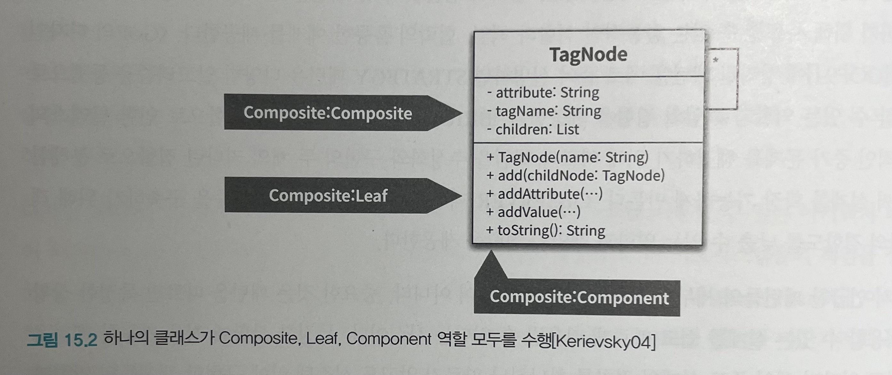
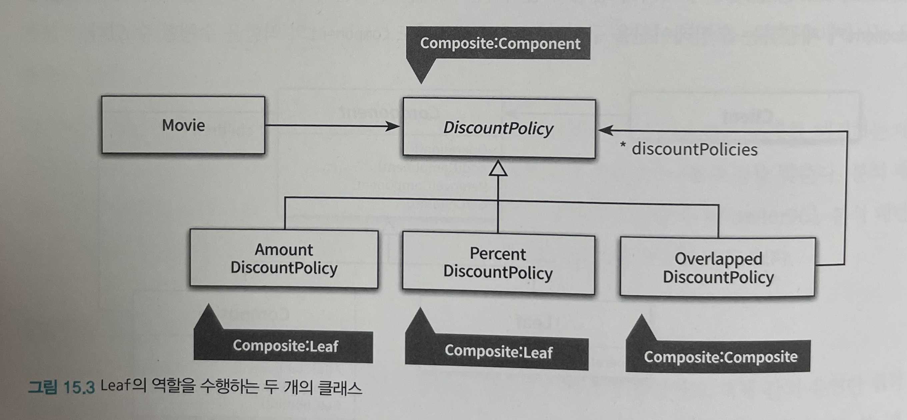
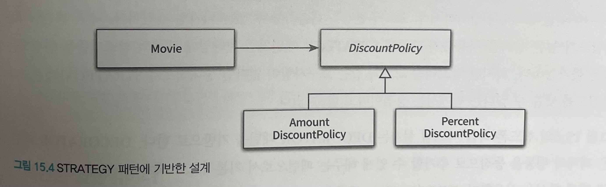
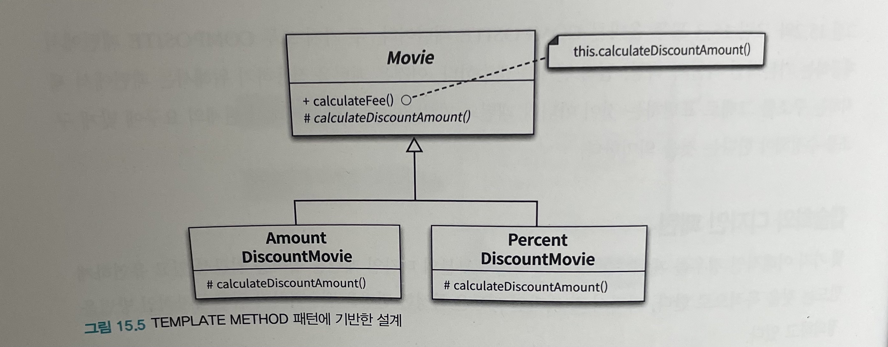
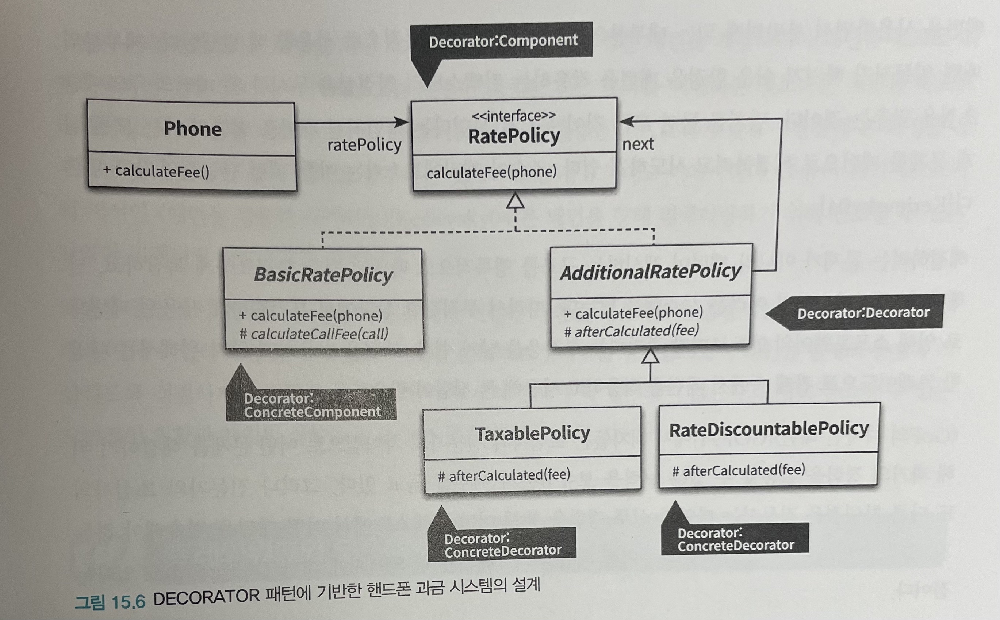
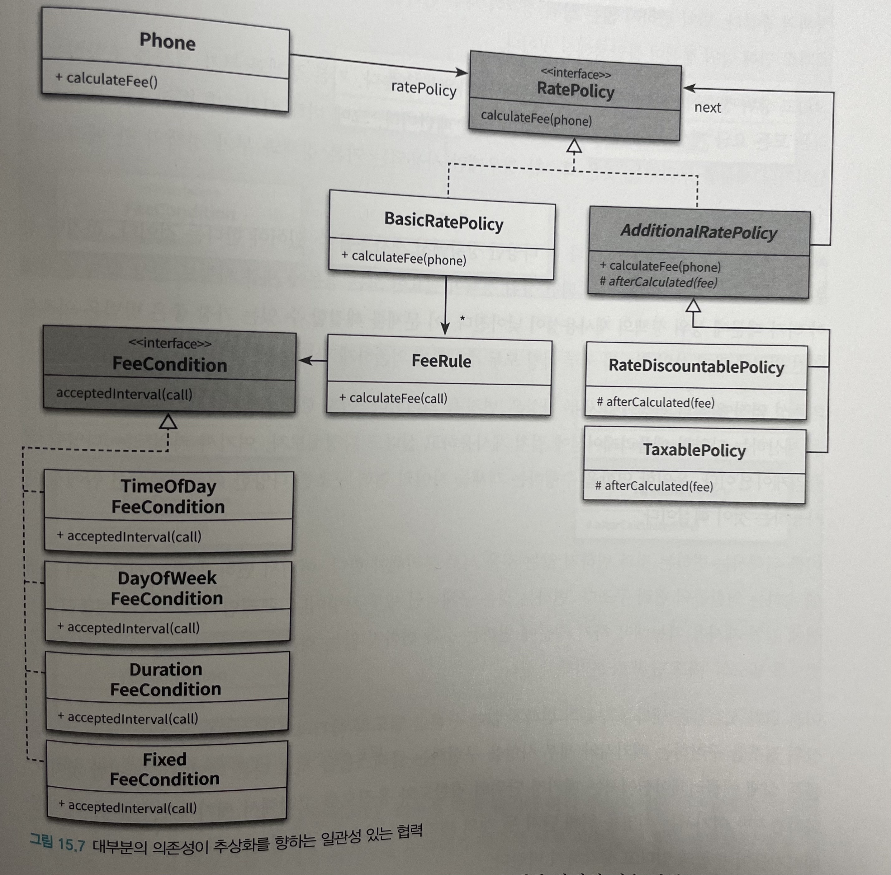
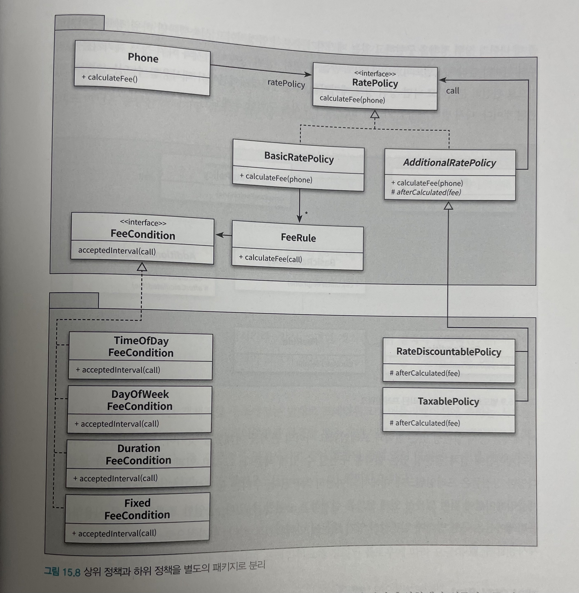
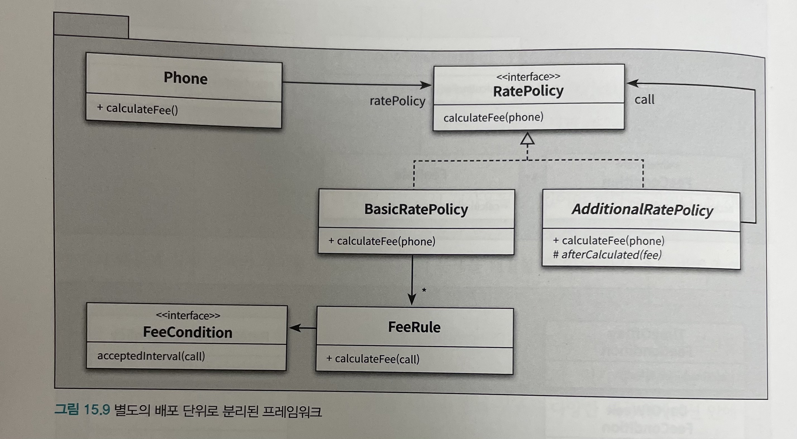

# Object (코드로 이해하는 객체지향 설계)

이 내용은 [오브젝트]을 읽으면서 정리한 내용을 포함하고 있습니다.

이번 주차의 정리할 내용은 다음과 같습니다.

- CHAPTER 15 디자인 패턴과 프레임워크
  - 디자인 패턴과 설계 재사용
  - 프레임워크와 코드 재사용
  - 일관성 있는 기본 정책 구현하기

## CHAPTER 15 디자인 패턴과 프레임워크

- `디자인 패턴` 이란?
  - 소프트웨어 설계에서 반복적으로 발생하는 문제에 대해 반복적으로 적용할 수 있는 해결 방법
  - 디자인 패턴의 목적은 설계를 재사용하는 것
  - 다양한 변경을 다루기 위해 반복적으로 재사용할 수 있는 설계의 묶음
- 디자인 패턴이 설계를 재사용하기 위한 것이라면 프레임워크는 설계와 코드를 함께 재사용하기 위한 것

**디자인 패턴과 프레임워크 모두 협력을 일관성 있게 만들기 위한 방법**

### 디자인 패턴과 설계 재사용

#### 소프트웨어 패턴

- 패턴의 핵심적인 특징
  - 패턴은 반복적으로 발생하는 문제와 해법의 쌍으로 정의된다.
  - 패턴을 사용함으로써 이미 알려진 문제와 이에 대한 해법을 문서로 정리할 수 있으며, 이 지식을 다른 사람과 의사소통할 수 있다.
  - 패턴은 추상적인 원칙과 실제 코드 작성 사이의 간극을 메워주며 실질적인 코드 작성을 돕는다.
  - 패턴의 요점은 패턴이 실무에서 탄생했다는 점이다.
- 패턴의 정의
  - 하나의 실무 컨텍스트에서 유용하게 사용해 왔고 다른 실무 컨텍스트에서도 유용할 것이라고 예상되는 아이디어
- 패턴이 지닌 가장 큰 가치는 경험을 통해 축적된 실무 지식을 효과적으로 요약하고 전달할 수 있다는 점
- 패턴의 이름은 높은 수준의 대화를 가능하게 하는 원천

#### 패턴 분류

- 패턴 분류 방법
  - 패턴의 범위나 적용 단계의 따라
  - 아키텍처 패턴
    - 소프트웨어의 전체적인 구조를 결정하기 위함
  - 분석 패턴
    - 도메인 내의 개념적인 문제를 해결하는 데 초점
  - 디자인 패턴
    - 중간 규모의 패턴, 특정한 설계 문제를 해결하는 것을 목적으로 하며, 프로그래밍 언어나 프로그래밍 패러다임에 독립적
  - 이디엄
    - 특정 프로그래밍 언어에만 국한된 하위 레벨 패턴
    - 주어진 언어의 기능을 사용해 컴포넌트, 혹은 컴포넌트 간의 특정 측면을 구현하는 방법을 서술
- 4가지 중 가장 널리 알려진 것 : `디자인 패턴`
  - 디자인 패턴은 특정 정황 내에서 일반적인 설계 문제를 해결하며, 협력하는 컴포넌트들 사이에서 반복적으로 발생하는 구조를 서술한다.

#### 패턴과 책임-주도 설계

패턴은 공통으로 사용할 수 있는 역할, 책임, 협력의 템플릿

- ex) `STRATEGY 패턴`
  - 다양한 알고리즘을 동적으로 교체할 수 있는 역할과 책임의 집합을 제공
- ex) `BRIDGE 패턴` 
  - 추상화의 조합으로 인한 클래스의 폭발적인 증가 문제를 해결하기 위해 역할과 책임을 추상화와 구현의 두 개의 커다한 집합으로 분해함으로써 설계를 확장 가능하게 만듬
- ex) `OBSERVER 패턴` 
  - 유연한 통지 메커니즘을 구축하기 위해 객체 간의 결합도를 낮출 수 있는 역할과 책임의 집합을 제공

ex) `COMPOSITE 패턴`

- Composite 패턴의 구조

- 하나의 클래스가 Composite, Leaf, Component 역할 모두를 수행

- Leaf의 역할을 수행하는 두 개의 클래스

#### 캡슐화와 디자인 패턴

디자인 패턴은 협력을 일관성 있고 유연하게 만드는 것을 목적으로, 각 디자인 패턴은 특정한 변경을 캡슐화하기 위한 독자적인 방법을 정의

- STRATEGY 패턴에 기반한 설계

- TEMPLATE METHOD 패턴에 기반한 설계
- 추상 클래스나 인터페이스를 사용해 변경을 캡슐화하는 합성과 달리 상속을 사용할 경우에는 추상 메서드를 이용해 변경을 캡슐화

- DECORATOR 패턴에 기반한 핸드폰 과금 시스템의 설계

#### 패턴은 출발점이다

- 명확한 트레이드오프 없이 패턴을 남용하면 설계가 불필요하게 복잡해지게 된다.
- 타당한 이유 없이 패턴을 적용하면 패턴에 익숙한 사람들의 경우에는 설계의 의도를 이해하지 못하게 되고, 패턴을 알지 못하는 사람들은 불필요하게 복잡한 설계를 따라가느라 시간을 낭비하게 된다.

### 프레임워크와 코드 재사용

#### 코드 재사용 대 설계 재사용

- 재사용 관점에서 설계 재사용보다 더 좋은 방법은 코드 재사용이다.
- 가장 이상적인 형태의 재사용 방법은 설계 재사용과 코드 재사용을 적절한 수준으로 조합하는 것이다.
  - 해답은 `프레임워크`
- `프레임워크`란 추상 클래스나 인터페이스를 정의하고 인스턴스 사이의 상호작용을 통해 시스템 전체 혹은 일부를 구현해 놓은 재사용 가능한 설계 또는 애플리케이션 개발자가 현재의 요구사항에 맞게 커스터마이징할 수 있는 애플리케이션의 골격을 의미

#### 상위 정책과 하위 정책으로 패키지 분리하기

- 프레임워크의 핵심은 추상 클래스나 인터페이스와 같은 추상화라고 할 수 있다.
  - 추상 클래스와 인터페이스가 일관성 있는 협력을 만드는 핵심 재료
- 상위 정책이 세부 사항보다 더 다양한 상황에서 재사용될 수 있어야 한다.
  - 상위 정책이 세부 사항에 의존하게 되면 상위 정책이 필요한 모든 경우에 세부 사항도 항상 함께 존재해야 하기 때문에 상위 정책의 재사용성이 낮아진다.
  - 이 문제를 해결하기 위한 가장 좋은 방법은 의존성 역전 원칙에 맞게 상위 정책과 세부 사항 모두 추상화에 의존하게 만드는 것이다.

- 대부분의 의존성이 추상화를 향하는 일관성 있는 협력

- 상위 정책과 하위 정책을 별도의 패키지로 분리

- 별도의 배포 단위로 분리된 프레임워크

#### 제어 역전 원리

- 훌륭한 객체지향 설계는 의존성이 역전된 설계
- 의존성 역전 원리는 프레임워크의 가장 기본적인 설계 메커니즘
- 객체지향 시대에는 프레임워크가 호출하는 코드를 작성해야 한다.
- 제어가 우리에게서 프레임워크로 넘어감