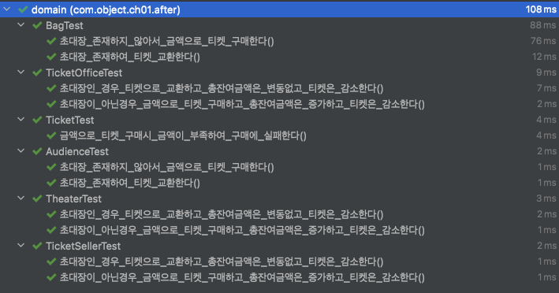

# Object (코드로 이해하는 객체지향 설계)

이 내용은 [오브젝트]을 읽으면서 정리한 내용을 포함하고 있습니다.

이번 주차의 정리할 내용은 다음과 같습니다.

- CHAPTER 01 객체, 설계
  - 01. 티켓 판매 어플리케이션 구현하기
  - 02. 무엇이 문제인가
  - 03. 설계 개선하기
  - 04. 객체지향 설계
- 리팩토링 및 테스트 코드 결과
  - 리팩토링
  - 테스트 코드 결과

## CHAPTER 01. 객체, 설계

- 어떤 분야를 막론하고 이론을 정립할 수 없는 초기에는 실무가 먼저 급속한 발전을 이룬다고 한다.
- 소프트웨어 설계와 유지보수에 중점을 두려면 이론이 아닌 실무에 초점을 맞추는 것이 효과적이다.

### 01. 티켓 판매 어플리케이션 구현하기

#### 요구 사항

- 관람객이 가지고 올 수 있는 소지품은 초대장, 현금, 티켓이다.
- 이벤트 당첨된 관람객은 초대장을 가지고 있다.
- 이벤트 당첨된 관람객은 초대장으로 티켓을 교환한다.
- 이벤트 당첨되지 않은 관람객은 티켓을 구매한다.
- 매표소에서는 관람객에게 판매할 티켓과 티켓의 판매 금액이 보관되어 있다.
- 판매원은 매표소에서 초대장을 티켓으로 교환해 주거나 티켓을 판매하는 역할을 수행한다.

### 02. 무엇이 문제인가

로버트 마틴의 `클린 소프트웨어` 에서 소프트웨어 모듈이 가져야 하는 세 가지 기능에 관한 내용은 다음과 같다.

```
모든 소프트웨어 모듈에는 세 가지 목적이 있다.
 - 첫 번째, 실행 중에 제대로 동작하는 것
 - 두 번째, 변경을 위해 존재하는 것
   - 대부분의 모듈은 생명주기 동안 변경되기 때문에 간단한 작업만으로도 변경이 가능해야 한다.
   - 변경하기 어려운 모듈은 제대로 동작하더라도 개선해야 한다.
 - 세 번째, 코드를 읽는 사람과 의사소통하는 것
   - 모듈은 특별한 훈련 없이도 개발자가 쉽게 읽고 이해할 수 있어야 한다.
   - 읽는 사람과 의사소통할 수 없는 모듈은 개선해야 한다.
```

마틴에 따르면, 모든 모듈은 제대로 실행돼야 하고, 변경이 용이해야 하며, 이해하기 쉬워야 한다.

#### 예상을 빗나가는 코드

Theater 클래스의 enter 메서드가 수행하는 일을 말로 풀어보면 다음과 같다.

```
소극장은 관람객의 가방을 열어 그 안에 초대장이 들어 있는 살펴본다. 
가방 안에 초대장이 들어 있으면 판매원은 매표소에 보관돼 있는 티켓을 관람객의 가방 안으로 옮긴다. 
가방 안에 초대장이 들어 있지 않다면 관람객의 가방에서 티켓 금액만큼의 현금을 꺼나 매표소에 적립한 후에 매표소에 보관돼 있는 티켓을 관람객의 가방 안으로 옮긴다.
```

- 관람객의 입장
  - 소극장이라는 제3자가 초대장을 확인하기 위해 관람객의 가방을 마음대로 열어 보는 것
- 판매원의 입장
  - 소극장이 허락도 없이 매표소에 보관 중인 티켓과 현금에 마음대로 접근할 수 있기 때문

##### 코드를 이해하기 어렵게 만드는 이유

- 현실 세계와 다르게 동작한다.
- 코드를 이해하기 위해서는 여러 가지 세부적인 내용들을 한꺼번에 기억하고 있어야 한다.
- 변경에 취약하다.

###### 현실 세계와 다르게 동작한다.

**이해 가능한 코드란 그 동작이 우리의 예상에서 크게 벗어나지 않는 코드다.**

현실에서는 다음과 같이 한다.

- 관람객이 직접 자신의 가방에서 초대장을 꺼내 판매원에게 건넨다.
- 티켓을 구매하는 관람객은 가방 안에서 돈을 직접 꺼내 판매원에게 지불한다.
- 판매원은 매표소에 있는 티켓을 직접 꺼내 관람객에게 건네고 관람객에게서 직접 돈을 받아 매표소에 보관한다.

코드에서는 현실과는 다르게 움직인다.

###### 코드를 이해하기 위해서는 여러 가지 세부적인 내용들을 한꺼번에 기억하고 있어야 한다.

Theater의 enter 메서드를 이해하기 위해서는,

```
Audience가 Bag을 가지고 있고, Bag 안에는 현금과 티켓이 들어 있으며 TicketSeller가 TicketOffice에서 티켓을 판매하고, TicketOffice 안에 돈과 티켓이 보관돼 있다는 모든 사실을 동시에 기억하고 있어야 한다.
```

이 코드는 하나의 클래스나 메서드에서 너무 많은 세부사항을 다루기 때문에 코드를 작성하는 사람뿐만 아니라 코드를 읽고 이해해야 하는 사람 모두에 큰 부담을 준다.

#### 변경에 취약한 코드

요구사항이 변경된다면 관련 없는 클래스들에서도 많은 수정 사항이 생기게 된다.

이것은 객체 사이의 의존성(dependency)과 관련된 문제이다.

- 문제는 의존성이 변경과 관련돼 있다는 점
- 의존성이라는 말 속에는 어떤 객체가 변경될 때 그 객체에게 의존하는 다른 객체도 함께 변경될 수 있다는 사실이 내포
- 객체 사이의 의존성이 과한 경우를 가리켜 결합도(coupling)가 높다고 말한다.
- 결합도는 의존성과 관련돼 있기 때문에 결합도 역시 변경과 관련이 있다.

객체지향 설계는 서로 의존하면서 협력하는 객체들의 공동체를 구축하는 것이다.

- 목표는 애플리케이션의 기능을 구현하는 데 필요한 최소한의 의존성만 유지하고 불필요한 의존성을 제거하는 것이다.

### 03. 설계 개선하기

예제 코드는 첫 번째 목적은 만족시키지만 두 번째와 세 번째 목적은 만족시키지 못한다.
변경과 의사소통이라는 문제가 서로 엮여 있다는 점에 주목해야 한다.
해결 방법은 의외로 간단한데, 객체들을 자율적인 존재로 만들고 불필요한 정보는 차단하는 것이다.

#### 자율성을 높이자

관람객과 판매원을 자율적인 존재로 만드면 되는 것이다.

즉, 캡슐화를 활용한다.

- 캡슐화의 목적은 변경하기 쉬운 객체를 만드는 것이다.
- 캡슐화를 통해 객체 내부로의 접근을 제한하면 객체와 객체 사이의 결합도를 낮출 수 있기 때문에 설계를 좀 더 쉽게 변경할 수 있게 된다.

#### 무엇이 개선됐는가

수정된 예제는 수정전 예제와 마찬가지로 기능상의 문제는 없다.
따라서 로버트 마틴이 말한 3가지 목적 중 첫번째 목적을 만족한다.
그럼 두 번째와 세 번째는 어떻게 될까?

- 코드를 읽는 사람과의 의사소통이라는 관점에서 코드는 확실히 개선되었다. 
- 내부 구현이 변경되어도 Theater를 함께 변경할 필요가 없어졌다.

```
모든 소프트웨어 모듈에는 세 가지 목적이 있다.
 - 첫 번째, 실행 중에 제대로 동작하는 것
 - 두 번째, 변경을 위해 존재하는 것
   - 대부분의 모듈은 생명주기 동안 변경되기 때문에 간단한 작업만으로도 변경이 가능해야 한다.
   - 변경하기 어려운 모듈은 제대로 동작하더라도 개선해야 한다.
 - 세 번째, 코드를 읽는 사람과 의사소통하는 것
   - 모듈은 특별한 훈련 없이도 개발자가 쉽게 읽고 이해할 수 있어야 한다.
   - 읽는 사람과 의사소통할 수 없는 모듈은 개선해야 한다.
```

#### 어떻게 한 것인가

자기 자신의 문제를 스스로 해결하도록 코드를 변경한 것이다.

수정하기 전에는,

- Theater가 Audience와 TicketSeller의 상세한 내부 구현까지 알고 있어야 했다.
- Theater는 Audience와 TicketSeller에 강하게 결합돼 있었고, 그 결과 Audience와 TicketSeller의 사소한 변경에도 Theater가 영향을 받을수 밖에 없었다.

수정한 후에는,

- Theater는 Audience나 TicketSeller의 내부에 직접 접근하지 않는다.
- Audience는 Bag 내부의 내용물을 확인하거나, 추가하거나, 제거하는 작업을 스스로 처리하며 외부의 누군가에게 자신의 가방을 열어보도록 허용하지 않는다.

객체의 자율성을 높이는 방향으로 설계를 개선했다.

#### 캡슐화 응집도

핵심은 객체 내부의 상태를 캡슐화하고 객체 간에 오직 메시지를 통해서만 상호작용하도록 만드는 것이다.

#### 절차지향과 객체지향

절차적 프로그래밍

- 프로세스와 데이터를 별도의 모듈에 위치시키는 방식
- 변경하기 어려운 설계
  - 필요한 모든 데이터에 의존해야 한다는 근본적인 문제점

객체지향 프로그래밍

- 데이터와 프로세스가 동일한 모듈 내부에 위치시키는 방식
- 변경하기 쉬운 설계

**훌륭한 객체지향 설계의 핵심은 캡슐화를 이용해 의존성을 적절히 관리함으로써 객체 사이의 결합도를 낮추는 것이다.**

#### 책임의 이동

절차적 프로그래밍과 객체지향 프로그래밍의 근본적인 차이를 만드는 것은 책임의 이동이다.

책임이 중앙집중된 절차적 프로그래밍


책임이 분산된 객체지향 프로그래밍


객체가 어떠 데이터를 가지느냐보다는 객체에 어떤 책임을 할당할 것이냐에 초점을 맞춰야 한다.

설계를 어렵게 만드는 것은 의존성이라는 것을 기억해야 한다.

- 해결 방법은 불필요한 의존성을 제거함으로써 객체 사이의 결합도를 낮추는 것이다.

#### 더 개선할 수 있다

그 외에도 객체가 자율성을 갖고 책임을 갖도록 분리한다.

#### 그래, 거짓말이다!

비록 현실에서는 수동적인 존재라고 하더라도 일단 객체지향의 세계에 들어오면 모든 것이 능동적이고 자율적인 존재로 바뀐다. 능동적이고 자율적인 존재로 소프트웨어 객체를 설계하는 원칙을 가리켜 의인화라고 부른다.

**훌륭한 객체지향 설계란, 소프트웨어를 구성하는 모든 객체들이 자율적으로 행동하는 설계를 가리킨다.**

### 04. 객체지향 설계

#### 설계가 왜 필요한가

Metz12의 따르면 `설계란 코드를 배치하는 것이다` 라고 하였다.

- 설계를 구현과 떨어뜨려서 이야기 하는 것은 불가능하다.
- 설계는 코드를 작성하는 매 순간 코드를 어떻게 배치할 것인지를 결정하는 과정에서 나온다.
- 설계는 코드 작성의 일부이며 코드를 작성하지 않고서는 검증할 수 없다.

좋은 설계란 무엇인가?

- 우리는 오늘 완성해야 하는 기능을 구현하는 코드를 짜야 하는 동시에 내일 쉽게 변경할 수 있는 코드를 짜야 한다.
- 변경을 수용할 수 있는 설계가 중요한 이유는 요구사항이 변경되기 때문이다.
- 변경을 수용할 수 있는 설계가 중요한 또 다른 이유는 코드를 변경할 때 버그가 추가될 가능성이 높기 때문이다.

#### 객체지향 설계

- 진정으로 원하는 것은 변경에 유연하게 대응할 수 있는 코드다.
- 객체지향 프로그래밍은 의존성을 효율적으로 통제할 수 있는 다양한 방법을 제공함으로써 요구사항 변경에 좀 더 수월하게 대응할 수 있는 가능성을 높여준다.
- 훌륭한 객체지향 설계란 협력하는 객체 사이의 의존성을 적절하게 관리하는 설계이다. 세상에 엮인 것이 많은 사람일수록 변하기 어려운 것처럼 객체가 실행되는 주변 환경에 강하게 결합될수록 변경하기 어려워진다.
- 데이터와 프로세스를 하나의 덩어리로 모으는 것은 훌륭한 객체지향 설계로 가는 첫걸음일 뿐이다. 진정한 객체지향 설계로 나아가는 길은 협력하는 객체들 사이의 의존성을 적절하게 조절함으로써 변경에 용이한 설계를 만드는 것이다.

## 리팩토링 및 테스트 코드

### 리팩토링

- 기존 요구사항에서 티켓의 금액이 명시되어 있지 않아서 기본 금액 설정하였고 해당 금액의 책임은 `Ticket` 클래스에세 위임

- 금액이 부족한 경우의 대한 예외 발생 처리를 위한 테스트 코드 작성

```
class TicketTest {

    @Test
    void 금액으로_티켓_구매시_금액이_부족하여_구매에_실패한다() {

        final long balance = 9000L;

        assertThatThrownBy(() -> Ticket.create(balance))
                .isInstanceOf(IllegalArgumentException.class)
                .hasMessage("티켓 구매 금액이 부족합니다.");
    }
}
```

### 테스트 코드 결과

요구 사항은 다음과 같다.

```
- 관람객이 가지고 올 수 있는 소지품은 초대장, 현금, 티켓이다.
- 이벤트 당첨된 관람객은 초대장을 가지고 있다.
- 이벤트 당첨된 관람객은 초대장으로 티켓을 교환한다.
- 이벤트 당첨되지 않은 관람객은 티켓을 구매한다.
- 매표소에서는 관람객에게 판매할 티켓과 티켓의 판매 금액이 보관되어 있다.
- 판매원은 매표소에서 초대장을 티켓으로 교환해 주거나 티켓을 판매하는 역할을 수행한다.
```

수행한 테스트 코드는 다음과 같다.

