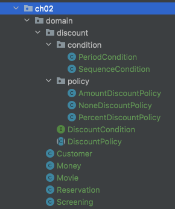
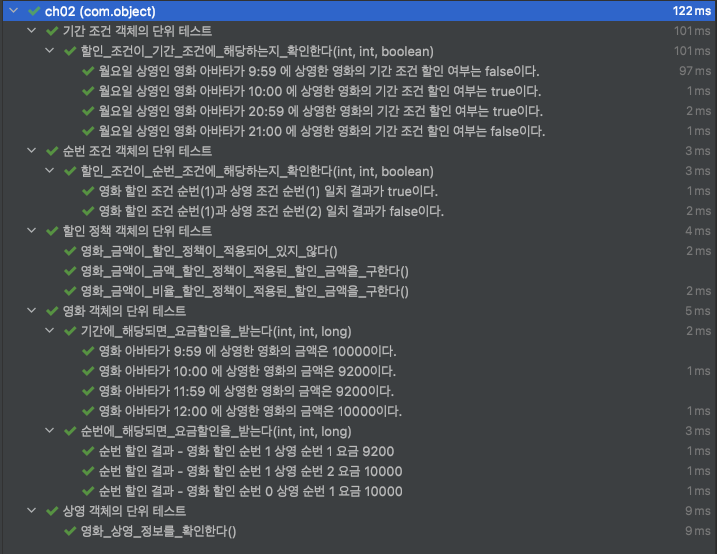

# Object (코드로 이해하는 객체지향 설계)

이 내용은 [오브젝트]을 읽으면서 정리한 내용을 포함하고 있습니다.

이번 주차의 정리할 내용은 다음과 같습니다.

- CHAPTER 02 객체지향 프로그래밍
  - 01. 영화 예매 시스템
  - 02. 객체지향 프로그래밍을 향해
  - 03. 할인 요금 구하기
  - 04. 상속과 다형성
  - 05. 추상화와 유연성
- 리팩토링 및 테스트 코드 결과
  - 리팩토링
  - 테스트 코드 결과

## CHAPTER 02. 객체지향 프로그래밍

### 01. 영화 예매 시스템

#### 요구사항 살펴보기

- 영화 
  - 영화에 대한 기본 정보를 표현
  - 제목, 상영시간, 가격 정보와 같이 영화가 가지고 있는 기본적인 정보를 표현
- 상영
  - 실제로 관객들이 영화를 관람하는 사건을 표현
  - 상영 일자, 시간, 순번 등을 표현
  - 하나의 영화는 하루 중 다양한 시간대에 걸쳐 한 번 이상 상영 가능
- 요금
  - 특정한 조건을 만족하면 요금 할인 가능
- 할인액
  - 할인 조건과 할인 정책
- 할인 조건
  - 가격의 할인 여부를 결정
  - 다수의 할인 조건을 함께 지정 가능
  - 순서 조건과 기간 조건
- 순서 조건
  - 상영 순번을 이용해 할인 여부를 결정
  - 예를 들어, 순서 조건의 순번이 10인 경우 매일 10번째로 상영되는 영화를 예매한 사용자들에게 할인 혜택을 제공
- 기간 조건
  - 영화 상영 시작 시간을 이용해 할인 여부를 결정
  - 요일, 시작 시간, 종료 시간의 세 부분으로 구성되며 영화 시작 시간이 해당 기간 안에 포함될 경우 요금을 할인
- 할인 정책
  - 할인 요금을 결정
  - 영화별로 하나의 할인 정책만 할당하며, 할인 정책을 지정하지 않는 것도 가능
  - 금액 할인 정책과 비율 할인 정책
- 금액 할인 정책
  - 예매 요금에서 일정 금액을 할인해주는 방식
  - ex) 800원 할인
- 비율 할인 정책
  - 정가에서 일정 비율의 요금을 할인해 주는 방식
  - ex) 10% 할인

### 02. 객체지향 프로그래밍을 향해

#### 협력, 객체, 클래스

- 객체지향은 말 그대로 객체를 지향하는 것
- 진정한 객체지향 패러다임으로의 전환은 클래스가 아닌 객체에 초점을 맞출 때에만 얻을 수 있다.

이를 위해서는 프로그래밍하는 동안 다음의 두 가지에 집중해야 한다.

- 첫째, 어떤 클래스가 필요한지를 고민하기 전에 어떤 객체들이 필요한지 고민하라
  - 클래스는 공통적인 상태와 핼동을 공유하는 객체들을 추상화한 것이다.
- 둘째, 객체를 독립적인 존재가 아니라 기능을 구현하기 위해 협력하는 공동체의 일원으로 봐야 한다.
  - 객체를 홀로 존재하는 것이 아니고 다른 객체에게 도움을 주거나 의존하면서 살아가는 협력적인 존재다.

#### 도메인의 구조를 따르는 프로그램 구조

도메인이란?

- 문제를 해결하기 위해 사용자가 프로그램을 사용하는 분야

(그림 41P)

일반적으로 클래스의 이름을 대응되는 도메인 개념의 이름과 동일하거나 적어도 유사하게 지어야 한다.
클래스 사이의 관계도 최대한 도메인 개념 사이에 맺어진 관계와 유사하게 만들어서 프로그램의 구조를 이해하고 예상하기 쉽게 만들어야 한다.

(그림 42P)

#### 클래스 구현하기

인스턴스 변수의 가시성은 private이고 메서드의 가시성은 public
클래스를 구현하거나 다른 개발자에 의해 개발된 클래스를 사용할 때 가장 중요한 것은 클래스의 경계를 구분 짓는 것
그렇다면 클래스의 내부와 외부를 구분해야 하는 이유는 무엇일까?
그 이유는 경계의 명확성이 객체의 자율성을 보장하기 때문이다.

##### 자율적인 객체

두 가지 중요한 사실

- 첫 번째, 객체가 상태와 행동을 함께 가지는 복합적인 존재
- 두 번째, 객체가 스스로 판단하고 행동하는 자율적인 존재

캡슐화

- 데이터와 기능을 객체 내부로 함께 묶는 것

접근 제어

- 대부분의 객체 지향 프로그래밍 언어들은 상태와 행동을 캡슐화하는 것에서 한 걸음 더 나아가 외부에서의 접근을 통제할 수 있는 접근 제어 매커니즘도 제공
- 많은 프로그래밍 언어들은 접근 제어를 위해 public, protected, private과 같은 접근 수정자(access modifier)를 제공
- 객체 내부에 대한 접근을 통제하는 이유
  - 객체를 자율적인 존재로 만들기 위해서
  - 객체지향의 핵심은 스스로 상태를 관리하고, 판단하고, 행동하는 자율적인 객체들의 공동체를 구성하는 것
  - 객체가 자율적인 존재로 우뚝 서기 위해서는 외부의 간섭을 최소화

일반적으로 객체의 상태는 숨기고 행동만 외부에 공개해야 한다.

- 클래스의 속성은 private으로 선언해서 감추고 외부에 제공해야 하는 일부 메서드만 public으로 선언

##### 프로그래머의 자유

프로그래머의 역할을 클래스 작성자와 클라이언트 프로그래머로 구분하는 것이 유용하다.

- 클래스 작성자
  - 새로운 데이터 타입을 프로그램에 추가
  - 클라이언트 프로그래머에게 필요한 부분만 공개하고 나머지는 꽁꽁 숨김
- 클라이언트 프로그래머
  - 클래스 작성자로 추가한 데이터 타입을 사용
  - 필요한 클래스들을 엮어서 애플리케이션을 빠르고 안정적으로 구축하는 것

#### 협력하는 객체들의 공동체

금액을 구현하기 위한 객체의 장점

- Long 타입보다 금액과 관련돼 있다는 의미를 전달하기 쉬움
  - 도메인의 의미를 풍부하게 표현할 수 있다는 것
- 금액과 관련된 로직이 서로 다른 곳에 중복되어 구현되는 것을 막을 수 있음

개념을 명시적으로 표현하는 것은 전체적인 설계의 명확성과 유연성을 높이는 첫걸음

Reservation 클래스는 고객(customer), 상영 정보(screening), 예매 요금(fee), 인원 수(audienceCount)를 속성으로 포함
영화를 예매하기 위해 Screening, Movie, Reservation 인스턴스들은 서로의 메서드를 호출하며 상호 작용한다.
이처럼 시스템의 어떤 기능을 구현하기 위해 객체들 사이에 이뤄지는 상호작용을 협력이라고 부른다.

(그림 48)

#### 협력에 관한 짧은 이야기

- 객체가 다른 객체와 상호작용할 수 있는 유일한 방법은 메시지를 전송하는 것
- 다른 객체에게 요청이 도착할 때 해당 객체가 메시지를 수신했다고 이야기
- 메시지를 수신한 객체는 스스로의 결정에 따라 자율적으로 메시지를 처리할 방법을 결정
  - 수신될 메시지를 처리하기 위한 자신만의 방법을 `메서드`
- 메시지와 메서드의 구분에서부터 `다형성`의 개념이 출발

### 03. 할인 요금 구하기

#### 할인 요금 계산을 위한 협력 시작하기

```java
    public Money calculateMovieFee(Screening screening) {
        return fee.minus(discountPolicy.calculateDiscountAmount(screening));
    }
```

- calculateMovieFee 메서드는 discountPolicy에 calculateDiscountAmount 메시지를 전송해 할인 요금을 반환
- 어떤 정책을 사용할 것인지 결정하는 코드가 존재하지 않음
- 상속과 다형성, 추상화

#### 할인 정책과 할인 조건

두 가지 할인 정책을 각각 AmountDiscountPolicy와 PercentDiscountPolicy라는 클래스로 구현

- 두 클래스는 대부분의 코드가 유사하고 할인 요금을 계산하는 방식만 조금 다름
- 중복 코드를 제거하기 위해 DiscountPolicy에 공통 코드를 보관
- 실제 어플리케이션에서는 DiscountPolicy의 인스턴스를 생성할 필요가 없기 때문에 추상 클래스(abstract class)로 구현

TEMPLATE METHOD 패턴

- 부모 클래스에 기본적인 알고리즘의 흐름을 구현하고 중간에 필요한 처리를 자식 클래스에게 위임하는 디자인 패턴

##### 오버라이딩과 오버로딩

오버라이딩

- 부모 클래스에 정의된 같은 이름, 같은 파라미터 목록을 가진 메서드를 자식 클래스에서 재정의하는 경우
- 자식 클래스의 메서드는 오버라이딩한 부모 클래스의 메서드를 가리키기 때문에 외부에서는 부모 클래스의 메서드가 보이지 않음

오버로딩

- 메서드의 이름은 같지만 제공되는 파라미터의 목록이 다르다.
- 오버로딩한 메서드는 원래의 메서드를 가리지 않기 때문에 이 메서드들은 사이 좋게 공존

#### 할인 정책 구성하기

생성자의 파라미터 목록을 이용해 초기화에 필요한 정보를 전달하도록 강제하면 올바른 상태를 가진 객체의 생성을 보장할 수 있다.

### 04. 상속과 다형성

#### 컴파일 시간 의존성과 실행 시간 의존성

어떤 클래스가 다른 클래스에 접근할 수 있는 경로를 가지거나 해당 클래스의 객체의 메서드를 호출할 경우 두 클래스 사이에 의존성이 존재한다고 말한다.

(그림 P57)

- Movie 클래스가 DiscountPolicy 클래스와 연결되어 있음
- 영화 요금을 계산하기 위해서는 추상 클래스인 DiscountPolicy가 아니라 AmountDiscountPolicy와 PercentDiscountPolicy 인스턴스가 필요
- 즉, Movie 실행 시 AmountDiscountPolicy와 PercentDiscountPolicy의 인스턴스에 의존해야 함
- Movie는 실행 시 추상 클래스인 DiscountPolicy에만 의존

코드의 의존성과 실행 시점의 의존성

- 클래스 사이의 의존성과 객체 사이의 의존성은 동일하지 않을 수 있다.
- 코드의 의존성과 실행 시점의 의존성이 다르면 다를수록 코드를 이해하기 어려워진다는 것이다.
- `의존성의 양면성은 설계가 트레이드오프의 산물`

훌륭한 객체지향 설계자로 성장하기 위해서는 항상 유연성과 가독성 사이에서 고민해야 한다.

- 설계가 유연해질수록 코드를 이해하고 디버깅하기는 점점 더 어려워진다.
- 유연성을 억제하면 코드를 이해하고 디버깅하기는 쉬워지지만 재사용성과 확장 가능성은 낮아진다.

#### 차이에 의한 프로그래밍

클래스를 하나 추가하고 싶은데, 그 클래스가 기존의 어떤 클래스와 매우 흡사하다고 가정해본다면, 

- 그 클래스의 코드를 가져와 약간 추가 또는 수정해서 새로운 클래스 생성
- 그 클래스의 코드를 전혀 수정하지 않고 재사용

이를 가능하게 해주는 방법이 `상속` 이다.

##### 상속

- 두 클래스 사이의 관계를 정의하는 방법
- 상속 관계를 선언함으로써 한 클래스는 자동으로 다른 클래스가 제공하는 코드를 자신의 일부로 합칠 수 있다.
- 코드를 제공하는 클래스를 슈퍼클래스(superclass), 부모클래스(parent class), 부모(parent), 직계 조상(immediateancestor), 직접적인 조상(direct ancestor) 
- 코드를 제공받는 클래스를 서브클래스(subclass), 자식 클래스(child class), 자식(child), 직계 자손(immediate descendant), 직접적인 자손(direct descendant)

상속의 특징

- 클래스 사이에 관계를 설정하는 것만으로 기존 클래스가 가지고 있는 모든 속성과 행동을 새로운 클래스에 포함시킬 수 있다.
- DiscountPolicy에 정의된 모든 속성과 메서드를 그대로 물려받는 AmountDiscountPolicy와 PercentDiscountPolicy 클래스는 상속의 강력함
- 기존 클래스를 기반으로 새로운 클래스를 쉽고 빠르게 추가할 수 있는 간편한 방법을 제공
- 부모 클래스의 구현은 공유하면서도 행동이 다른 자식 클래스를 쉽게 추가할 수 있다.

#### 상속과 인터페이스

상속이 가치 있는 이유는 부모 클래스가 제공하는 모든 인터페이스를 자식 클래스가 물려받을 수 있기 때문이다.

인터페이스는 객체가 이해할 수 있는 메시지의 목록을 정의한다는 것을 기억

#### 다형성

메시지와 메서드는 다른 개념

- 메시지 전송
  - Movie는 DiscountPolicy의 인스턴스에게 calculateDiscountAmount 전송
- 메서드 실행
  - Movie와 협력하는 객체가 AmountDiscountPolicy의 인스턴스라면 AmountDiscountPolicy에서 오버라이딩한 메서드가 실행
  - Movie와 협력하는 객체가 PercentDiscountPolicy의 인스턴스라면 PercentDiscountPolicy에서 오버라이딩한 메서드가 실행

코드 상에서 Movie 클래스는 DiscountPolicy 클래스에게 메시지를 전송하지만 실행 시점에 실제로 실행되는 메서드는 Movie와 협력하는 객체의 실제 클래스가 무엇인지에 따라 달라진다. 다시 말해서 Movie는 동일한 메시지를 전송하지만 실제로 어떤 메서드가 실행될 것인지는 메시지를 수신하는 객체의 클래스가 무엇이냐에 따라 달라진다. 

컴파일 시간 의존성과 실행 시간 의존성을 다르게 만들 수 있는 객체지향의 특성을 이용해 서로 다른 메서드를 실행할 수 있게 한다.

다형성이란 동일한 메시지를 수신했을 때 객체의 타입에 따라 다르게 응답할 수 있는 능력을 의미한다.

- 다형적인 협력에 참여하는 객체들은 모두 같은 메시지를 이해할 수 있어야 한다.
- 인터페이스가 동일해야 한다.
- 메시지와 메서드를 실행 시점에 바인딩한다는 것
  - 지연 바인딩(lazy binding) 또는 동적 바인딩(dynamic binding)
- 컴파일 시점에 실행될 함수나 프로시저를 결정하는 것
  - 초기 바인딩(early binding) 또는 정적 바인딩(static binding)

##### 구현 상속과 인터페이스 상속

상속을 분류하는 방법

- 구현 상속(implementation inheritance)
  - 서브클래싱(subclassing)
  - 순수하게 코드를 재사용하기 위한 목적으로 상속을 사용하는 것
- 인터페이스 상속(interface inheritance)
  - 서브타이핑(subtyping)
  - 다형적인 협력을 위해 부모 클래스와 자식 클래스가 인터페이스를 공유할 수 있도록 상속을 이용하는 것 

상속은 사용하는 방법

- 구현 상속이 아니라 인터페이스 상속을 사용해야 한다.

#### 인터페이스와 다형성

자바의 인터페이스는 말 그대로 구현에 대한 고려 없이 다형적인 협력에 참여하는 클래스들이 공유 가능한 외부 인터페이스를 정의한 것이다.

(그림 P64)

- 자바의 인터페이스를 이용해 타입 계층을 구현
- DiscountCondition 인터페이스를 실체화하고 있는 SequenceCondition과 PeriodCondition은 동일한 인터페이스를 공유하며 다형적인 협력에 참여
- SequenceCondition과 PeriodCondition은 isSatisfiedBy 메시지를 이해할 수 있기 때문에 클라이언트인 DiscountPolicy 입장에서 이 둘은 DiscountCondition과 아무 차이도 없음
- DiscountCondition은 실체화하는 클래스들은 동일한 인터페이스를 공유하며 DiscountCondition을 대신해서 사용될 수 있으며 이 경우에도 업캐스팅이 적용되며 협력은 다형적

### 05. 추상화 유연성

#### 추상화의 힘

프로그래밍 언어 측면에서 정책과 조건이 더 추상적인 이유는 인터페이스에 초점을 맞추기 때문이다.

- DiscountPolicy는 모든 할인 정책들이 수신할 수 있는 메시지를 정의
- DiscountCondition은 모든 할인 조건들이 수신할 수 있는 메시지를 정의

둘 다 같은 계층에 속하는 클래스들이 공통으로 가질 수 있는 인터페이스를 정의하며 구현의 일부(추상 클래스인 경우) 또는 전체(자바 인터페이스인 경우)를 자식 클래스가 결정할 수 있도록 결정권을 위임

(그림 65P)

- 추상화 사용을 통한 2가지 장점
  - 첫 번째, 추상화의 계층만 따로 떼어 놓고 살펴보면 요구사항의 정책을 높은 수준에서 서술할 수 있다는 것
  - 두 번째, 추상화를 이용하면 설계가 좀 더 유연해진다는 것

추상화를 사용하면 세부적인 내용을 무시한 채 상위 정책을 쉽고 간단하게 표현할 수 있다.

- 상위 개념만으로도 도메인의 중요한 개념을 설명할 수 있다.

추상화를 이용해 상위 정책을 기술한다는 것은 기본적인 애플리케이션의 협력 흐름을 기술한다는 것을 의미한다.

- 재사용 가능한 설계의 기본을 이루는 디자인 패턴이나 프레임워크 모두 추상화를 이용해 상위 정책을 정의하는 객체지향의 매커니즘을 활용하고 있다.

#### 유연한 설계

할인 정책이 적용돼 있지 않는 영화의 대한 추가 설계 필요

- 현재 할인 정책이 없는 경우에는 할인 금액이 0원이라는 사실을 결정하는 책임을 Movie에서 담당
- 책임의 위치를 결정하기 위해 조건문을 사용하는 것은 협력의 설계 측면에서 대부분의 경우 좋지 않은 선택
  - 항상 예외 케이스를 최소화하고 일관성을 유지할 수 있는 방법을 선택

일관성을 지킬 수 있는 방법

- 0원이라는 할인 요금을 계산할 책임을 그대로 DiscountPolicy 계층에 유지시키는 것

중요한 것은 기존 소스를 수정하지 않고 새로운 클래스를 추가하는 것만으로 애플리케이션의 기능을 확장했다는 것이다.

- 추상화를 중심으로 코드의 구조를 설계하면 유연하고 확장 가능한 설계를 만들 수 있다.
  - Movie는 특정한 할인 정책에 묶이지 않는다.
  - 할인 정책을 구현한 클래스가 DiscountPolicy를 상속받고 있다면 어떤 클래스와도 협력 가능
  - DiscountPolicy 역시 특정한 할인 조건에에 묶여있지 않다.
  - DiscountCondition을 상속받은 어떤 클래스와도 협력이 가능하다.
  - 이것은 DiscountPolicy와 DiscountCondition이 추상적이기 때문에 가능
- 컨텍스트 독립성

(그림 68P)

- 유연성이 필요한 곳에 추상화를 사용하라

#### 추상 클래스와 인터페이스 트레이드오프

구현과 관련된 모든 것들이 트레이드오프의 대상이 될 수 있다는 사실이다.

- 작성하는 모든 코드에는 합당한 이유가 있어야 한다.
- 비록 아주 사소한 결정이더라도 트레이드오프를 통해 얻어진 결론과 그렇지 않은 결론 사이의 차이는 크다.
- 고민하고 트레이드오프하라.

#### 코드 재사용

코드를 재사용하기 위한 방법들

- 상속
- 합성

상속 대신 합성을 선호하는 이유는 무엇일까?

#### 상속

상속은 객체지향에서 코드를 재사용하기 위해 널리 사용되는 기법

두 가지 관점에서 설계 안 좋은 영향을 미칠 수 있다.

- 상속이 캡슐화를 위반
  - 상속을 이용하기 위해서는 부모 클래스의 내부 구조를 잘 알고 있어야 한다.
  - 부모 클래스의 구현이 자식 클래스에게 노출되기 때문
- 설계를 유연하지 못하는 만든다는 것
  - 부모 클래스와 자식 클래스 사이의 관계를 컴파일 시점에 결정
  - 실행 시점에 객체의 종류를 변경하는 것이 불가능

#### 합성

합성은 인터페이스에 정의된 메시지를 통해서만 코드를 재사용하는 방법이다.

상속이 가지는 두 가지 문제점을 모두 해결한다.

- 인터페이스에 정의된 메시지를 통해서만 재사용이 가능하기 때문에 구현을 효과적으로 캡슐화할 수 있다.
- 의존하는 인스턴스를 교체하는 것이 비교적 쉽기 때문에 설계를 유연하게 만든다.

상속은 클래스를 통해 강하게 결합되는 데 비해 합성은 메시지를 통해 느슨하게 결합된다.

- 코드 재사용을 위해서는 상속보다는 합성을 선호하는 것이 더 좋은 방법이다.

코드를 재사용하는 경우 -> 상속보다는 합성
다형성을 위해 인터페이스를 재사용하는 경우 -> 상속과 합성을 함께 조합해서 사용

## 리팩토링 및 테스트 코드

### 리팩토링

- 영화, 상영 등 도메인과 할인 정책 및 조건들을 패키지로 분리하여서 패키지별 특성을 분리



### 테스트 코드 결과

요구 사항은 다음과 같다.

```
- 영화 
  - 영화에 대한 기본 정보를 표현
  - 제목, 상영시간, 가격 정보와 같이 영화가 가지고 있는 기본적인 정보를 표현
- 상영
  - 실제로 관객들이 영화를 관람하는 사건을 표현
  - 상영 일자, 시간, 순번 등을 표현
  - 하나의 영화는 하루 중 다양한 시간대에 걸쳐 한 번 이상 상영 가능
- 요금
  - 특정한 조건을 만족하면 요금 할인 가능
- 할인액
  - 할인 조건과 할인 정책
- 할인 조건
  - 가격의 할인 여부를 결정
  - 다수의 할인 조건을 함께 지정 가능
  - 순서 조건과 기간 조건
- 순서 조건
  - 상영 순번을 이용해 할인 여부를 결정
  - 예를 들어, 순서 조건의 순번이 10인 경우 매일 10번째로 상영되는 영화를 예매한 사용자들에게 할인 혜택을 제공
- 기간 조건
  - 영화 상영 시작 시간을 이용해 할인 여부를 결정
  - 요일, 시작 시간, 종료 시간의 세 부분으로 구성되며 영화 시작 시간이 해당 기간 안에 포함될 경우 요금을 할인
- 할인 정책
  - 할인 요금을 결정
  - 영화별로 하나의 할인 정책만 할당하며, 할인 정책을 지정하지 않는 것도 가능
  - 금액 할인 정책과 비율 할인 정책
- 금액 할인 정책
  - 예매 요금에서 일정 금액을 할인해주는 방식
  - ex) 800원 할인
- 비율 할인 정책
  - 정가에서 일정 비율의 요금을 할인해 주는 방식
  - ex) 10% 할인
```

수행한 테스트 코드는 다음과 같다.

