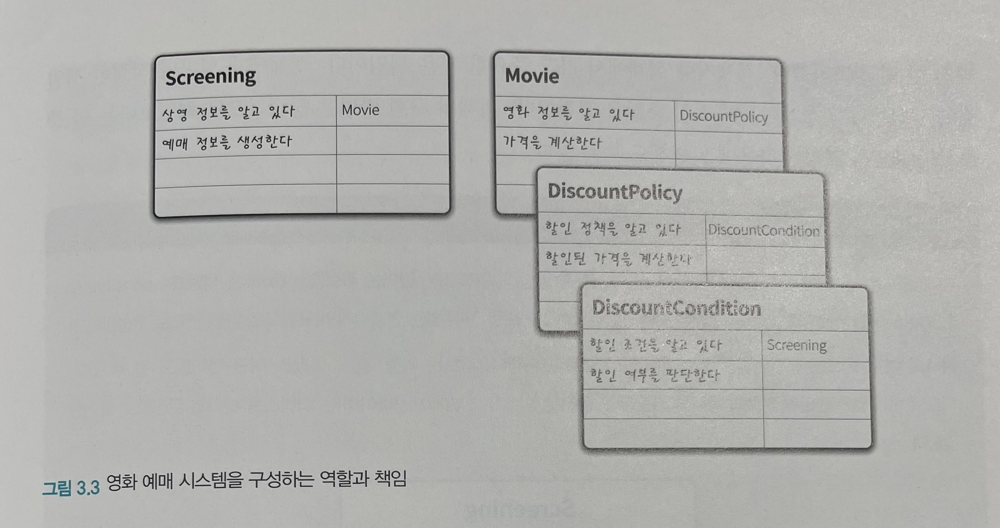
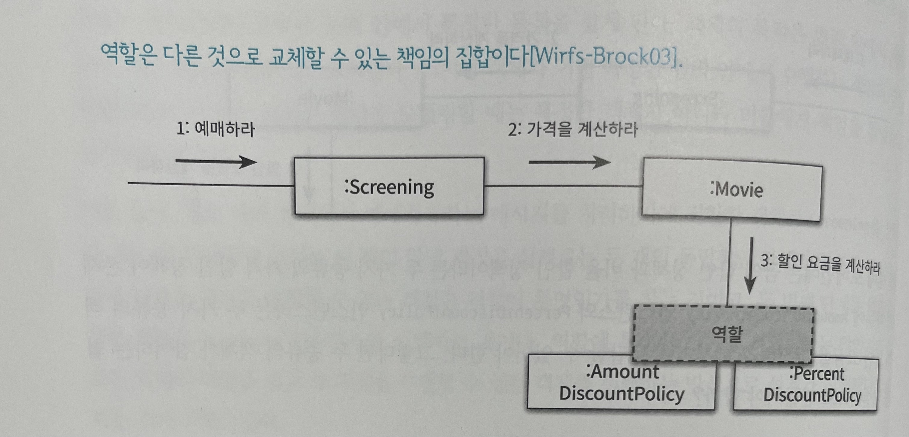
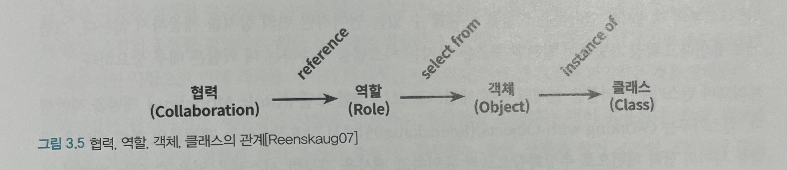
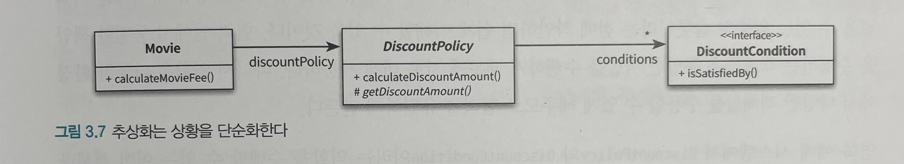
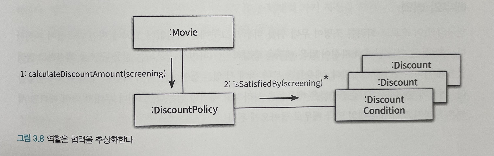

# Object (코드로 이해하는 객체지향 설계)

이 내용은 [오브젝트]을 읽으면서 정리한 내용을 포함하고 있습니다.

이번 주차의 정리할 내용은 다음과 같습니다.

- CHAPTER 03 역할, 책임, 협력
  - 01. 협력
  - 02. 책임
  - 03. 역할

## CHAPTER 03. 역할, 책임, 협력

- 객체지향 패러다임의 관점에서 핵심은 `역할(role)`, `책임(responsibility)`, `협력(collaboration)` 
- 객체지향의 본질은 협력하는 객체들의 공동체를 창조하는 것
  - 너무 이른 시기에 구현에 초점을 맞추는 것은 변경이 어렵고 유연하지 못한 코드를 낳는다.

### 01. 협력

#### 영화 예매 시스템 돌아보기

- 객체지향 원칙을 따르는 애플리케이션의 제어 흐름은 어떤 하나의 객체에 의해 통제되지 않고 다양한 객체들 사이에 균형 있게 분배
- 다양한 객체들이 메시지를 주고 받으면 상호작용

이것을 협력이라고 한다.

#### 협력

- 어떤 객체가 다른 객체에게 무엇인가를 요청하는 것
- 한 객체는 어떤 것이 필요할 때 다른 객체에게 전적으로 위임하거나 서로 협력, 즉 두 객체가 상호작용을 통해 더 큰 책임을 수행하는 것
- 객체 사이의 협력을 위해 사용하는 유일한 커뮤니케이션 수단은 `메시지 전송`
- 메시지를 수신한 객체를 `메서드` 를 실행해 요청에 응답

- Screening이 Movie에게 처리를 위임하는 이유는 요금을 계산하는 데 필요한 기본 요금과 할인 정책을 가장 잘 알고 있는 객체가 Movie이기 때문이다.
- 요금을 계산하는 작업을 Screening이 수행한다면 Movie의 인스턴스 변수인 fee와 discountPolicy에 직접 접근해야만 할 것이다.

##### 자율적인 객체

- 객체는 자율적인 존재로 자신의 상태를 직접 관리하고 스스로의 결정에 따라 행동하는 객체
- 자율성을 보장받기 위해서는 필요한 정보와 정보에 기반한 행동을 같은 객체안에 모아야 한다.
- 내부 구현을 캡슐화해야 한다.
- 자율적인 객체는 자신에게 할당된 책임을 수행하던 중에 필요한 정보를 알지 못하거나 외부의 도움이 필요한 경우 적절한 객체에게 메시지를 전송해서 협력을 요청한다.

#### 협력이 설계를 위한 문맥을 결정한다

- 객체지향에서 객체란, 상태와 행동을 함께 캡슐화하는 실행 단위
- 객체가 가질 수 있는 상태와 행동의 기준
  - 객체의 행동을 결정하는 것은 객체가 참여하고 있는 협력
    - 협력이 바뀌면 객체가 제공해야 하는 행동 역시 변경
  - 객체의 상태를 결정하는 것은 행동
    - `Movie` 객체가 변수로 `fee`, `discountPolicy` 를 포함하는 이유는 요금 계산이라는 행동을 수행하는 데 필요한 정보이기 때문
  - 상태는 객체가 행동하는 데 필요한 정보에 의해 결정되고 행동은 협력 안에서 객체가 처리할 메시지로 결정
  - 협력은 객체를 설계하는 데 필요한 일종의 문맥(context)을 제공

### 02. 책임

#### 책임이란 무엇인가

- 협력에 참여하기 위한 객체가 수행하는 행동
- 객체가 `무엇을 알고 있는가?` 와 `무엇을 할 수 있는가?` 로 구성
- 객체의 책임을 크게 `하는 것(doing)` 과 `아는 것(knowing)` 으로 세분화

하는 것

- 객체를 생성하거나 계산을 수행하는 등의 스스로 하는 것
- 다른 객체의 행동을 시작시키는 것
- 다른 객체의 활동을 제어하고 조절하는 것

아는 것

- 사적인 정보에 관해 아는 것
- 관련된 객체에 관해 아는 것
- 자신이 유도하거나 계산할 수 있는 것에 관해 아는 것

- 협력 안에서 객체에게 할당한 책임이 외부의 인터페이스와 내부의 속성을 결정

객체지향 개발에서 가장 중요한 능력은 책임을 능숙하게 소프트웨어 객체에 할당하는 것

#### 책임 할당

자율적인 객체를 만드는 가장 기본적인 방법은 책임을 수행하는 데 필요한 정보를 가장 잘 알고 있는 전문가에게 그 책임을 할당하는 것

객체에게 책임을 할당하기 위해서는 협력이라는 문맥을 정의한다.

예시 - 영화 예매 시스템

- `예매하라` 라는 이름의 메시지로 협력 시작
  - 메시지 선택 후 처리할 적절한 객체를 선택
    - 영화를 예매하기 위해서는 상영 시간과 기본 요금을 알아야 하기 때문에 이 정보를 소유하고 있거나 해당 정보의 소유자를 가장 잘 알고 있는 Screening을 선택
  - 하지만 Screening은 예매 가격을 계산하는데 필요한 정보를 충분히 알고 있지 않음 -> 가격 전문가가 아님
  - Screening이 외부의 객체에게 가격 계산을 요청해야 한다는 것을 의미
- `계산하라` 라는 새로운 메시지
  - 가격을 계산하는 데 필요한 정보를 가장 많이 알고 있는 Movie 선택
  - 하지만 Movie은 할인 요금을 계산하는 데 적절한 객체가 아님
- 이렇게 계속 반복적

#### 책임 주도 설계

- 어떤 책임을 선택하느냐가 전체적인 설계의 방향과 흐름을 결정
- 책임을 갖고 책임을 수행할 적절한 객체를 찾아 책임을 할당하는 방식으로 협력을 설계

방법

- 시스템이 사용자에게 제공해야 하는 기능인 시스템 책임을 파악한다.
- 시스템 책임을 더 작은 책임으로 분할한다.
- 분할된 책임을 수행할 수 있는 적절한 객체 또는 역할을 찾아 책임을 할당한다.
- 객체가 책임을 수행하는 도중 다른 객체의 도움이 필요한 경우 이를 책임질 적절한 객체 또는 역할을 찾는다.
- 해당 객체 또는 역할에게 책임을 할당함으로써 두 객체가 협력하게 한다.

협력이 책임을 이끌어내고 책임이 협력에 참여할 객체를 결정한다.

#### 메시지가 객체를 결정한다

두 가지 중요한 이유

- 객체가 최소한의 인터페이스를 가질 수 있게 된다.
- 객체는 충분히 추상적인 인터페이스를 가질 수 있게 된다.

#### 행동이 상태를 결정한다

객체의 행동은 객체가 협력에 참여할 수 있는 유일한 방법

- 객체가 협력에 적합한지를 결정하는 것은 그 객체의 상태가 아니라 행동
- 얼마나 적절한 객체를 창조했느냐는 얼마나 적절한 책임을 할당했느냐에 달려있고, 책임이 얼마나 적절한지는 협력에 얼마나 적절한가에 달려있다.

### 03. 역할

#### 역할과 협력

객체는 협력이라는 주어진 문맥 안에서 특정한 목적을 갖음
객체의 목적은 협력 안에서 객체가 맡게 되는 책임의 집합으로 표시
객체가 어떤 특정한 협력 안에서 수행하는 책임의 집합을 역할

ex) 영화 예매 협력에서 `예매하라`

- 메시지를 처리하기에 적합한 객체로 `Screening` 선택
- 두 개의 독립적인 단계가 합쳐짐
- 첫 번째 단계는 영화를 예매할 수 있는 적절한 역할이 무엇인가를 찾는 과정
- 두 번째 단계는 역할을 수행할 객체로 `Screening` 인스턴스를 선택

익명의 역할을 찾고 그 역할을 수행할 수 있는 객체를 선택하는 방식으로 설계가 진행됐다고 생각하는 것이 자연스러움

#### 유연하고 재사용 가능한 협력

역할이 중요한 이유

- 역할을 통해 유연하고 재사용 가능한 협력을 얻을 수 있기 때문
- 객체가 아닌 책임에 초점을 맞춰야 함

- 동일한 책임을 수행하는 역할을 기반으로 두 개의 협력을 하나로 통합할 수 있다는 것
- 역할을 이용하면 불필요한 중복 코드를 제거 가능

##### 역할의 구현

- 가장 일반적인 방법은 추상 클래스와 인터페이스를 사용하는 것
- 추상 클래스는 책임의 일부를 구현해 놓은 것
- 인터페이스는 일체의 구현 없이 책임의 집합만을 나열해 놓은 것
- 추상 클래스와 인터페이스는 동일한 책임을 수행하는 다양한 종류의 클래스들을 협력에 참여시킬 수 있는 확장 포인트를 제공

역할이 다양한 종류의 객체를 수용할 수 있는 일종의 슬롯이자 구체적인 객체들의 타입을 캡슐화하는 추상화
협력 안에서 역할이 어떤 책임을 수행해야 하는지를 결정하는 것이 중요하며 역할을 구현하는 방법은 그다음 문제
객체에게 중요한 것은 행동이며, 역할은 객체를 추상화해서 객체 자체가 아닌 협력에 초점을 맞출 수 있게 함

#### 객체 대 역할

협력에 적합한 책임을 수행하는 대상이 한 종류라면 간단하게 객체로 간주하며, 여러 종류의 객체들이 참여할 수 있다면 역할로 부른다.

역할을 가리켜 실행되는 동안 협력 안에서 각자의 위치를 가지는 객체들에 대한 별칭이라고 정의하기도 한다.

중요한 것은 협력을 구체적인 객체가 아니라 추상적인 역할의 관점에서 설계하면 협력이 유연하고 재사용 가능해진다는 것이다. 따라서 역할의 가장 큰 장점은 설계의 구성 요소를 추상화할 수 있다는 것이다.

#### 역할과 추상화

추상화를 이용한 설계가 가질 수 있는 두 가지 장점

- 추상화 계층만을 이용하면 중요한 정책을 상위 수준에서 단순화할 수 있다는 것
- 설계가 좀 더 유연해진다는 것

##### 중요한 정책을 단순화

- 추상화는 상황을 단순화한다.
- 협력에 참여하는 할인 정책과 할인 조건의 종류는 중요하지 않으며, 구체적인 할인 정책과 조건이 자리를 대체할 것이라는 것만 알고 있어도 충분하다.

- 역할은 협력을 추상화한다.
- 역할이 중요한 이유는 동일한 협력을 수행하는 객체들을 추상화할 수 있기 때문이다.
- 역할을 사용하면 장황한 정책과 규칙들을 설명할 필요 없이 `할인 정책과 여러 개의 할인 조건을 적용한다` 로 줄여서 표현 가능하다.

##### 설계 유연성

역할은 다양한 환경에서 다양한 객체들을 수용할 수 있게 해주므로 협력을 유연하게 만든다.

- 다양한 종류의 할인 정책과 할인 조건에도 적용될 수 있는 협력을 만들었다는 것을 의미
- 협력 안에서 역할이라는 추상화를 이용하면 기존 코드를 수정하지 않고도 새로운 행동을 추가 가능

프레임워크나 디자인 패턴과 같이 재사용 가능한 코드나 설계 아이디어를 구성하는 핵심적인 요소가 바로 역할이다.

#### 배우와 배역

연극 안에서 배역을 연기하는 배우라는 은유는 협력 안에서 역할을 수행하는 객체라는 관점이 가진 입체적인 측면들이 존재한다.

- 협력은 연극과 동일하고 코드는 극본과 동일하다.
- 배우는 연극이 상영될 때 배역이라는 특정한 역할을 연기한다.
- 객체는 협력이라는 실행 문맥 안에서 특정한 역할을 수행한다.
- 연극 배우는 연극이 끝나면 자신의 배역을 잊고 원래의 자기 자신을 되찾는다. 
- 객체는 협력이 끝나고 협력에서의 역할을 잊고 원래의 객체로 돌아올 수 있다.

객체는 다양한 역할을 가질 수 있다.

- 협력에 참여할 때 협력 안에서 하나의 역할로 보여진다. 
- 객체가 다른 협력에 참여할 때는 다른 역할로 보여진다. 
- 협력의 관점에서 동일한 역할을 수행하는 객체들은 서로 대체 가능하다.