# Object (코드로 이해하는 객체지향 설계)

이 내용은 [오브젝트]을 읽으면서 정리한 내용을 포함하고 있습니다.

이번 주차의 정리할 내용은 다음과 같습니다.

- CHAPTER 04 설계 품질과 트레이드 오프
  - 01. 데이터 중심의 영화 예매 시스템
  - 02. 설계 트레이드 오프
  - 03. 데이터 중심의 영화 예매 시스템의 문제점
  - 04. 자율적인 객체를 향해
  - 05. 하지만 여전히 부족하다
  - 06. 데이터 중심 설계의 문제점
- 리팩토링 및 테스트 코드 결과
  - 리팩토링
  - 테스트 코드 결과

## CHAPTER 04 설계 품질과 트레이드 오프

객체지향 설계의 핵심은 역할, 책임, 협력

- 역할
  - 대체 가능한 책임의 집합
- 책임
  - 객체가 다른 객체와 협력하기 위해 수행하는 행동
- 협력
  - 애플리케이션의 기능을 구현하기 위해 메시지를 주고받는 객체들 사이의 상호작용

책임 주도 설계에서 가장 중요한 것은 책임이며, 객체지향 애플리케이션 전체의 품질을 결정하는 것

객체지향 설계란, 올바른 객체에게 올바른 책임을 할당하면서 낮은 결합도와 높은 응집도를 가진 구조를 창조하는 활동이다.

훌륭한 설계란

- 합리적인 비용 안에서 변경을 수용할 수 있는 구조를 만드는 것이다. 
- 적절한 비용 안에서 쉽게 변경할 수 있는 설계는 응집도가 높고 서로 느슨하게 결합돼 있는 요소로 구성된다.

결합도와 응집도를 합리적인 수준으로 유지할 수 있는 중요한 원칙

- 객체의 상태가 아니라 객체의 행동에 초점을 맞추는 것
- 객체를 단순히 데이터의 집합으로 바라보는 시각은 객체 내부 구현을 public interface에 노출시키는 결과를 낳게 됨

### 01. 데이터 중심의 영화 예매 시스템

객체지향 설계에서는 두 가지 방법은 이용해 시스템을 객체로 분할

- 상태를 분할의 중심축으로 삼는 방법
- 책임을 분할의 중심축으로 삼는 방법

데이터 중심의 관점 - 객체의 상태에 초점
책임 중심의 관점 - 객체의 행동에 초점

훌륭한 객체지향 설게는 데이터가 아니라 책임에 초점을 맞춰야 한다.

- 상태 변경은 인터페이스의 변경을 초래하며 이 인터페이스에 의존하는 모든 객체에게 변경의 영향이 퍼지게 됨
- 데이터에 초점을 맞추는 설계는 변경에 취약할 수 밖에 없음

#### 데이터를 준비하자

데이터 중심의 설계

- 객체 내부에 저장되는 데이터를 기반으로 시스템을 분할하는 방법

객체지향의 가장 중요한 원칙 - 캡슐화
이를 달성하기 위해 가장 간단한 방법

- 내부의 데이터를 반환하는 접근자 추가
- 데이터를 변경하는 수정자 추가

영화 예매 시스템을 위한 필요한 모든 데이터를 클래스로 구현

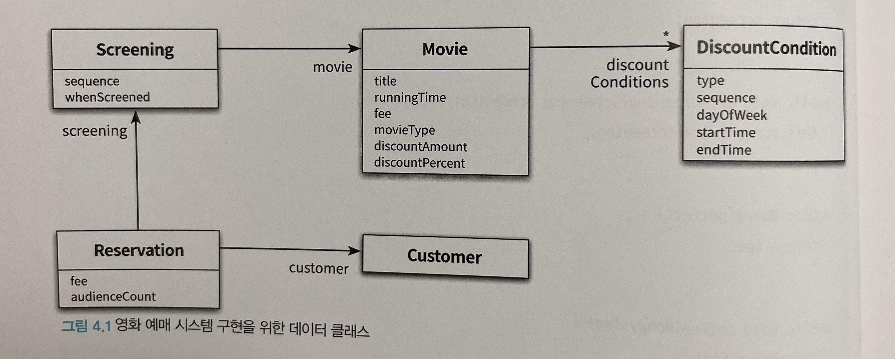

#### 영화를 예매하자

`ReservationAgency` 는 데이터 클래스들을 조합해서 영화 예매 절차를 구현하는 클래스

- `reserve` 메서드는 크게 두 부분으로 나뉨
  - DiscountCondition에 대해 루프를 돌면서 할인 가능 여부를 확인하는 for 문
  - discountable 변수의 값을 체크하고 적절한 할인 정책에 따라 예매 요금을 계산하는 if 문

### 02. 설계 트레이드 오프

#### 캡슐화

- 상태와 행동을 하나의 객체 안에 모으는 이유는 객체의 내부 구현을 외부로부터 감추기 위함
- 객체를 사용하면 변경 가능성이 높은 부분은 내부에 숨기고 외부에는 상대적으로 안정적인 부분만 공개함으로써 변경의 여파를 통제 가능
- 변경될 가능성이 높은 부분을 `구현` 이라고 부르고 상대적으로 안정적인 부분을 `인터페이스`
- 객체지향에서 가장 중요한 원리는 `캡슐화`, 불안정한 구현 세부사항을 안정적인 인터페이스 뒤로 캡슐화하는 것

Q. 객체 내부에 무엇을 캡슐화해야 하는가?

- 변경될 수 있는 어떤 것이라도 캡슐화해야 한다.
- 객체지향 설계의 핵심

#### 응집도와 결합도

응집도

- 모듈에 포함된 내부 요소들이 연관돼 있는 정도를 나타냄
- 모듈 내의 요소들이 하나의 목적을 위해 긴밀하게 협력한다면 그 모듈은 높은 응집도를 가짐

결합도

- 의존성의 정도를 나타내며 다른 모듈에 대해 얼마나 많은 지식을 갖고 있는지를 나타내는 척도
- 어떤 모듈이 다른 모듈에 대해 너무 자세한 부분까지 알고 있다면 두 모듈은 높은 결합도를 가짐

좋은 설계

- 높은 응집도
- 낮은 결합도

Q. 높은 응집도와 낮은 결합도를 가진 설계를 추구해야 하는 이유는?

- 설계를 변경하기 쉽게 만들기 때문
- 변경의 관점에서 응집도란, 변경이 발생할 때 모듈 내부에서 발생하는 변경의 정도
- 변경의 관점에서 결합도란, 한 모듈이 변경되기 위해서 다른 모듈의 변경을 요구하는 정도

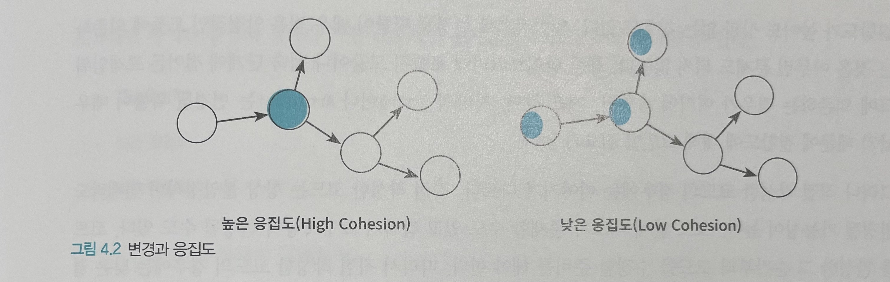

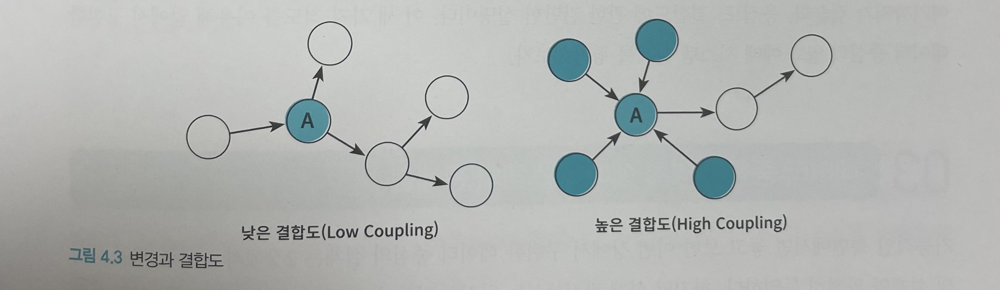

클래스의 구현이 아닌 인터페이스에 의존하도록 코드를 작성해야 낮은 결합도를 얻을 수 있다.

결합도가 높아도 상관 없는 경우

- 일반적으로 변경될 확률이 매우 적은 안정적인 모듈에 의존하는 경우
- 표준 라이브러리에 포함된 모듈 또는 성숙 단계 접어든 프레임워크에 의존하는 경우
- ex) 자바의 String 또는 ArrayList는 변경될 확률이 매우 낮음

직접 작성하는 코드의 경우에는 이야기가 다름

- 불안정
- 언제라도 변경 가능성
- 코드안에 버그 존재 가능성
- 요구사항 변경
- 코드를 완성한 순간부터 코드를 수정할 준비를 해야 함

### 03. 데이터 중심의 영화 예매 시스템의 문제점

데이터 중심의 설계가 가진 대표적인 문제점

- 캡슐화 위반
- 높은 결합도
- 낮은 응집도

#### 캡슐화와 위반

`Movie` 클래스

- 접근자와 수정자 메서드를 객체 내부의 상태에 대한 어떤 정보도 캡슐화하지 못함
  - ex) fee - getFee 메서드와 setFee 메서드
- 캡슐화의 원칙을 어기게 된 근본적인 원인은 객체가 수행할 책임이 아니라 내부에 저장할 데이터에 초점을 맞췄기 때문

캡슐화의 원칙을 위반하는 변경에 취약한 설계를 얻게 된다.

#### 높은 결합도

- 접근자와 수정자를 통해 내부 구현을 인터페이스의 일부로 만들기 때문에 캡슐화를 위반
- 여러 데이터 객체들을 사용하는 제어 로직이 특정 객체 안에 집중되기 때문에 하나의 제어 객체가 대수의 데이터 객체에 강하게 결합된다는 것

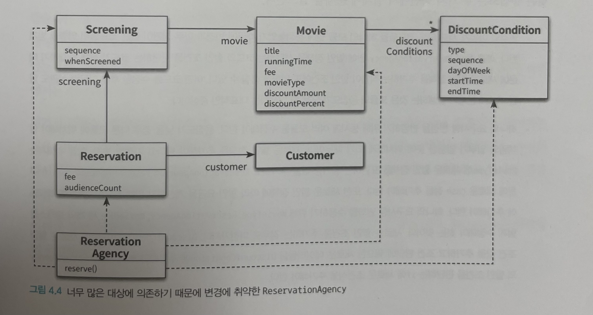

#### 낮은 응집도

- 서로 다른 이유로 변경되는 코드가 하나의 모듈 안에 공존할 때 모듈의 응집도가 낮다고 말한다.
- 각 모듈의 응집도를 살펴보기 위해서는 코드를 수정하는 이유가 무엇인지 살펴봐야 한다.

낮은 응집도의 두 가지 측면에서 설계 문제

- 변경의 이유가 서로 다른 코드들을 하나의 모듈 안에 뭉쳐놓았기 때문에 변경과 아무 상관 없는 코드들이 영향을 받게 된다.
- 하나의 요구사항 변경을 반영하기 위해 동시에 여러 모듈을 수정해야 한다. 응집도가 낮을 경우 다른 모듈에 위치해야 할 책임의 일부가 엉뚱한 곳에 위치하게 되기 때문이다.

어떤 요구사항 변경을 수용하기 위해 하나 이상의 클래스를 수정해야 하는 것은 설계의 응집도가 낮다는 증거이다.

##### 단일 책임 원칙(SRP)

- 클래스는 단 한 가지의 변경 이유만 가져야 한다.
- 책임 = 변경의 이유

### 04. 자율적인 객체를 향해

#### 캡슐화를 지켜라

객체는 스스로의 상태를 책임져야 하며 외부에서는 인터페이스에 정의된 메서드를 통해서만 상태에 접근할 수 있어야 한다.

- 여기서 객체에게 의미 있는 메서드는 객체가 책임져야 하는 무언가를 수행하는 메서드
- 속성의 접근 제어자를 private으로 설정했다고 해도 접근자와 수정자를 통해 속성을 외부로 제공하고 있다면 캡슐화를 위반

##### 사각형을 표현하는 클래스

```java
class Rectangle {

    private int left;
    private int top;
    private int right;
    private int bottom;

    public Rectangle(final int left, final int top, final int right, final int bottom) {

        this.left = left;
        this.top = top;
        this.right = right;
        this.bottom = bottom;
    }
    public int getLeft() {
        return left;
    }
    public void setLeft(final int left) {
        this.left = left;
    }
    public int getTop() {
        return top;
    }
    public void setTop(final int top) {
        this.top = top;
    }
    public int getRight() {
        return right;
    }
    public void setRight(final int right) {
        this.right = right;
    }
    public int getBottom() {
        return bottom;
    }
    public void setBottom(final int bottom) {
        this.bottom = bottom;
    }
}
```

- 사각형의 너비와 높이를 증가시키는 코드가 필요한 경우에는 외부의 어떤 클래스 안에 다음과 구현될 가능성 있음

```java
class AnyClass {
    void anyMethod(Rectangle rectangle, int multiple) {
        rectangle.setRight(rectangle.getRight() * multiple);
        rectangle.setBottom(rectangle.getBottom() * multiple);
    }
}
```

- 코드 중복 발생할 확률 높음
- 변경에 취약하다는 점

해결 방법은 간단하다. Rectangle 내부에 너비와 높이를 조절하는 로직을 캡슐화

#### 스스로 자신의 데이터를 책임지는 객체

- 이 객체가 어떤 데이터를 포함해야 하는가?
- 이 객체가 데이터에 대해 수행해야 하는 오퍼레이션은 무엇인가?

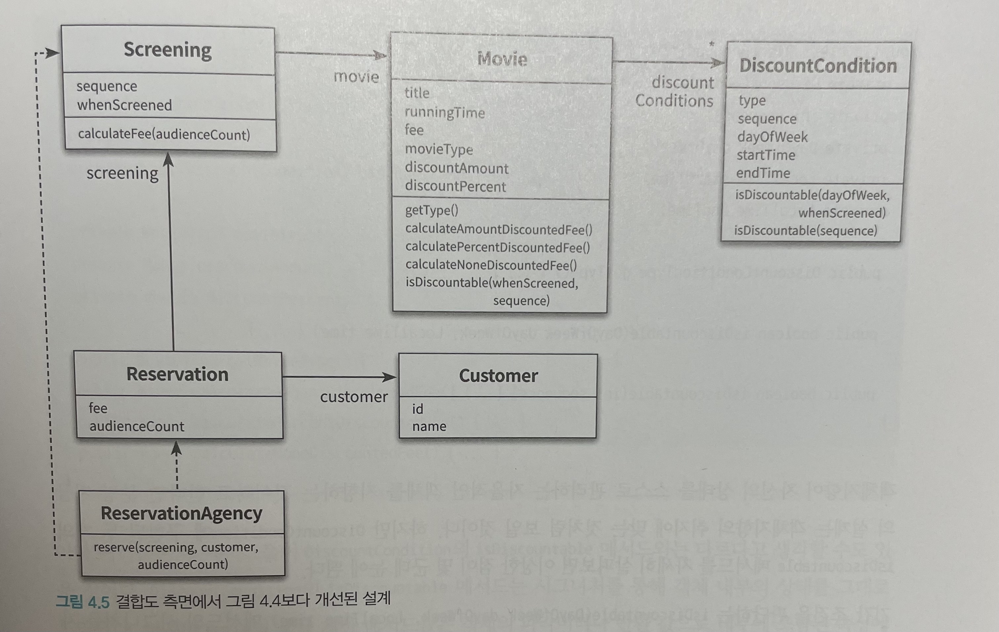

### 05. 하지만 여전히 부족하다

첫 번째 설계보다 두 번째 설계가 향상된 것은 사실이지만 만족스러울 정도는 아니다.

리팩토링 영역에서 추가할 예정

#### 캡슐화 위반

- DiscountCondition의 속성을 변경해야 한다면 어떻게 될까?
  - 지금은 순번 조건과 기간 조건 밖에 없지만 조건이 추가된다면 어떻게 해야 할까?

- Movie의 새로운 할인 정책이 추가되거나 제거되다면 어떻게 될 것인가?
  - 지금은 금액 할인 정책, 비율 할인 정책, 미적용 밖에 없지만 정책이 추가된다면 어떻게 해야 할까?

이 메서드들에 의존하는 모든 클래스들이 영향을 받게 될 것이다. 즉, 내부 구현을 성공적으로 캡슐화하지 못한다.

#### 높은 결합도

두 객체 사이에 결합도가 높을 경우 한 객체의 구현을 변경할 때 다른 객체에게 변경의 영향이 전파될 확률이 높아진다는 사실을 기억해야 한다.

- DiscountCondition의 기간 할인 조건의 명칭이 PERIOD에서 다른 값으로 변경된다면 Movie를 수정해야 한다.
- DiscountCondition의 종류가 추가되거나 삭제된다면 Movie 안의 if ~ else 구문을 수정해야 한다.

#### 낮은 응집도

하나의 변경을 수용하기 위해 코드의 여러 곳을 동시에 변경해야 한다는 것은 설계의 응집도가 낮다는 것이다.

- 할인 조건의 종류를 변경하기 위해서는 DiscountCondition, Movie, 그리고 Movie를 사용하는 Screening을 함께 수정해야 한다.

### 06. 데이터 중심 설계의 문제점

- 데이터 중심의 설계는 본질적으로 너무 이른 시기에 데이터에 관해 결정하도록 강요한다.
- 데이터 중심의 설계에서는 협력이라는 문맥을 고려하지 않고 객체를 고립시킨 채 오퍼레이션을 결정한다.

#### 데이터 중심 설계는 객체의 행동보다는 상태에 초점을 맞춘다

- 데이터 중심의 설계는 너무 이른 시기에 데이터에 대해 고민하기 때문에 캡슐화에 실패하게 된다.
- 객체의 내부 구현이 객체의 인터페이스를 어지럽히고 객체의 응집도와 결합도에 나쁜 영향을 미치기 때문에 변경에 취약한 코드를 낳게 된다.

#### 데이터 중심 설계는 객체를 고립시킨 채 오퍼레이션을 정의하도록 만든다

- 객체의 구현이 이미 결정된 상태에서 다른 객체와의 협력 방법을 고민하기 때문에 이미 구현된 객체의 인터페이스를 억지로 끼워맞출수밖에 없다.

## 리팩토링

Movie 클래스에서 내부 구현을 인터페이스로 노출시키고 있는 부분을 리팩토링하였다.

구조는 다음과 같다.

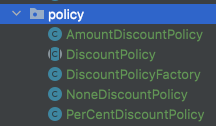

- 팩토리 패턴 : `DiscountPolicyFactory`
- 추상 클래스 : `DiscountPolicy`
- 구현 클래스 : `AmountDiscountPolicy`, `PerCentDiscountPolicy`, `NoneDiscountPolicy`

### 팩토리 패턴

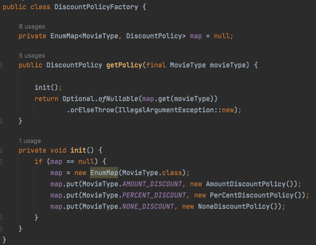

- 팩토리 패턴을 통해 영화의 타입의 따라서 할인 정책 클래스를 로드
- 추가로 리팩토링한다면 MovieType의 따른 정책 클래스를 로드할 수 있도록 자동화 필요

### 추상 클래스


- 할인 계산과 영화 타입 조회의 공통 영역을 추상 메소드로 설계하였다.

### 구현 클래스

각 할인 정책의 따른 세부 구현 클래스를 설계하였다.

#### 금액 할인 정책

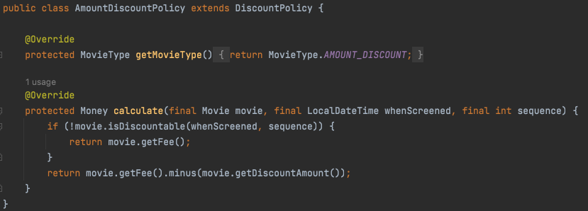

#### 비율 할인 정책

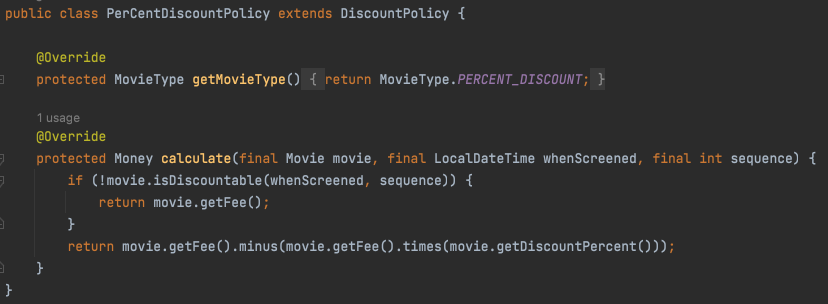

#### 미적용 정책

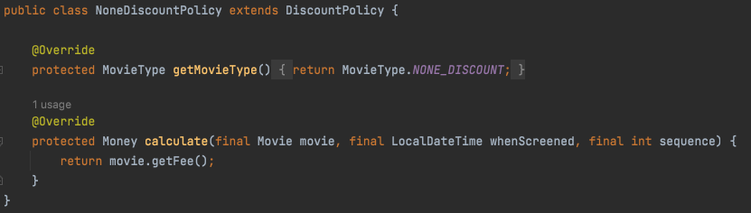

- 추가로 리팩토링한다면 미적용 정책의 경우 `fee` 만 필요하기 때문에 파라미터 변경 필요

할인 정책이 변경되거나, 새로운 할인 정책이 나와도 다른 클래스의 영향을 최소한으로 주게 된다.

## 테스트 코드 결과

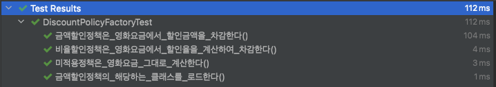

- 자세한 내용은 소스 참고

## 그 외

enum을 활용한 방법도 생각하였지만, 정책 별로 로직을 따로 관리하는 것이 더 좋아 보였음

```java
public enum MovieType {

    AMOUNT_DISCOUNT {
        @Override
        Money apply(final Money fee, final Money discountAmount, final double discountPercent) {
            return fee.minus(discountAmount);
        }
    },

    PERCENT_DISCOUNT {
        @Override
        Money apply(final Money fee, final Money discountAmount, final double discountPercent) {
            return fee.minus(fee.times(discountPercent));
        }
    },

    NONE_DISCOUNT {
        @Override
        Money apply(final Money fee, final Money discountAmount, final double discountPercent) {
            return fee;
        }
    };

    abstract Money apply(final Money fee, final Money discountAmount, final double discountPercent);
}
```