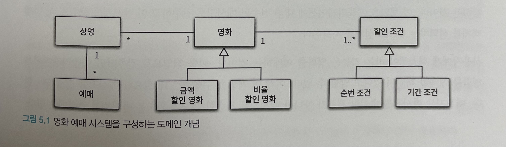
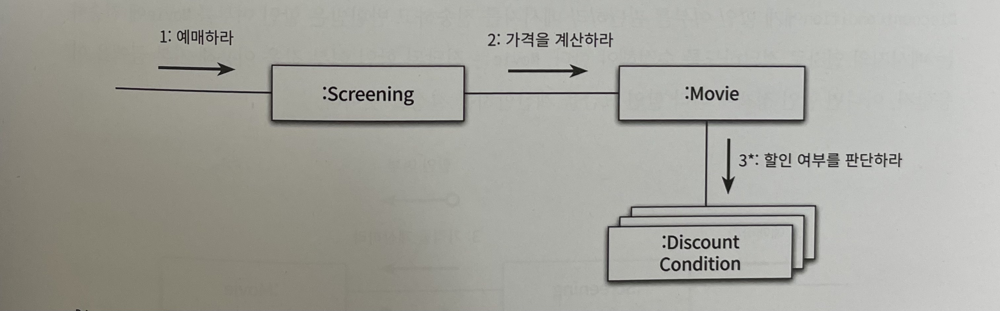
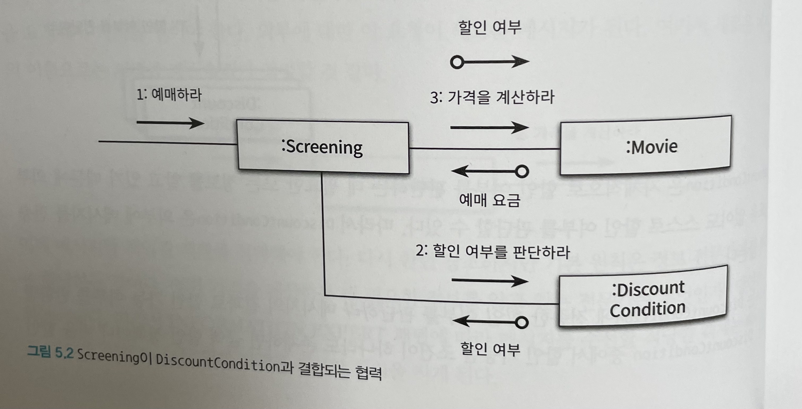
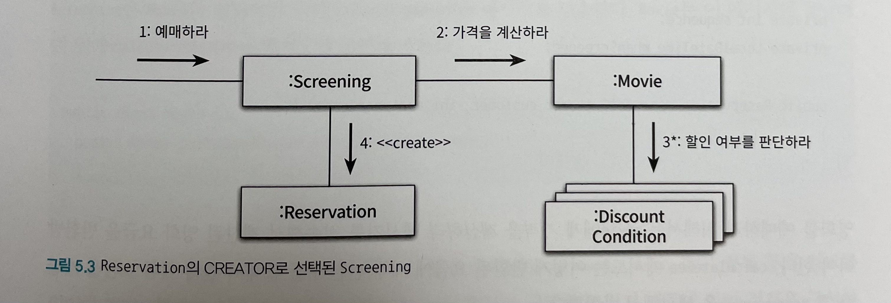
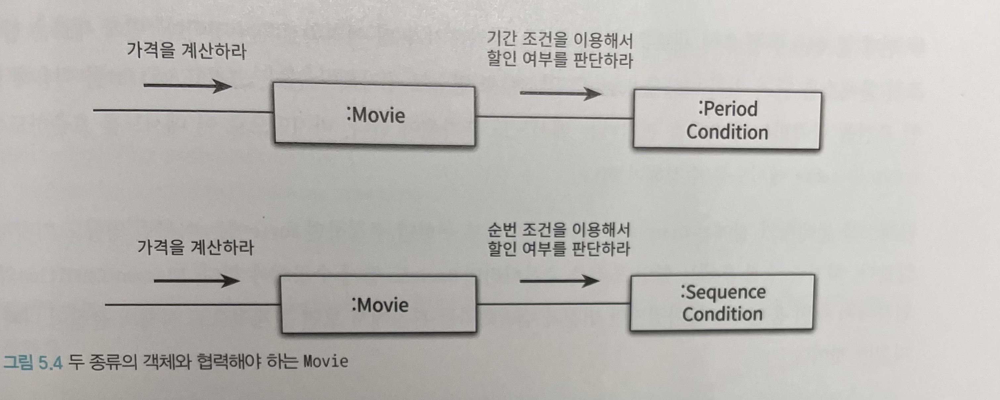
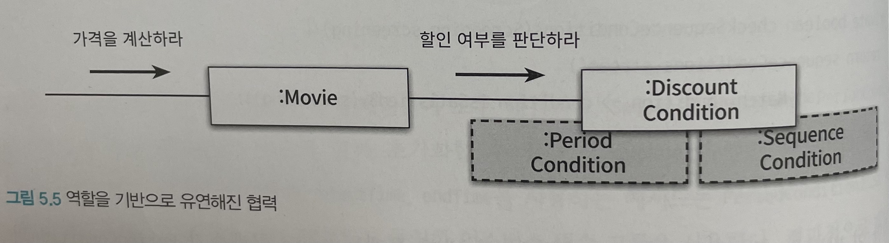
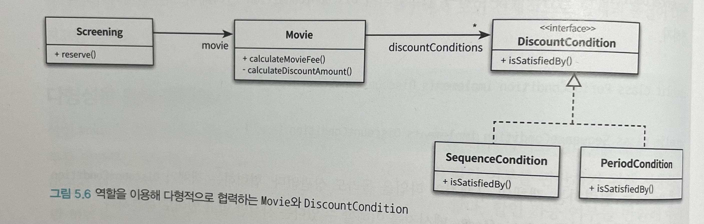
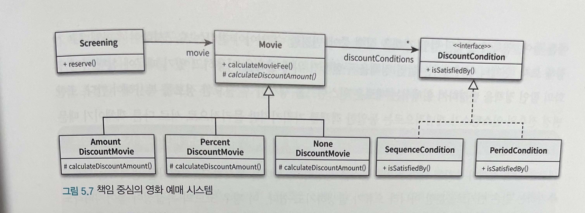
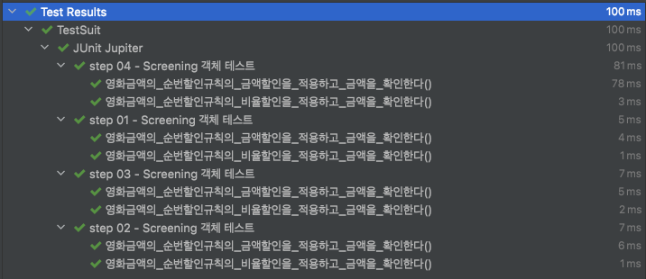

# Object (코드로 이해하는 객체지향 설계)

이 내용은 [오브젝트]을 읽으면서 정리한 내용을 포함하고 있습니다.

이번 주차의 정리할 내용은 다음과 같습니다.

- CHAPTER 05 책임 할당하기
  - 01. 책임 주도 설계를 향해
  - 02. 책임 할당을 위한 GRASP 패턴
  - 03. 구현을 통한 검증
  - 04. 책임 주도 설계의 대안
- 리팩토링 및 테스트 코드 결과
  - 테스트 코드 결과

## CHAPTER 05 책임 할당하기

데이터 중심 설계의 특징

- 행동보다 데이터를 먼저 결정
- 협력이라는 문맥을 벗어나 고립된 객체의 상태에 초점을 맞춤
- 캡슐화를 위반하기 쉬움
- 요소들 사이의 결합도가 높아짐
- 코드를 변경하기 어려움

즉, 책임의 초점을 맞추는 것이 문제를 해결할 수 있는 가장 기본적인 방법이다.
책임의 초점을 맞춰서 설계할 때 직면하는 가장 큰 어려움은 어떤 객체에게 어떤 책임을 할당할지를 결정하기가 쉽지 않다는 것이다.

여기서는 `GRASP 패턴`을 소개하고 이해하고 나면 응집도와 결합도, 캡슐화 같은 다양한 기준에 따라 책임을 할당하고 결과를 트레이드오프할 수 있는 기준을 배우게 될 것이다.

### 01. 책임 주도 설계를 향해

데이터 중심의 설계 -> 책임 중심의 설계로 전환하기 위한 원칙 2가지

- 데이터보다 행동을 먼저 결정하라
- 협력이라는 문맥 안에서 책임을 결정하라

#### 데이터보다 행동을 먼저 결정하라

- 객체에게 중요한 것은 데이터가 아니라 외부에 제공하는 행동
- 클라이언트 입장에서 객체가 수행하는 행동이란 곧 객체의 책임을 의미
- 데이터는 객체가 책임을 수행하는 데 필요한 재료를 제공하는 역할만 수행

데이터 중심의 설계

- 이 객체가 포함해야 하는 데이터가 무엇인가? 를 결정한 후
- 데이터를 처리하는 데 필요한 오퍼레이션은 무엇인가? 를 결정

책임 중심의 설계

- 이 객체가 수행해야 하는 책임은 무엇인가? 를 결정한 후
- 이 책임을 수행하는 데 필요한 데이터는 무엇인가? 를 결정

객체지향 설계에서 가장 중요한 것은 객체에게 적절한 책임을 할당하는 능력
그렇다면 객체에게 어떤 책임을 할당해야 하는가? 해결의 실마리는 `협력` 에서 찾을 수 있다.

#### 협력이라는 문맥 안에서 책임을 결정하라

객체에게 할당된 책임의 품질은 협력에 적합한 정도로 결정되는데, 할당된 책임이 협력에 어울리지 않는다면 그 책임은 나쁜 것이다.
협력에 적합한 책임을 수확하기 위해서는 객체를 결정한 후에 메시지를 선택하는 것이 아니라 메시지를 결정한 후에 객체를 선택해야 한다.

메시지는 클라이언트의 의도를 표현한다.
객체를 결정하기 전에 객체가 수신할 메시지를 먼저 결정한다.

#### 책임 주도 설계

- 시스템이 사용자에게 제공해야 하는 기능인 시스템 책임을 파악한다.
- 시스템 책임을 더 작은 책임으로 분할한다.
- 분할된 책임을 수행할 수 있는 적절한 객체 또는 역할을 찾아 책임을 할당한다.
- 객체가 책임을 수행하는 도중 다른 객체의 도움이 필요한 경우 이를 책임질 적절한 객체 또는 역할을 찾는다.
- 해당 객체 또는 역할에게 책임을 할당함으로써 두 객체가 협력하게 된다.

### 02. 책임 할당을 위한 GRASP 패턴

`GRASP 패턴` 

- General Responsibility Assignment Software Pattern(일반적인 책임 할당을 위한 소프트웨어 패턴)
- 객체에게 책임을 할당할 때 지침으로 삼을 수 있는 원칙의 집합을 패턴 형식으로 정리한 것

#### 도메인 개념에서 출발하기

어떤 책임을 할당해야 할 때 가장 먼저 고민해야 하는 유력한 후보는 바로 도메인 개념



- 설계를 시작하기 위해 참고할 수 있는 개념들의 모음 정도
- 중요한 것은 설계를 시작하는 것이며 도메인 개념들을 완벽하게 정리하는 것이 아니다.
- 도메인 개념을 정리하는 데 너무 많은 시간을 들이지 말고 빠르게 설계와 구현을 진행

#### 정보 전문가에게 책임을 할당하라

책임 주도 설계 방식의 첫 단계는 애플리케이션이 제공해야 하는 기능을 애플리케이션의 책임으로 생각하는 것이다.
이 책임을 애플리케이션에 대해 전송된 메시지로 간주하고 이 메시지를 책임질 첫 번째 객체를 선택하는 것으로 설계를 시작한다.

메시지는 메시지를 수신할 객체가 아니라 메시지를 전송할 객체의 의도를 반영해서 결정해야 한다.
첫 번째 질문은 다음과 같다.

영화 예매를 예로 보면, 

`메시지를 전송할 객체는 무엇을 원하는가?`

- 협력을 시작하는 객체는 미정이지만 이 객체가 원하는 것은 분명해 보인다.
- 영화를 예매하는 것
- 메시지의 이름으로는 `예매하라`가 적절

`메시지를 수신할 적합한 객체는 누구인가?`

- 책임을 수행할 정보를 알고 있는 객체에게 책임을 할당하는 것
- INFORMATION EXPERT(정보 전문가) 패턴

INFORMATION EXPERT 패턴에 따르면 예매하는 데 필요한 정보를 가장 많이 알고 있는 객체에게 `예매하라` 메시지를 처리할 책임을 할당해야 한다.

#### 높은 응집도와 낮은 결합도





- 첫 번째 설계는 Movie가 DiscountContion에 할인 여부를 판단하라 메시지를 전송
- 두 번째 설계는 첫 번째 설계의 대안으로 Movie 대신 Screening이 직접 DiscountCondition과 협력하게 하는 것은 어떨까?

첫 번째 설계를 선택하게 된 이유는 응집도와 결합도에 있다.

- 높은 응집도와 낮은 결합도는 객체에 책임을 할당할 때 항상 고려해야 하는 기본 원리
- 책임을 할당할 수 있는 다양한 대안들이 존재한다면 응집도와 결합도의 측면에서 더 나은 대안을 선택하는 것이 좋다.

##### LOW COUPLING 패턴

- 설계의 전체적인 결합도가 낮게 유지되도록 책임을 할당

##### HIGH COHESION 패턴

- 높은 응집도를 유지할 수 있게 책임을 할당

#### 창조자에게 객체 생성 책임을 할당하라

영화 예매 협력의 최종 결과물은 Reservation 인스턴스를 생성하는 것이다.

- 협력에 참여하는 어떤 객체에게는 Reservation 인스턴스를 생성할 책임이 할당해야 한다는 것을 의미한다.
- GRASP의 CREATOR(창조자) 패턴은 이 같은 경우에 사용할 수 있는 책임 할당 패턴으로서 객체를 생성할 책임을 어떤 객체에게 할당할지에 대한 지침을 제공

##### CREATOR 패턴

객체 A를 생성해야 할 때 어떤 객체에게 객체 생성 책임을 할당해야 하는가? 아래 조건을 최대한 많이 만족하는 B에게 객체 생성 책임을 할당하라.

- B가 A 객체를 포함하거나 참조한다.
- B가 A 객체를 기록한다.
- B가 A 객체를 긴밀하게 사용한다.
- B가 A 객체를 초기화하는 데 필요한 데이터를 가지고 있다(이 경우는 B는 A에 대한 정보 전문가다)



협력과 책임이 제대로 동작하는지 확인할 수 있는 유일한 방법은 코드를 작성하고 실행해 보는 것이다.

### 03. 구현을 통한 검증

#### DiscountCondition 개선하기

가장 큰 문제점은 변경에 취약한 클래스를 포함하고 있다는 것이다.

- 코드를 수정해야 하는 이유를 하나 이상 가지는 클래스

`DiscountCondition` 은 다음과 같은 이유로 변경 가능

- 새로운 할인 추가
- 순번 조건을 판단하는 로직 변경
- 기간 조건을 판단하는 로직이 변경되는 경우

```java
public enum DiscountConditionType {
    // 새로운 할인이 추가되면 DiscountCondition 수정이 필요하다
    SEQUENCE,       // 순번조건
    PERIOD          // 기간 조건
}

public class DiscountCondition {
    private DiscountConditionType type;
    private int sequence;
    private DayOfWeek dayOfWeek;
    private LocalTime startTime;
    private LocalTime endTime;

    public boolean isSatisfiedBy(Screening screening) {
      // 새로운 할인이 추가되면 DiscountCondition 수정이 필요하다
        if (type == DiscountConditionType.PERIOD) {
            return isSatisfiedByPeriod(screening);
        }

        return isSatisfiedBySequence(screening);
    }

    // 기간 조건을 판단하는 로직 변경이 필요하면 수정이 필요하다
    private boolean isSatisfiedByPeriod(Screening screening) {
        return dayOfWeek.equals(screening.getWhenScreened().getDayOfWeek()) &&
                startTime.compareTo(screening.getWhenScreened().toLocalTime()) <= 0 &&
                endTime.compareTo(screening.getWhenScreened().toLocalTime()) <= 0;
    }

    // 순번 조건을 판단하는 로직 변경이 필요하면 수정이 필요하다
    private boolean isSatisfiedBySequence(Screening screening) {
        return sequence == screening.getSequence();
    }
}
```

`DiscountCondition` 은 하나 이상의 변경 이유를 가지기 때문에 응집도가 낮다. 응집도가 낮다는 것은 서로 연관성이 없는 기능이나 데이터가 하나의 클래스 안에 뭉쳐져 있다는 것을 의미한다. 따라서 낮은 응집도가 초래하는 문제를 해결하기 위해서는 변경의 이유에 따라 클래스를 분리해야 한다.

코드를 통해 변경의 이유를 파악할 수 있는 방법

- 인스턴스 변수가 초기화 되는 시점
  - 응집도가 높은 클래스는 인스턴스를 생성할 때 모든 속성을 함께 초기화
  - 응집도가 낮은 클래스는 객체의 속성 중 일부만 초기화하고 일부는 초기화되지 않은 상태로 남겨둠
  - `함께 초기화되는 속성을 기준으로 코드를 분리해야 한다.`
- 메서드들이 인스턴스 변수를 사용하는 방식
  - 모든 메서드가 객체의 모든 속성을 사용한다면 클래스의 응집도는 높다고 볼 수 있음
  - 메서드들이 사용하는 속성에 따라 그룹이 나뉜다면 클래스의 응집도가 낮다고 볼 수 있음
  - 속성 그룹과 해당 그룹에 접근하는 메서드 그룹을 기준으로 코드를 분리해야 한다.

##### 클래스 응집도 판단하기

클래스 응집도가 낮은 신호

- 클래스가 하나 이상의 이유로 변경돼야 한다면 응집도가 낮은 것, 변경의 이유를 기준으로 클래스를 분리하라
- 클래스의 인스턴스를 초기화하는 시점에 경우에 따라 서로 다른 속성들을 초기화하고 있다면 응집도가 낮은 것이다. 초기화되는 속성의 그룹을 기준으로 클래스를 분리하라
- 메서드 그룹이 속성 그룹을 사용하는지 여부로 나뉜다면 응집도가 낮은 것이다. 이들 그룹을 기준으로 클래스를 분리하라

#### 타입 분리하기

`DiscountCondition`의 가장 큰 문제는 순번 조건과 기간 조건이라는 두 개의 독립적인 타입이 하나의 클래스 안에 공존하고 있다는 점이다.

- 가장 간단한 방법은 클래스 분리
  - 클래스 분리로 인한 `Movie` 클래스가 2개의 클래스를 의존하는 상황
- 전체적으로 응집도는 높아졌지만 변경과 캡슐화라는 관점에서 보면 전체적으로 설계의 품질이 나빠짐



#### 다형성을 통해 분리하기

`Movie` 입장에서는 둘 모두 할인 여부를 판단하는 동일한 책임을 수행



객체의 암시적인 타입에 따라 행동을 분기해야 한다면 암시적인 타입을 명시적인 클래스로 정의하고 행동을 나눔으로써 응집도 문제를 해결할 수 있다.
다시 말해 객체의 타입에 따라 변하는 행동이 있다면 타입을 분리하고 변화하는 행동을 각 타입의 책임으로 할당하라는 것이다.



##### POLYMORPHISM 패턴

- 타입을 명시적으로 정의하고 각 타입에 다형적으로 행동하는 책임을 할당
- 객체의 타입을 검사해서 타입에 따라 여러 대안들을 수행하는 조건적인 논리를 사용하지 말라고 경고
- 대신 다형성을 이용해 새로운 변화를 다루기 쉽게 확장하라고 권고

#### 변경으로부터 보호하기

Movie의 관점에서 DiscountCondition의 타입이 캡슐화된다는 것은 새로운 DiscountCondition 타입을 추가하더라도 Movie가 영향을 받지 않는다는 것을 의미한다.

변경을 캡슐화하도록 책임을 할당하는 것을 GRASP에서는 PROTECTED VARIATIONS(변경 보호) 패턴이라고 부른다.

클래스를 변경에 따라 분리하고 인터페이스를 이용해 변경을 캡슐화하는 것은 설계의 결합도와 응집도를 향상시키는 매우 강력한 방법이다.

- 하나의 클래스가 여러 타입의 행동을 구현하고 있는 것처럼 보인다면 클래스를 분해하고 POLYMORPHISM 패턴에 따라 책임을 분산
- 예측 가능한 변경으로 인해 여러 클래스들이 불안정해진다면 PROTECTED VARIATIONS 패턴에 따라 안정적인 인터페이스 뒤로 변경을 캡슐화

#### Movie 클래스 개선하기

Movie의 경우, 금액 할인 정책 영화와 비율 할인 정책 영화하는 두 가지 타입을 하나의 클래스 안에 구현하고 있기 때문에 하나 이상의 이유로 변경 가능 -> 응집도가 낮음

역활의 개념을 도입해서 협력을 다형적으로 만들면 된다.



#### 변경와 유연성

개발자로서 변경에 대비할 수 있는 두 가지 방법이 있다.

- 하나는 코드를 이해하고 수정하기 쉽도록 최대한 단순하게 설계하는 것
- 하나는 코드를 수정하지 않고도 변경을 수용할 수 있도록 코드를 더 유연하게 만드는 것

`일단 절차형 코드로 실행되는 프로그램을 빠르게 작성한 후 완성된 코드를 객체지향적인 코드로 변경하는 것이다.`

### 04. 책임 주도 설계의 대안

책임과 객체 사이에서 방황할 때 돌파구를 찾기 위해 선택하는 방법은 최대한 빠르게 목적한 기능을 수행하는 코드를 작성하는 것이다.

주의할 점은 코드를 수정한 후에 겉으로 드러나는 동작이 바뀌어서는 안 된다는 것이다.
캡슐화를 항상 시키고, 응집도를 높이고, 결합도를 낮춰야 하지만 동작은 그대로 유지해야 한다.

이처럼 이해하기 쉽고 수정하기 쉬운 소프트웨어로 개선하기 위해 겉으로 보이는 동작은 바꾸지 않은 채 내부 구조를 변경하는 것을 리팩터링 이라고 한다.

#### 메서드 응집도

현재 영화 예매를 처리하는 모든 절차는 ReservationAgency에 집중되어 있다.

- 어떤 일을 수행하는지 한눈에 파악하기 어렵기 때문에 코드를 전체적으로 이해하는 데 너무 많은 시간이 걸린다.
- 하나의 메서드 안에서 너무 많은 작업을 처리하기 때문에 변경이 필요할 때 수정해야 할 부분을 찾기 어렵다.
- 메서드 내부의 일부 로직만 수정하더라도 메서드의 나머지 부분에서 버그가 발생할 확률이 높다.
- 로직의 일부만 재사용하는 것이 불가능하다.
- 코드를 재사용하는 유일한 방법은 원하는 코드를 복사해서 붙여넣는 것뿐이므로 코드 중복을 초래하기 쉽다.

한마디로 말해서 긴 메서드는 응집도가 낮기 때문에 이해하기도 어렵고 재사용하기도 어려우며 변경하기도 어렵다.

어떻게 해야 할까?

- 클래스가 작고, 목적이 명확한 메서드들로 구성돼 있다면 변경을 처리하기 위해 어떤 메서드를 수정해야 하는지를 쉽게 판단할 수 있다.
- 또한 메서드의 크기가 작고 목적이 분명하기 때문에 재사용하기도 쉽다. 

#### 객체를 자율적으로 만들자

어떤 메서드를 어떤 클래스로 이동시켜야 할까?

- 자신이 소유하고 있는 데이터를 자기 스스로 처리하도록 만드는 것이 자율적인 객체를 만드는 지름길이다.

책임 주도 설계 방법에 익숙하지 않다면 일단 데이터 중심으로 구현한 후 이를 리팩터링하더라도 유사한 결과를 얻을 수 있다는 것이다.

## 테스트 코드 결과

기본 코드에서 변경되는 코드에 대해서 테스트 코드 작성

- step 01 : 기본 코드
- step 02 : DiscountCondition 개선하기
- step 03 : 타입 분리하기
- step 04 : 다형성을 통해 분리하기

할인 정책의 따른 영화를 예매하는 행동에 대한 테스트 코드 작성을 위해서 `Screening` 의 대한 테스트 코드만 작성

