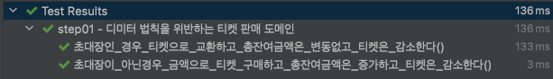
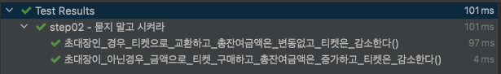
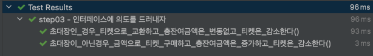
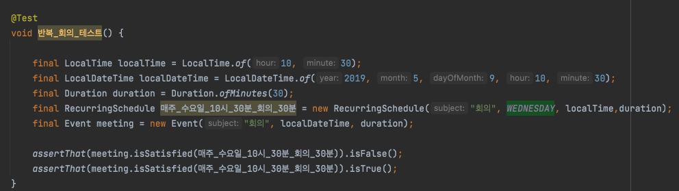
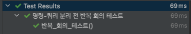
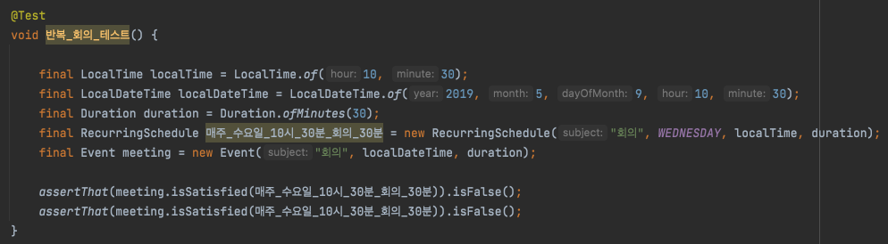
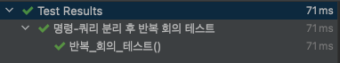

# Object (코드로 이해하는 객체지향 설계)

이 내용은 [오브젝트]을 읽으면서 정리한 내용을 포함하고 있습니다.

이번 주차의 정리할 내용은 다음과 같습니다.

- CHAPTER 06 메시지와 인터페이스
  - 01. 협력과 메시지
  - 02. 인터페이스와 설계 품질
  - 03. 원칙의 함정
  - 04. 명령-쿼리 분리 원칙
- 테스트 코드 결과

## CHAPTER 06 메시지와 인터페이스

- 클래스는 도구다.
- 객체가 수신하는 메시지들이 객체의 퍼블릭 인터페이스를 구성한다.
  - 훌륭한 퍼블릭 인터페이스를 얻기 위해서는 책임 주도 설계 방법을 따르는 것만으로 부족하다.
  - 유연하고 재사용 가능한 퍼블릭 인터페이스를 만드는 데 도움이 되는 설계 원칙과 기법을 익히고 적용해야 한다.

### 01. 협력과 메시지

#### 클라이언트-서버 모델

협력의 관점에서 객체는 두 가지 종류의 메시지 집합으로 구성

- 하나는 객체가 수신하는 메시지의 집합
- 하나는 외부의 객체에게 전송하는 메시지의 집합

#### 메시지와 메시지 전송

메시지

- 객체들이 협력하기 위해 사용할 수 있는 유일한 의사 소통
- 오퍼레이션명과 인자로 구성

메시지 전송

- 한 객체가 다른 객체에게 도움을 요청하는 것
- 오퍼레이션명과 인자, 메시지 수신자

ex)
condition.isSatisfiedBy(screening);

- condition : 수신자
- isSatisfiedBy : 오퍼레이션명
- screening : 인자

#### 메시지와 메서드

- 메시지와 메서드의 구분은 메시지 전송자와 메시지 수신자가 느슨하게 결합될 수 있게 한다
  - 메시지 전송자는 자신이 어떤 메시지를 전송해야 하는지만 알면 된다.
  - 수신자가 어떤 클래스의 인스턴스인지, 어떤 방식으로 요청을 처리하는지 모르더라도 원활한 협력이 가능하다.
  - 메시지 수신자 역시 누가 메시지를 전송하는지 알 필요가 없다.
  - 단지 메시지가 도착했다는 사실만 알면 된다.
- 실행 시점에 메시지와 메서드를 바인딩하는 메커니즘은 두 객체 사이의 결합도를 낮춤으로써 유연하고 확장 가능한 코드를 작성할 수 있게 만든다.

#### 퍼블릭 인터페이스와 오퍼레이션

퍼블릭 인터페이스

- 객체가 의사소통을 위해 외부에 공개하는 메시지 집합

오퍼레이션

- 프로그래밍 언어의 관점에서 퍼블릭 인터페이스에 포함된 메시지
- 수행 가능한 어떤 행동에 추상화
- 내부의 구현 코드는 제외하고 단순한 메시지와 관련된 시그니쳐를 가리키는 경우가 대부분

메서드

- 메시지를 수신했을 때 실제로 실행되는 코드

#### 시그니처

- 오퍼레이션(또는 메서드)의 이름과 파라미터 목록을 합침
- 실행 코드 없이 정의한 것
- 다형성의 축복을 받기 위해서는 하나의 오퍼레이션에 대해 다양한 메서드를 구현해야 한다.

##### 용어 정리

- 메시지
  - 객체가 다른 객체와 협력하기 위해 사용하는 의사소통 메커니즘
  - 협력에 참여하는 전송자와 수신자 양쪽 모두를 포함하는 개념
- 오퍼레이션
  - 객체가 다른 객체에게 제공하는 추상적인 서비스
  - 전송자와 수신자
- 메서드
  - 메시지에 응답하기 위해 실행되는 코드 블록
  - 오퍼레이션의 구현
- 퍼블릭 인터페이스
  - 객체가 협력에 참여하기 위해 외부에서 수신할 수 있는 메시지의 묶음
  - 클래스의 퍼블릭 메서드들의 집합이나 메시지의 집합을 가리키는 데 사용
  - 객체를 설계할 때 가장 중요한 것은 훌륭한 인터페이스를 설계하는 것 
- 시그니쳐
  - 오퍼레이션이나 메서드의 명셰를 나타낸 것으로, 이름과 인자의 목록을 포함

### 02. 인터페이스와 설계 품질

좋은 인터페이스

- 최소한의 인터페이스
  - 꼭 필요한 오퍼레이션만을 인터페이스에 포함
- 추상적인 인터페이스
  - 어떻게 수행하는지가 아니라 무엇을 하는지를 표현

-> 이러한 좋은 인터페이스를 설계할 수 있는 가장 좋은 방법은 책임 주도 설계 방법을 따르는 것

퍼블릭 인터페이스 설계 시 품질에 영향을 미치는 원칙과 기법

- 디미터 법칙
- 묻지 말고 시켜라
- 의도를 드러내는 인터페이스
- 명령-쿼리 분리

#### 디미터 법칙

- 협력하는 객체의 내부 구조에 대한 결합으로 인해 발생하는 설계 문제를 해결하기 위해 제안된 원칙
- `낯선 자에게 말하지 말라(don't talk to strangers)`
- `오직 인접한 이웃하고만 말하라(only talk to your immediate neighbors`)
- `오직 하나의 도트만 사용하라(use only on dot)`

##### 효과

- 객체들의 협력 경로를 제한하면 결합도를 효과적으로 낮출 수 있음
- 불필요한 어떤 것도 다른 객체에게 보여주지 않으며, 다른 객체의 구현에 의존하지 않는 코드를 작성
- 클래스를 캡슐화하기 위해서

##### 디미터의 법칙을 따르기 위해서 클래스가 특정한 조건을 만족하는 대상

- this 객체
- 메서드의 매게변수
- this의 속성
- this의 속성인 컬렉션의 요소
- 메서드 내에서 생성된 지역 객체

##### 예제

디미터의 법칙을 위반하는 코드

```java
screnning.getMovie().getDiscountConditions();
```

위반하는 코드를 변경

```java
screening.calculateFee(audienceCount);
```

#### 묻지 말고 시켜라

```
절차적인 코드는 정보를 얻은 후에 결정한다. 객체지향 코드는 객체에게 그것을 하도록 시킨다.
```

- 객체의 상태에 관해 묻지 말고 원하는 것을 시켜야 한다는 사실을 강조
- 객체가 어떻게 작업을 수행하는지를 노출하지 말고 무엇을 하는지를 서술

```
(중략)
이 스타일을 따르지 않을 경우 "기차 충돌(train work)"로 알려진, 일련의 getter들이 기차의 객차처럼 상호 연결되어 보이는 코드가 만들어지고 만다.
```

#### 의도를 드러내는 인터페이스

메서드 명명

첫번째, 메서드가 작업을 어떻게 수행하는지를 나타내도록 이름 짓는 것

```java
public class PeriodCondition {
    public boolean isSatisfiedByPeriod(Screening screening) { ... }
}

public class SequenceCondition {
    public boolean isSatisfiedBySequence(Screening screening) { ... }
}
```

- 메서드의 이름이 내부의 구현을 드러냄
- 메서드에 대해 제대로 커뮤니케이션하지 못함
  - 클라이언트의 관점에서 `isSatisfiedByPeriod`와 `isSatisfiedBySequence` 모두 할인 조건을 판단하는 동일한 작업을 수행
  - 메서드의 이름이 다르기 때문에 두 메서드의 내부 구현을 정확하게 이해하지 못한다면 두 메서드가 동일한 작업을 수행한다는 사실을 알아채기 어려움
- 메서드 수준에서 캡슐화를 위반
  - 할인 여부를 판단하는 방법이 변경되면 객체를 변경 및 메서드 변경해야 한다.

두번째, '어떻게'가 아니라 '무엇'을 하는지를 드러내는 것이다.

- 메서드의 구현이 한 가지인 경우에는 무엇을 하는지를 드러내는 이름을 짓는 것이 어려움
- 무엇을 하는지를 드러내는 이름은 코드를 읽고 이해하기 쉽게 만들뿐만 아니라 유연한 코드를 낳는 지름길

```java
public interface DiscountCondition {
    boolean isSatisfiedBy(Screening screening);
}

public class PeriodCondition implements DiscountCondition {
    public boolean isSatisfiedBy(Screening screening) { ... }
}

public class SequenceCondition implements DiscountCondition {
    public boolean isSatisfiedBy(Screening screening) { ... }
}
```

- 변경된 코드는(`isSatisfiedBy`) 동일한 목적을 가진다는 것을 메서드의 이름을 통해 명확하게 표현
- 클라이언트가 두 메서드를 가진 객체를 동일한 타입으로 간주할 수 있도록 동일한 타입 계층으로 묶음
  - 자바에서는 인터페이스(interface) 활용

이와 같은 메서드의 이름을 짓는 패턴을 `의도를 드러내는 선택자(Intention Revealing Selector`) 라고 한다.

`의도를 드러내느 선택자`를 인터페이스 레벨로 확장한 `의도를 드러내는 인터페이스`를 제시

- 구현과 관련된 모든 정보를 캡슐화하고 객체의 퍼블릭 인터페이스에는 협력과 관련된 의도만을 표현해야 한다는 것

아래는 책의 내용을 인용

```
하나의 구현을 가진 메시지의 이름을 일반화하도록 도와주는 간단한 훈련 방법을 소개하겠다. 매우 다른 두번째 구현을 상상하라. 그러고는 해당 메서드에 동일한 이름을 붙인다고 상상해보라. 그렇게 하면 아마도 그 순간에 여러분이 할 수 있는 한 가장 추상적인 이름을 메서드에 붙일 것이다.
```

```
(중략)
그러므로 수행 방법에 관해서는 언급하지 말고 결과와 목적만을 포함하도록 클래스와 오퍼레이션의 이름을 부여하라. 
(중략)
방법이 아닌 의도를 표현하는 추상적인 인터페이스 뒤로 모든 까다로운 매커니즘을 캡슐화해야 한다. 도메인의 퍼블릭 인터페이스에서는 관계와 규칙을 시행하는 방법이 아닌 이벤트와 규칙 그 자체만 명시한다.
```

#### 함께 모으기

##### 디미터 법칙을 위반하는 티켓 판매 도메인

Theater가 audience와 ticketSeller 내부에 포함된 객체에 직접 접근한다.

```java
public class Theater {
    private TicketSeller ticketSeller;

    public Theater(TicketSeller ticketSeller) {
        this.ticketSeller = ticketSeller;
    }

    public void enter(Audience audience) {
        if (audience.getBag().hasInvitation()) {
            Ticket ticket = ticketSeller.getTicketOffice().getTicket();
            audience.getBag().setTicket(ticket);
        } else {
            Ticket ticket = ticketSeller.getTicketOffice().getTicket();
            audience.getBag().minusAmount(ticket.getFee());
            ticketSeller.getTicketOffice().plusAmount(ticket.getFee());
            audience.getBag().setTicket(ticket);
        }
    }
}
```

Theater 클래스의 enter 메소드에서 발췌한 코드는 다음과 같다.

```java
audience.getBag().minusAmount(ticket.getFee());
```

디미터의 법칙을 위반하는 설계는 인터페이스와 구현의 분리 원칙을 위반

디미터 법칙을 위반한 코드를 수정하는 일반적인 방법은 Audience와 TicketSeller의 내부 구조를 묻는 대신 Audience와 TicketSeller가 직접 자신의 책임을 수행하도록 시키는 것이다.

##### 묻지 말고 시켜라

묻지 말고 시켜라 스타일을 따르는 퍼블릭 인터페이스 생성

##### 인터페이스에 의도를 드러내자

- 오퍼레이션의 이름은 협력이라는 문맥을 반영해야 한다.
- 클라이언트가 객체에게 무엇을 원하는지를 표현해야 한다.
- 객체 자신이 아닌 클라이언트의 의도를 표현하는 이름을 가져야 한다.
  - sellTo, buy, hold 등은 명확하게 표현한다.
  - setTicket은 아니다.

### 03. 원칙의 함정

#### 디미터 법칙은 하나의 도트(.)를 강제하는 규칙이 아니다

```java
IntStream.of(1, 15, 20, 3, 9).filter(x -> x > 10).distinct().count();
```

- 위 코드에서 of, filter, distinct 메서드는 모두 IntStream이라는 동일한 클래스의 인스턴스를 반환
- IntStream의 내부 구조가 노출되지 않고 IntStream을 다른 IntSream으로 변환할 뿐, 객체를 둘러싸고 있는 캡슐은 그대로 유지

`여러 개의 도트를 사용한 코드가 객체의 내부 구조를 노출하고 있는가?`

#### 결합도와 응집도의 충돌

- 일반적으로 어떤 객체의 상태를 물어본 후 반환된 상태를 기반으로 결정을 내리고 그 결정에 따라 객체의 상태를 변경하는 코드는 묻지 말고 시켜라 스타일로 변경해야 한다.

- 클래스는 하나의 변경 원인만을 가져야 한다.
  - 서로 상관없는 책임들이 함께 뭉쳐있는 클래스는 응집도가 낮으며 작은 변경으로도 쉽게 무너짐
  - 디미터 법칙과 묻지 말고 시켜라 원칙을 무작정 따르면 애플리케이션은 응집도가 낮은 객체로 넘쳐남
- 객체는 내부 구조를 숨겨야 하므로 디미터 법칙을 따르는 것이 좋지만 자료 구조라면 당연히 내부를 노출해야 하므로 디미터 법칙을 적용할 필요가 없음

### 04. 명령-쿼리 분리 원칙

#### 용어 정리

- 루틴
  - 어떤 절차를 묶어 호출 가능하도록 이름을 부여한 기능 모듈
- 프로시저
  - 정해진 절차에 따라 내부의 상태를 변경하는 루틴의 한 종류
  - 부수효과를 발생시킬 수 있지만 값을 반환할 수 없음
- 함수
  - 어떤 절차에 따라 필요한 값을 계산해서 반환하는 루틴의 한 종류
  - 값을 반환할 수 있지만 부수효과를 발생시킬 수 없음
- 명령
  - 객체의 상태를 수정하는 오퍼레이션
  - 프로시저의 역할
- 쿼리
  - 객체와 관련된 정보를 반환하는 오퍼레이션
  - 함수의 역할

명령과 쿼리를 분리하기 위해서는 두 가지 규칙을 준수

- 객체의 상태를 변경하는 명령은 반환값을 가질 수 없다.
- 객체의 상태를 반환하는 쿼리는 상태를 변경할 수 없다.

얻게되는 장점으로는 참조 투명성의 장점을 제한적으로 누릴 수 있다.

#### 반복 일정의 명령과 쿼리 분리하기

소스로 대체

#### 명령-쿼리 분리와 참조 투명성

참조 투명성

- 어떤 표현식 e가 있을 때 e의 값으로 e가 나타나는 모든 위치를 교체하더라도 결과가 달라지지 않는 특성
- 예시
    ```
    f(1) + f(1) = 6
    f(1) * 2    = 6
    f(1) - 1    = 2
    ```
  - f(1) = 3 이므로 결과가 달라지지 않음

참조 투명성을 만족하는 식의 두 가지 장점

- 모든 함수를 이미 알고 있는 하나의 결과값으로 대체할 수 있기 때문에 식을 쉽게 계산 가능
- 모든 곳에서 함수의 결과값이 동일하기 때문에 식의 순서를 변경하더라도 각 식의 결과는 달라지지 않음

객체지향 패러다임

- 객체의 상태 변경이라는 부수효과를 기반으로 하기 때문에 참조 투명성은 예외에 가까움
- 객체지향의 세상에 발을 내딛는 순간 견고하다고 생각했던 바닥에 심각한 균열이 생기기 시작함
- 명령-쿼리 분리 원칙을 사용하면 이 균열을 조금이나마 줄일 수 있음

#### 책임에 초점을 맞춰라

디미터 법칙, 묻지 말고 시켜라, 의도를 드러내는 인터페이스 설계

-> 메시지를 먼저 선택하고 그 후에 메시지를 처리할 객체를 선택하는 것

명령과 쿼리를 분리

-> 객체의 구현 이전에 객체 사이의 협력에 초점을 맞추고 협력 방식을 단순화하고 유연하게 만드는 것

## 테스트 코드 결과

리팩토링을 통한 변화가 생겨도 테스트 코드를 통해서 기본 동작을 검증하도록 한다.

- 초대장인_경우_티켓으로_교환하고_총잔여금액은_변동없고_티켓은_감소한다()
- 초대장이_아닌경우_금액으로_티켓_구매하고_총잔여금액은_증가하고_티켓은_감소한다()

### 티켓 판매 도메인

step 01 : 디미터 법칙을 위반하는 티켓 판매 도메인



step 02 : 묻지 말고 시켜라



step 03 : 인터페이스에 의도를 드러내자



### 반복 일정

step 01 : 명령-쿼리 분리 전

테스트 소스는 다음과 같다.


  
- 매 실행 시 결과값이 예상과 다르게 나옴



step 02 : 명령-쿼리 분리 후

테스트 소스는 다음과 같다.



- 명령 로직을 분리한 후 테스트 코드 수행 시 일정한 결과값이 예상과 동일하게 나옴



### 오타

예제 소스 중 TicketOffice의 `plusAmount` 메소드의 인자값을 수정해야 한다.

```java
    public void plusAmount(Long sell) {
        this.amount += amount;
    }
```

```java
    public void plusAmount(Long amount) {
        this.amount += amount;
    }
```