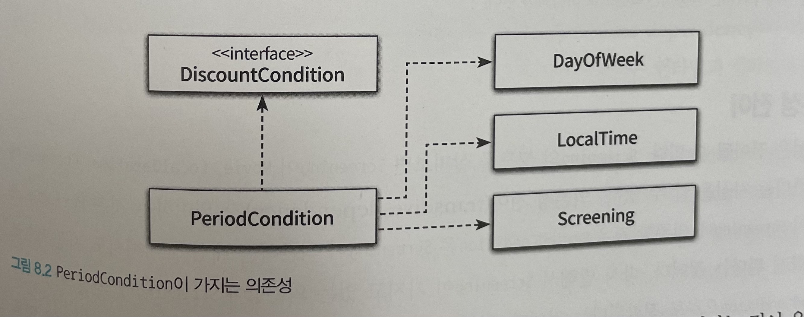
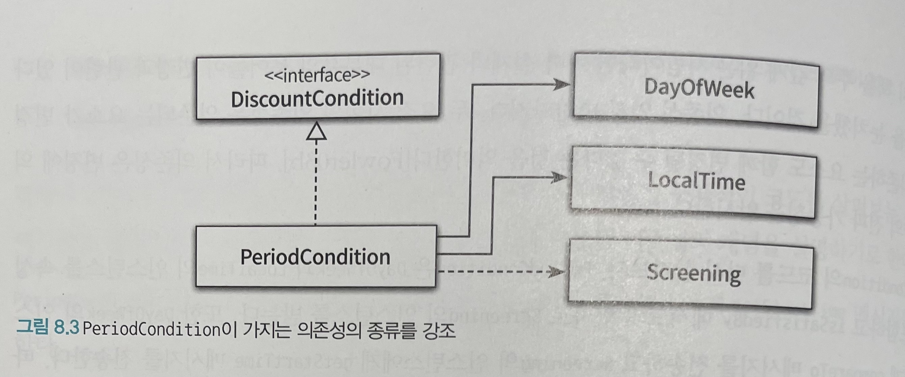
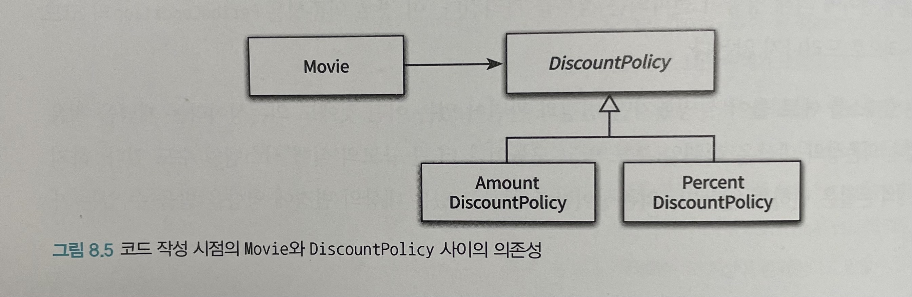
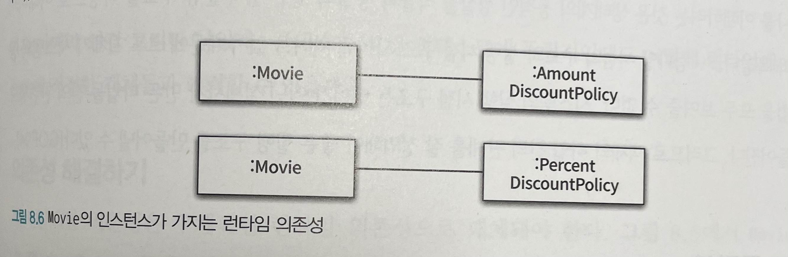

# Object (코드로 이해하는 객체지향 설계)

이 내용은 [오브젝트]을 읽으면서 정리한 내용을 포함하고 있습니다.

이번 주차의 정리할 내용은 다음과 같습니다.

- CHAPTER 08 의존성 관리하기
  - 01. 의존성 이해하기
  - 02. 유연한 설계

## CHAPTER 08 의존성 관리하기

객체지향 설계의 핵심은 협력을 위해 필요
한 의존성은 유지하면서도 변경을 방해하는 의존성은 제거하는 데 있다.

### 01. 의존성 이해하기

#### 변경과 의존성

어떤 객체가 협력하기 위해 다른 객체를 필요로 할 때 두 객체 사이에 의존성이 존재하게 된다.

의존성의 시점

- 실행 시점 : 의존하는 객체가 정상적으로 동작하기 위해서는 실행 시에 의존 대상 객체가 반드시 존재
- 구현 시점 : 의존 대상 객체가 변경될 경우 의존하는 객체도 함께 변경

의존성은 방향성을 가지며 항상 단방향이다.



- 의존하고 있는 모든 대상을 표현한 것
- 의존성 대상이 가지는 특성이 약간씩은 다르다
  - DayOfWeek과 LocalTime은 PeriodCondition에 인스턴스 변수로 사용
  - Screening은 메서드 인자로 사용
  - PeriodCondition이 DiscountCondition에 의존하는 이유는 인터페이스에 정의된 오퍼레이션들을 퍼블릭 인터페이스의 일부포 포함시키기 위함



#### 의존성 전이

예를 들어, PeriodCondition이 Screening에 의존할 경우 PeriodCondition은 Screening이 의존하는 대상에 대해서도 자동적으로 의존하게 된다는 것이다.


의존성의 종류

- 직접 의존성
  - 한 요소가 다른 요소에 직접 의존하는 경우
- 간접 의존성
  - 직접전인 관계는 존재하지 않지만 의존성 전이에 의해 영향이 전파되는 경우

#### 런타임 의존성과 컴파일타임 의존성

런타임이란?

- 애플리케이션이 실행되는 시점
- 의존성이 다루는 주체는 객체사이의 의존성



- 코드 작성 시점의 Movie와 DiscountPolicy 사이의 의존성

컴파일타임이란?

- 작성된 코드를 컴파일하는 시점
- 문맥에 따라서는 코드 그 자체
- 의존성이 다루는 주체는 클래스 사이의 의존성



- Movie의 인스턴스가 가지는 런타임 의존성

Movie 클래스가 AmountDiscountPolicy 클래스와 PercentDiscountPolicy 클래스 둘 모두에 의존하도록 만드는 것은 좋은 방법이 아니다. Movie의 전체적인 결합도를 높일뿐만 아니라 새로운 할인 정책을 추가하기 어렵다.

-> Movie가 두 클래스 중 어떤 것도 알지 못하게 만드는 것이다. 대신 두 클래스 모두를 포괄하는 DiscountPolicy라는 추상 클래스에 의존하도록 만들고 이 컴파일 타임 의존성을 실행 시에 PercentDiscountPolicy 인스턴스나 AmountDiscountPolicy 인스턴스에 대한 런타임 의존성으로 대체해야 한다.

-> 컴파일 타임 구조와 런타임 구조 사이의 거리가 멀면 멀수록 설계가 유연해지고 재사용 가능해진다.

#### 컨텍스트 독립성

- 클래스가 특정한 문맥에 강하게 결합될수록 다른 문맥에서 사용하기는 더 어려움
- 클래스 사용될 특정한 문맥에 대해 최소한의 가정만으로 이뤄져 있다면 다른 문맥에서 재사용하기가 더 수월해짐

컨텍스트가 독립적이라는 말은 각 객체가 해당 객체를 실행하는 시스템에 관해 아무것도 알지 못하는 것

Q. 클래스가 실행 컨텍스트에 독립적인데도 어떻데 런타임에 실행 컨텍스트에 적절한 객체들과 협력할 수 있을까?

#### 의존성 해결하기

컴파일타임 의존성은 구체적인 런타임 의존성으로 대체돼야 한다.


- Movie 클래스는 DiscountPolicy 클래스에 의존
- 컴파일타임 의존성


- Movie 인스턴스는 PercentDiscountPolicy 인스턴스나 AmountDiscountPolicy 인스턴스 중 하나에 의존
- Movie 클래스와 DiscountPolicy 클래스 사이에 존재하는 컴파일타임 의존성이 Movie 인스턴스와 PercentDiscountPolicy 인스턴스 사이의 런타임 의존성이나 Movie 인스턴스와 AmountDiscountPolicy 인스턴스 사이의 런타임 의존성으로 교체돼야 한다는 것을 의미

의존성을 해결하는 3가지 방법

- 객체를 생성하는 시점에 생성자를 통해 의존성 해결
- 객체 생성 후 setter 메서드를 통해 의존성 해결
  - 객체를 생성한 이후에도 의존하고 있는 대상을 변경할 수 있는 가능성 -> 설계를 좀 더 유연하게
  - 단점으로는 객체의 상태가 불완전
- 메서드 실행 시 인자를 이용해 의존성 해결
  - 메서드가 실행될 떄마다 의존 대상이 매번 달라져야 하는 경우에 유용

### 02. 유연한 설계

#### 의존성과 결합도

모든 의존성은 나쁜 것은 아니다.

- 문제는 의존성의 존재가 아니라 의존성의 정도
- 해결 방법은 의존성을 바람직하게 만드는 것
  - Movie 클래스의 할인 정책을 한 가지로 의존하게 만들것인가?
- 컴파일타임 의존성을 런타임 의존성으로 변경

바람직한 의존성

- 재사용성과 관련
- 어떤 의존성이 다양한 환경에서 재사용할 수 있다면 그 의존성은 바람직한 것
- 컨텍스트에 독립적인 의존성은 바람직한 의존성이고 특정한 컨텍스트에 강하게 결합된 의존성은 바람직하지 않는 의존성

느슨한 결합도, 약한 결합도

- 어떤 두 요소 사이에 존재하는 의존성이 바람직할 때

단단한 결합도, 강한 결합도

- 두 요소 사이의 의존성이 바람직하지 못할 때

#### 지식이 결합을 낳는다

결합도의 정도

- 한 요소가 자신이 의존하고 있는 다른 요소에 대해 알고 있는 정보의 양으로 결정
- 한 요소가 다른 요소에 대해 더 많은 정보를 알고 있을수록 두 요소는 강하게 결합
- 반대로 다른 요소에 대해 더 적은 정보를 알고 있을수록 두 요소는 약하게 결합

클래스에 직접 의존하는 경우

- 협력할 객체가 처리해줄 것이라는 사실을 알고 있음

추상 클래스에 의존하는 경우

- 구체적인 내용은 알 수 없고 처리한다는 사실만 알고 있음
- 지식의 양이 적기 때문에 결합도가 느슨

이것을 달성할 수 있는 가장 효과적인 방법은 바로 `추상화`

#### 추상화에 의존하라

추상화를 사용하면 현재 다루고 있는 문제를 해결하는 데 불필요한 정보를 감출 수 있다.

##### 의존 대상 구분

- 구체 클래스 의존성
- 추상 클래스 의존성
  - 구체 클래스보다 추상 클래스에 의존하는 것이 결합도 낮음
- 인터페이스 의존성
  - 상속 계층을 모르더라도 협력 가능
  - 협력하는 객체가 어떤 메시지를 수신할 수 있는지에 대한 지식만을 남기기 때문에 추상 클래스 의존성보다 결합도 낮음

의존하는 대상이 더 추상적일수록 결합도는 더 낮아진다.
결합도를 느슨하게 하기 위해서는 구체적인 클래스 -> 추상 클래스 -> 인터페이스에 의존!!

#### 명시적인 의존성

- 모든 경우에 의존성은 명시적으로 퍼블릭 인터페이스에 노출
- 의존성이 명시적이지 않으면 클래스를 다른 컨텍스트에서 재사용하기 위해 내부 구현을 직접 변경해야 한다.

```
public class Movie {

    private DiscountPolicy discountPolicy;

    public Movie(String title, Duration duration, Money fee) {

        this.discountPolicy = new AmountDiscountPolicy(...);
    }
}
```

```
public class Movie {

    private DiscountPolicy discountPolicy;

    public Movie(String title, Duration duration, Money fee, DiscountPolicy discountPolicy) {

        this.discountPolicy = discountPolicy;
    }
}
```

#### new는 해롭다

결합도 측면에서 new가 해로운 이유

- new 연산자를 사용하기 위해서는 구체 클래스의 이름을 직접 기술해야 한다. 따라서 new를 사용하는 클라이언트는 추상화가 아닌 구체 클래스에 의존할 수밖에 없기 때문에 결합도가 높아진다.
- new 연산자는 생성하려는 구체 클래스뿐만 아니라 어떤 인자를 이용해 클래스의 생성자를 호출해야 하는지도 알아야 한다. 따라서 new를 사용하면 클라이언트가 알아야 하는 지식의 양이 늘어나기 때문에 결합도가 높아진다.

해결 방법

- 인스턴스를 생성하는 로직과 생성된 인스턴스를 사용하는 로직을 분리
- 필요한 인스턴스를 생성자의 인자로 전달받아 내부의 인스턴스 변수에 할당

사용고 생성의 책임을 분리하고 의존성을 생성자에 명시적으로 드러내고 구체 클래스가 아닌 추상 클래스에 의존하게 함으로써 설계를 유연하게 만들 수 있다. 그리고 그 출발은 객체를 생성하는 책임을 객체 내부가 아니라 클라이언트로 옮기는 것에서 시작했다는 점을 기억해야 한다.


#### 가끔은 생성해도 무방하다

클래스 안에 객체의 인스턴스를 직접 생성하는 방식

- 주로 협력하는 기본 객체를 설정하고 싶은 경우

주 생성자 및 부 생성자를 활용해서 생성자 내부의 설정

#### 표준 클래스에 대한 의존은 해롭지 않다

변경될 확률이 거의 없는 클래스

- JDK에 포함된 표준 클래스
- 이런 클래스들에 대해서는 구체 클래스에 의존하거나 직접 인스턴스를 생성하더라도 문제가 없음
- ex) new ArrayList<>();

클래스를 직접 생성하더라도 가능한 한 추상적인 타입을 사용하는 것이 확장성 측면에서 유리

#### 컨텍스트 확장하기

설계를 유연하게 만들 수 있는 방법

- 핵심 객체를 추상화에 의존하게 만들고
- 생성자를 통해 의존성을 명시적으로 드러내고
- new와 같이 구체 클래스를 직접적으로 다뤄야 하는 책임을 외부로 옮김

#### 조합 가능한 행동

- 어떤 객체과 협력하느냐에 따라 객체의 행동이 달라지는 것은 유연하고 재사용 가능한 설계가 가진 특징
- 유연하고 재사용 가능한 설계는 응집도 높은 책임들을 가진 작은 객체들을 다양한 방식으로 연결함으로써 애플리케이션의 기능을 쉽게 확장 가능
- 유연하고 재사용 가능한 설계는 객체가 어떻게 하는지를 장황하게 나열하지 않고도 객체들의 조합을 통해 무엇을 하는지를 표현하는 클래스들로 구성
- 유연하고 재사용 가능한 설계는 작은 객체들의 행동을 조합함으로써 새로운 행동을 이끌어낼 수 있는 설계