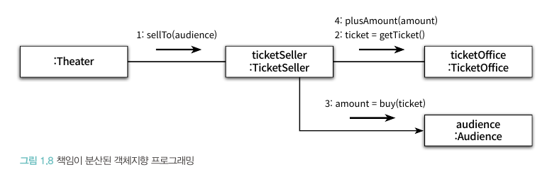

# Chapter 1. 객체, 설계

- 이론이 먼저일까, 실무가 먼저일까?
    - 어떤 분야든 초기 단계에서는 아무것도 없는 상태에서 이론을 정립하기 보다는 실무를 관찰한 결과를 바탕으로 이론을 정립
    - 소프트웨어 분야는 그 역사가 짧으므로 실무를 통해 이론을 정립
    - 해당 서적은 **객체지향 프로그래밍을 설계하고 유지보수하는 데 필요한 원칙과 기법**을 설명하기 위해 쓰여진 책

## 티켓 판매 애플리케이션 구현하기

```java
package chapter1;

import java.time.LocalDateTime;

// 초대장
public class Invitation {
    private LocalDateTime when;
}
```

```java
package chapter1;

// 티켓
public class Ticket {
    private Long fee;

    public Long getFee(){
        return fee;
    }
}
```

```java
package chapter1;

// 관람객의 소지품
public class Bag {
    private Long amount;
    private Invitation invitation;
    private Ticket ticket;

    /* 이벤트에 당첨도니 관람객의 가방 안에는 현금과 초대장이
    * 들어있지만 이벤트에 당첨되지 않은 관람객의 가방 안에는 초대장이
    * 들어있지 않음을 표현하는 생성자
    */
    public Bag(long amount){
        this(null, amount);
    }

    public Bag(Invitation invitation, long amount){
        this.invitation = invitation;
        this.amount = amount;
    }

    public boolean hasInvitation(){
        return invitation != null;
    }

    public boolean hasTicket(){
        return ticket != null;
    }

    public void setTicket(Ticket ticket){
        this.ticket = ticket;
    }

    public void minusAmount(Long amount){
        this.amount -= amount;
    }

    public void plusAmount(Long amount){
        this.amount += amount;
    }
}
```

```java
package chapter1;

// 관람객
public class Audience {
    private Bag bag;

    public Audience(Bag bag){
        this.bag = bag;
    }

    public Bag getBag(){
        return bag;
    }
}
```

```java
package chapter1;

import java.util.ArrayList;
import java.util.Arrays;
import java.util.List;

// 매표소
public class TicketOffice {
    private Long amount;
    private List<Ticket> tickets = new ArrayList<>();

    public TicketOffice(Long amount, Ticket ...tickets){
        this.amount = amount;
        this.tickets.addAll(Arrays.asList(tickets));
    }

    public Ticket getTicket(){
        return tickets.remove(0);
    }

    public void minusAmount(Long amount){
        this.amount -= amount;
    }

    public void plusAmount(Long amount){
        this.amount += amount;
    }
}
```

```java
package chapter1;

// 티켓 판매원
public class TicketSeller {
    private TicketOffice ticketOffice;

    public TicketSeller(TicketOffice ticketOffice){
        this.ticketOffice = ticketOffice;
    }

    public TicketOffice getTicketOffice(){
        return ticketOffice;
    }
}
```

```java
package chapter1;

public class Theater {
    private TicketSeller ticketSeller;

    public Theater(TicketSeller ticketSeller) {
        this.ticketSeller = ticketSeller;
    }

    public void enter(Audience audience) {
        if (audience.getBag().hasInvitation()) {
            Ticket ticket = ticketSeller.getTicketOffice().getTicket();
            audience.getBag().setTicket(ticket);
        } else {
            Ticket ticket = ticketSeller.getTicketOffice().getTicket();
            audience.getBag().minusAmount(ticket.getFee());
            ticketSeller.getTicketOffice().plusAmount(ticket.getFee());
            audience.getBag().setTicket(ticket);
        }
    }
}
```

- 위의 프로그램은 간단하고 예상대로 동작하겠지만 몇 가지 문제점을 가지고 있다

## 무엇이 문제인가

- 로버트 마틴 ‘클린 소프트웨어: 애자일 원칙과 패턴, 그리고 실천 방법’ 서적에서 소프트웨어 모듈이 가져야 할 세 가지 기능

> 첫 번째 목적은 실행 중에 제대로 동작하는 것
두 번째 목적은 변경을 위해 존재하는 것(간단한 작업만으로도 변경이 가능한 것)
세 번째 목적은 코드를 읽는 사람과 의사소통하는 것
> 
- 위에서 작성한 모듈은 두 번째와 세 번째의 목적에 부합하지 못함

### 예상을 빗나가는 코드

- Theater의  enter() 메서드가 수행하는 일
    - 소극장은 관람객의 가방을 열어 그 안에 초대장이 들어 있는지 살펴본다. 가방 안에 초대장이 들어 있으면 판매원은 매표소에 보관돼 있는 티켓을 관람객의 가방 안으로 옮긴다. 가방 안에 초대장이 들어 있지 않다면 관람객의 가방에서 티켓 금액만큼의 현금을 꺼내 매표소에 적립한 후에 매표소에 보관돼 있는 티켓을 관람객의 가방 안으로 옮긴다.
- 위의 내용대로라면 관람객과 판매원이 소극장의 통제를 받는 수동적인 존재가 되버림!
- 우리의 상식과는 너무나 다르기에 코드를 읽는 사람과 제대로 의사소통을 할 수 없음
- 그 외에도 enter 메서드를 이해하기 위해선 Audience가 Bag를 가지고 있고, Bag 안에는 현금과 티켓이 들어 있는 등 이해가 필요한 부분이 너무나도 많음

### 변경에 취약한 코드

- 현재 코드는 관람객이 현금과 초대장을 보관하기 위해 항상 가방을 들고 다니며, 판매원이 매표소에서만 티켓을 판매한다고 가정함
- 이런 세부적인 사실 중 하나라도 변경되면 해당 클래스 뿐 아니라 클래스에 의존하는 Theater도 같이 변경됨
- 객체 사이의 의존성을 완전히 없애는 것이 정답은 아니지만, 애플리케이션의 기능을 구현하는 데 필요한 최소한의 의존성만 유지하고 불필요한 의존성을 제거하는 것이 목표

## 설계 개선하기

- Theater가 관람객의 가방과 판매원의 매표소에 직접 접근한다는 것은 Theater가 Audience와 TicketSeller에 결합된다는 것을 의미
- Theater가 원하는 것은 관람객이 소극장에 입장하는 것 뿐이기에 관람객과 판매원을 자율적인 존재로 변경

### 단계1. Theater의 enter 메서드 개선

- TicketOffice에 접근하는 모든 코드를 TicketSeller 내부로 숨김

```java
package chapter1.After;

// 티켓 판매원
public class TicketSeller {
    private TicketOffice ticketOffice;

    public TicketSeller(TicketOffice ticketOffice){
        this.ticketOffice = ticketOffice;
    }

    public void sellTo(Audience audience){
        if (audience.getBag().hasInvitation()) {
            Ticket ticket = ticketOffice.getTicket();
            audience.getBag().setTicket(ticket);
        } else {
            Ticket ticket = ticketOffice.getTicket();
            audience.getBag().minusAmount(ticket.getFee());
            ticketOffice.plusAmount(ticket.getFee());
            audience.getBag().setTicket(ticket);
        }
    }
}
```

```java
package chapter1.After;

public class Theater {
    private TicketSeller ticketSeller;

    public Theater(TicketSeller ticketSeller) {
        this.ticketSeller = ticketSeller;
    }

    public void enter(Audience audience) {
        ticketSeller.sellTo(audience);
    }
}
```

- 이처럼 개념적이나 물리적으로 객체 내부의 세부적인 사항을 감추는 것을 캡슐화라고 부름
- 수정한 Theater 클래스 어디서도 ticketOffice에 접근하지 못하며 TicketSeller의 인터페이스에만 의존

### 단계 2. TicketSeller와 동일하게 Audience 캡슐화 개선

```java
package chapter1.After;

// 관람객
public class Audience {
    private Bag bag;

    public Audience(Bag bag) {
        this.bag = bag;
    }

    public Long buy(Ticket ticket) {
        if (bag.hasInvitation()) {
            bag.setTicket(ticket);
            return 0L;
        } else {
            bag.setTicket(ticket);
            bag.minusAmount(ticket.getFee());
            return ticket.getFee();
        }
    }
}
```

```java
package chapter1.After;

// 티켓 판매원
public class TicketSeller {
    private TicketOffice ticketOffice;

    public TicketSeller(TicketOffice ticketOffice){
        this.ticketOffice = ticketOffice;
    }

    public void sellTo(Audience audience){
        ticketOffice.plusAmount(audience.buy(ticketOffice.getTicket()));
    }
}
```

## 무엇이 개선됐는가

- 수정된 Audience와 TicketSeller는 자신이 가지고 있는 소지품을 스스로 관리하기에 상식에도 일치하여 의사소통 관점에서 개선
- Audience나 TicketSeller의 내부 구현을 변경하더라도 Theater를 함께 변경할 필요가 없어졌기에 변경 용시어의 측면에서도 개선

## 어떻게 한 것인가

- 객체의 자율성을 높이는 방향으로 설계를 개선하여 이해하기 쉽고 유연한 설계를 얻을 수 있었음

## 캡슐화와 응집도

- 밀접하게 연관된 작업만을 수행하고 연관성 없는 작업은 다른 객체에게 위임하는 객체를 가리켜 응집도가 높다고 말함
- 객체의 응집도를 높이기 위해 객체 스스로 자신의 데이터를 책임지고 처리하는 자율적인 존재여야 함
- **외부의 간섭을 최대한 배제하고 메세지를 통해서만 협력하는 자율적인 객체들의 공동체**를 만드는 것이 훌륭한 객체지향 설계를 얻을 수 있는 지름길

## 절차지향과 객체지향

- 기존 프로그램에서 enter 메서드는 **프로세스**이며 Audience, TicketSeller, Bag 등은 **데이터**이다. 이처럼 프로세스와 데이터를 별도의 모듈에 위치시키는 방식을 절차적 프로그래밍이라 부른다
- 절차적 프로그래밍의 세상에서는 데이터의 변경으로 인한 영향을 지역적으로 고립시키기 어렵기에 변경하기 어려운 코드를 양산하는 경향이 있다
- 반면 데이터와 프로세스가 동일한 모듈 내부에 위치하도록 프로그래밍하는 방식을 객체지향 프로그래밍이라 부른다

## 책임의 이동




- 객체지향 설계의 핵심은 단순히 데이터와 프로세스를 하나의 객체 안으로 모으는 것이 아닌 적절한 객체에 적절한 책임을 할당하는 것

## 더 개선할 수 있다

```java
package chapter1.After;

import java.util.ArrayList;
import java.util.Arrays;
import java.util.List;

// 매표소
public class TicketOffice {
    private Long amount;
    private List<Ticket> tickets = new ArrayList<>();

    public TicketOffice(Long amount, Ticket ...tickets){
        this.amount = amount;
        this.tickets.addAll(Arrays.asList(tickets));
    }

    public void sellTicketTo(Audience audience){
        plusAmount(audience.buy(getTicket()));
    }

    private Ticket getTicket(){
        return tickets.remove(0);
    }

    private void plusAmount(Long amount){
        this.amount += amount;
    }
}
```

```java
package chapter1.After;

// 티켓 판매원
public class TicketSeller {
    private TicketOffice ticketOffice;

    public TicketSeller(TicketOffice ticketOffice){
        this.ticketOffice = ticketOffice;
    }

    public void sellTo(Audience audience){
        ticketOffice.sellTicketTo(audience);
    }
}
```

- TicketOffice에게도 자율성을 주어 TicketSeller는 구현이 아닌 인터페이스에만 의존하게 되었다
- 하지만 해당 변경은 TicketOffice의 자율성은 높였지만 Audience라는 새로운 의존성이 생겨 결합도가 상승해버리는 결과가 생김
- 위의 예시를 통해 어떤 기능을 설계하는 방법은 한 가지 이상일 수 있으며, 설계는 트레이드오프의 산물인 점을 알 수 있다

## 그래, 거짓말이다!

- TicketOffice나 Bag 등은 실세계에서는 자율적인 존재가 아님에도 무생물 역시 스스로 행동하고 자율적인 존재로 취급함
- 이를 통해 현실에서는 수동적인 존재라 할지라도 객체지향의 세계에 들어오면 모든 것이 능동적이고 자율적인 존재로 바뀜을 시사(**의인화 anthropomorphism**)
- 앞에서는 실세계서의 생물처럼 스스로 생각하고 행동하도록 소프트웨어 객체를 설계하는 것이 이해하기 쉬운 코드를 작성하는 것이라 설명했지만….. → **훌륭한 객체지향 설계를 소프트웨어를 구성하는 모든 객체들이 자율적으로 행동하는 설계**를 가리킴

## 설계가 왜 필요한가

- 설계는 코드를 작성하는 매 순간 코드를 어떻게 배치할 것인지를 결정하는 과정
- 좋은 설계란 오늘 요구하는 기능을 온전히 수행하면서 내일의 변경을 매끄럽게 수용할 수 있는 설계!