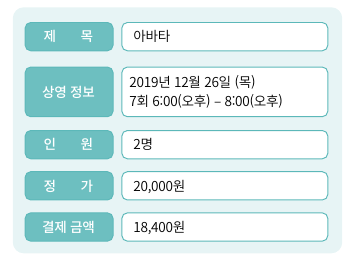
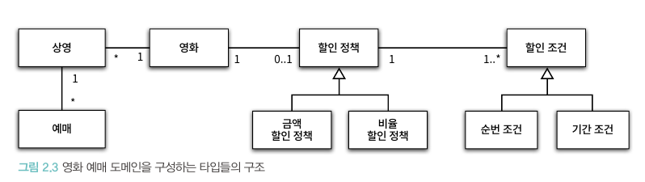
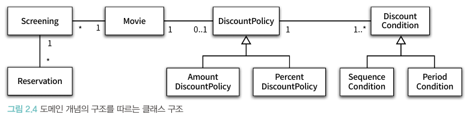
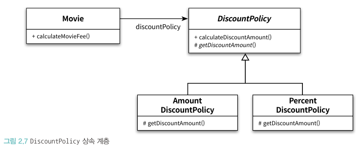
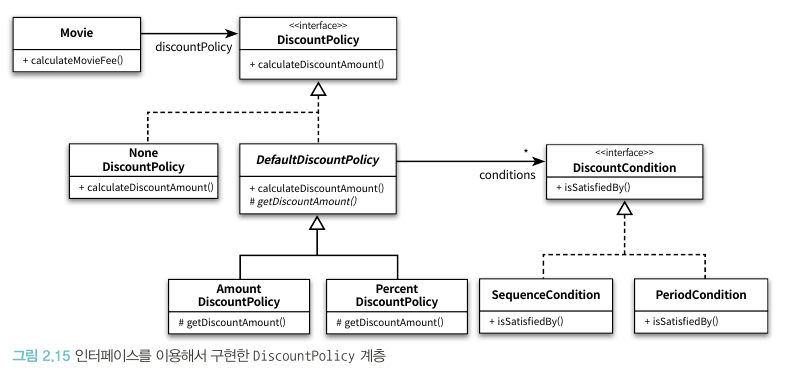

# 📚 2장 객체지향 프로그래밍

## 📖 2.1 영화 예매 시스템

요구사항 살펴보기

- 영화: 영화에 대한 기본 정보
- 상영: 관객들이 영화를 관람하는 사건
- 할인 조건: 할인 여부를 결정
    - 순서 조건: 상영 순번을 이용해 할인 여부를 결정하는 규칙
    - 기간 조건: 상영 시작 시간을 이용해 할인 여부를 결정하는 규칙
- 할인 정책: 할인 요금을 결정
    - 금액 할인 정책: 예매 요금에서 일정 금액을 할인해주는 방식
    - 비율 할인 정책: 정가에서 일정 비율의 요금을 할인해 주는 방식

할인 정책과 할인 조건이 지정된 영화 예시


예매 완료시 생성하는 예매 정보


## 📖 2.2 객체지향 프로그래밍을 향해

### 🔖 2.2.1 협력, 객체, 클래스

객체지향 언어에 익숙한 사람이라면 어떤 클래스가 필요한지 고민하지만 이는 **객체지향의 본질과는 거리가 멀다**
객체지향 패러다임으로의 전환은 클래스가 아닌 객체에 초점을 맞출 때 얻음

1. 어떤 클래스가 필요한지를 고민하기 전에 어떤 객체들이 필요한지 고민하라. 클래스는 공통적인 상태와 행동을 공유하는 객체들을 추상화한 것. 이는 설계를 단순하고 깔끔하게 만든다.
2. 객체를 독립적인 존재가 아니라 기능을 구현하기 위해 협력하는 공동체의 일원으로 봐야 한다. 객체를 협력하는 공동체의 일원으로 바라보는 것은 설계를 유연하고 확장 가능하게 만든다.

### 🔖 2.2.2 도메인의 구조를 따르는 프로그램 구조

- 도메인이란? 문제를 해결하기 위해 사용자가 프로그램을 사용하는 분야
- 객체지향 패러다임이 강력한 이유는 요구사항을 분석하는 초기 단계부터 프로그램을 구현하는 마지막 단계까지 객체라는 동일한 추사항화 기법을 사용할 수 있기 때문
- 요구사항과 프로그램을 객체라는 동일한 관점에서 바라봄

영화 예매 도메인



### 🔖 2.2.3 클래스 구현하기

```java
package chapter2;

import lombok.AllArgsConstructor;

import java.time.LocalDateTime;

@AllArgsConstructor
public class Screening {
    private Movie movie;
    private int sequence;
    private LocalDateTime whenScreened;

    public LocalDateTime getStartTime() {
        return whenScreened;
    }

    public boolean isSequence(int sequence) {
        return this.sequence == sequence;
    }

    public Money getMovieFee() {
        return movie.getFee();
    }

}
```

**자율적인 객체**

- 객체는 상태와 행동을 함께 가지는 복합적인 존재
- 객체가 스스로 판단하고 행동하는 자율적인 존재
- 객체지향 패러다임에선 데이터와 기능을 한 덩어리로 묶음(**캡슐화**)으로써 문제 영역의 아이디어를 적절하게 표현
- 객체의 접근 제어자는 객체를 자율적인 존재로 만들기 위해 외부 간섭을 최소화함. 객체가 원하는 것을 요청하고 객체가 최선의 방법을 결정할 수 있을 것이라 믿고 기다림
- 외부에서 접근 가능한 **퍼블릭 인터페이스**와 내부에서만 접근 가능한 **구현**으로 나눔

**프로그래머의 자유**

- 프로그래머 역할을 클래스 작성자와 클라이언트 프로그래머로 구분하는 것이 유용[Eckel06]
- 클라이언트 프로그래머의 목표는 필요한 클래스들을 엮어 애플리케이션을 빠르고 안정정으로 구축
- 클래스 작성자는 필요한 부분만을 공개하고 나머지를 숨겨 내부 구현을 변경(**구현 은닉**)
- 설계가 필요한 이뉴는 변경을 관리하기 위함

### 🔖 2.2.4 협력하는 객체들의 공동체

```java
package chapter2;

import lombok.AllArgsConstructor;

import java.time.LocalDateTime;

@AllArgsConstructor
public class Screening {
    private Movie movie;
    private int sequence;
    private LocalDateTime whenScreened;

    public LocalDateTime getStartTime() {
        return whenScreened;
    }

    public boolean isSequence(int sequence) {
        return this.sequence == sequence;
    }

    public Money getMovieFee() {
        return movie.getFee();
    }

    public Reservation reserve(Customer customer, int audienceCount) {
        return new Reservation(customer, this, calculateFee(audienceCount), audienceCount);
    }

    private Money caculateFee(int audienceCount) {
        return movie.calculateMovieFee(this).times(audienceCount);
    }

}
```

```java
package chapter2;

import lombok.AllArgsConstructor;

import java.math.BigDecimal;

@AllArgsConstructor
public class Money {
    public static final Money ZERO = Money.wons(0);

    private final BigDecimal amount;

    public static Money wons(long amount) {
        return new Money(BigDecimal.valueOf(amount));
    }

    public static Money wons(double amount) {
        return new Money(BigDecimal.valueOf(amount));
    }

    public Money plus(Money amount) {
        return new Money(this.amount.add(amount.amount));
    }

    public Money minus(Money amount) {
        return new Money(this.amount.subtract(amount.amount));
    }

    public Money times(double percent) {
        return new Money(this.amount.multiply(BigDecimal.valueOf(percent)));
    }

    public boolean isLessThan(Money other) {
        return amount.compareTo(other.amount) < 0;
    }

    public boolean isGreaterThanOrEqual(Money other) {
        return amount.compareTo(other.amount) >= 0;
    }

}

```

```java
package chapter2;

import lombok.AllArgsConstructor;

@AllArgsConstructor
public class Reservation {
    private Customer customer;
    private Screening screening;
    private Money fee;
    private int audienceCount;

}

```

- 영화를 예매하기 위해 Screening, Move, Reservation 인스턴스들은 서로의 메서드를 호출하며 상호작용(**협력**)
  

### 🔖 2.2.5 협력에 관한 짧은 이야기

- 객체는 다른 객체의 인터페이스에 공개된 행동을 수행하도록 요청(request) 하며 요청을 받은 객체는 요청을 처리한 후 응답(response)한다.
- 객체가 다른 객체와 상호작용할 수 있는 유일한 방법은 메세지를 전송(send a message)하는 것 뿐이고 메시지를 수신한 객체는 스스로의 결정에 따라 자율적으로 메세지를 처리할 방법(**메서드**)을 결정
- 메시지와 메서드를 구분하는 것은 매우 중요하며 이 구분에서 **다형성(polymorphism)** 개념이 출발한다

## 📖 2.3 할인 요금 구하기

### 🔖 2.3.1 할인 요금 계산을 위한 협력 시작하기

```java
package chapter2;

import lombok.AllArgsConstructor;

import java.time.Duration;

@AllArgsConstructor
public class Movie {
    private String title;
    private Duration runningTime;
    private Money fee;
    private DiscountPolicy discountPolicy;

    public Money getFee() {
        return fee;
    }

    public Money calculateMovieFee(Screening screening) {
        return fee.minus(discountPolicy.calculateDiscountAmount(screening));
    }
}

```

- calculateMovieFee 메서드에서 어떤 할인 정책을 사용할 것인지 결정하는 코드는 존재하지 않으며, 단지 discountPolicy에게 메시지를 전송
- 이 코드에는 **상속**과 **다형성**의 개념이 숨겨져 있으며 **추상화**라는 원리가 숨겨져있다.

### 🔖 2.3.2 할인 정책과 할인 조건

```java
package chapter2;

import java.util.List;

public abstract class DiscountPolicy {
    private List<DiscountCondition> conditions;

    public DiscountPolicy(DiscountCondition... conditions) {
        this.conditions = List.of(conditions);
    }

    public Money calculateDiscountAmount(Screening screening) {
        for (DiscountCondition condition : conditions) {
            if (condition.isSatisfiedBy(screening)) {
                return getDiscountAmount(screening);
            }
        }

        return Money.ZERO;
    }

    abstract protected Money getDiscountAmount(Screening screening);
}

```

- 부모 클래스에 기본적인 알고리즘의 흐름을 구현하고 중간에 필요한 처리를 자식 클래스에게 위임하는 디자인 패턴을 TEMPLATE METHOD 패턴[GOF94]라고 함

```java
package chapter2;

import java.util.List;

public abstract class DiscountPolicy {
    private List<DiscountCondition> conditions;

    public DiscountPolicy(DiscountCondition... conditions) {
        this.conditions = List.of(conditions);
    }

    public Money calculateDiscountAmount(Screening screening) {
        for (DiscountCondition condition : conditions) {
            if (condition.isSatisfiedBy(screening)) {
                return getDiscountAmount(screening);
            }
        }

        return Money.ZERO;
    }

    abstract protected Money getDiscountAmount(Screening screening);
}

```

```java
package chapter2;

public interface DiscountCondition {
    boolean isSatisfiedBy(Screening screening);
}

```

```java
package chapter2;

import lombok.AllArgsConstructor;

@AllArgsConstructor
public class SequenceCondition implements DiscountCondition {
    private int sequence;

    @Override
    public boolean isSatisfiedBy(Screening screening) {
        return screening.isSequence(sequence);
    }
}

```

```java
package chapter2;

import lombok.AllArgsConstructor;

import java.time.DayOfWeek;
import java.time.LocalTime;

@AllArgsConstructor
public class PeriodCondition implements DiscountCondition {
    private DayOfWeek dayOfWeek;
    private LocalTime startTime;
    private LocalTime endTime;

    public boolean isSatisfiedBy(Screening screening) {
        return screening.getStartTime().getDayOfWeek().equals(dayOfWeek) &&
                startTime.compareTo(screening.getStartTime().toLocalTime()) <= 0 &&
                endTime.compareTo(screening.getStartTime().toLocalTime()) >= 0;
    }
}

```

```java
package chapter2;

public class AmountDiscountPolicy extends DiscountPolicy {
    private Money discountAmount;

    public AmountDiscountPolicy(Money discountAmount, DiscountCondition... conditions) {
        super(conditions);
        this.discountAmount = discountAmount;
    }

    @Override
    protected Money getDiscountAmount(Screening screening) {
        return discountAmount;
    }
}

```

```java
package chapter2;

public class PercentDiscountPolicy extends DiscountPolicy {
    private double percent;

    public PercentDiscountPolicy(double percent, DiscountCondition... conditions) {
        super(conditions);
        this.percent = percent;
    }

    @Override
    protected Money getDiscountAmount(Screening screening) {
        return screening.getMovieFee().times(percent);
    }
}

```

### 🔖 2.3.3 할인 정책 구성하기

- 요구사항: 하나의 영화에 대해 단 하나의 할인 정책만 설정할 수 있지만 할인 조건의 경우 여러 개를 적용할 수 있음

```java
// 영화 객체 생성
Movie avatar=new Movie("아바타",
        Duration.ofMinutes(120),
        Money.wons(10000),
        new AmountDiscountPolicy(Money.wons(800),
        new SequenceCondition(1),
        new SequenceCondition(10),
        new PeriodCondition(DayOfWeek.MONDAY,LocalTime.of(10,0),LocalTime.of(11,59)),
        new PeriodCondition(DayOfWeek.THURSDAY,LocalTime.of(10,0),LocalTime.of(20,59))
        ));

        Movie titanic=new Movie("타이타닉",
        Duration.ofMinutes(180),
        Money.wons(11000),
        new PercentDiscountPolicy(0.1,
        new PeriodCondition(DayOfWeek.TUESDAY,LocalTime.of(14,0),LocalTime.of(16,59)),
        new SequenceCondition(2),
        new PeriodCondition(DayOfWeek.THURSDAY,LocalTime.of(10,0),LocalTime.of(13,59))
        ));
```

- 생성자의 파라미터 목록을 이용해 초기화에 필요한 정보를 전달하도록 강제할 수 있다

## 📖 2.4 상속과 다형성

### 🔖 2.4.1 컴파일 시간 의존성과 실행 시간 의존성



- Movie 인스턴스가 코드 작성 시점에는 존재조차 모른 Policy 인스턴스와 실행 시점 협력 가능한 이유?
    - 실행 시에 Movie 인스턴스에 AmountDiscountPolicy 인스턴스를 전하기 때문
- 코드의 의존성과 실행 시점의 의존성을 서로 다를 수 있다
    - 유연하고, 쉽게 재사용할 수 있으며, 확장 가능한 객체지향 설계가 가지는 특징은 코드의 의존성과 실행 시점의 의존성이 다름
    - 다만 의존성이 다를수록 코드 이해가 어려워짐
    - 결국 이런 의존성의 양면성은 설계가 **트레이드오프의 산물**이라는 사실을 보여줌
    - 설계가 유연해질수록 코드를 이해하고 디버깅하기는 점점 어려워진다. 훌륭한 설계자가 되기 위해 항상 유연성과 가독성 사이에서 고민해야 함

### 🔖 2.4.2 차이에 의한 프로그래밍

- 부모 클래스와 다른 부분만을 추가해서 새로운 클래스를 쉽고 빠르게 만드는 방법을 차이에 의한 프로그래밍이라 부른다

### 🔖 2.4.3 상속과 인터페이스

- 상속이 가치 있는 이유는 부모 클래스가 제공하는 모든 인터페이스를 자식 클래스가 물려받을 수 있기 때문
- 결과적으로 자식 클래스는 부모 클래스가 수신할 수 있는 모든 메세지를 수신할 수 있기에 외부 객체는 자식 클래스를 부모 클래스와 동일한 타입으로 간주할 수 있음
- 자식 클래스가 부모 클래스를 대신하는 것을 **업캐스팅(upcasting)** 이라 부름

### 🔖 2.4.4 다형성

- 메시지와 메서드는 다른 개념
- Movie 클래스는 DiscountPolicy의 인스턴스에게 calculateDiscountAmount 메시지를 전송
- 실행되는 메서드는 Movie와 상호작용하기 위해 연결된 객체의 클래스가 무엇인가에 따라 달라짐
- 동일한 메시지를 전송하지만 실제로 어떤 메서드가 실행될 것인지는 메시지를 수신하는 객체의 클래스가 무엇이냐에 따라 달라짐 -> **다형성**
- 다형성은 컴파일 시간 의존성과 실행 시간 의존성이 다를 수 있다는 사실을 기반으로 함
- 다형성은 메시지와 메서드를 실행 시점에 바인딩하고 이를 **지연 바인딩(lazy binding) 또는 동적 바인딩(dynamic binding)** 이라 함
    - 반대되는 개념은 초기 바인딩(early binding) 또는 정적 바인딩(static binding)이라 함

## 📖 2.5 추상화와 유연성

### 🔖 2.5.1 추상화의 힘

- 추상화의 장점
    - 추상화 계층만 따로 떼어 놓고 살펴보면 요구사항의 정책을 높은 수준에서 서술할 수 있음
    - 추상화를 이용하면 설계가 좀 더 유연해짐
- 추상화를 이용해 상위 정책을 기술한다는 것은 기본적인 애플리케이션의 협력 흐름을 기술한다는 것
    - 할인 정책이나 할인 조건의 새로운 자식 클래스들은 상위의 협력 흐름을 그대로 따르게 됨
- 이 개념으로 디자인 패턴이나 프레임워크 모드 추상화를 이용해 상위 정책을 정의하는 객체지향의 메커니즘을 활용한다

### 🔖 2.5.2 유연한 설계

- 만약 할인 정책이 없는 경우?

```java
    public Money calculateMovieFee(Screening screening){
        if(discountPolicy==null)
        return fee;

        return fee.minus(discountPolicy.calculateDiscountAmount(screening));
    }
```

- 위와 같이 설계한다면 예외 케이스로 취급하는 것이기에 일관성 있던 협력 방식이 무너지게 된다
- 기존 할인 정책의 경우 할인할 금액을 계산하는 책임이 DiscountPolicy에 있었지만 위 코드의 경우 Movie 쪽에 있기 때문!

```java
package chapter2;

public class NoneDiscountPolicy extends DiscountPolicy {
    @Override
    protected Money getDiscountAmount(Screening screening) {
        return Money.ZERO;
    }
}

```

- 위와 같이 NoneDiscountPolicy라는 새로운 클래스를 추가하는 것만으로 애플리케이션의 기능을 확장!!
- 이처럼 추상화를 중심으로 코드의 구조를 설계하면 유연하고 확장 가능한 설계를 만들 수 있음
- 추상화가 유연한 설계를 가능하게 하는 이유는 설계가 구체적인 상황에 결홥되는 것을 방지하기 때문에 **컨텍스트 독립성(context independency)**은 프레임워크와 같은 유연한 설계가 필수적인 분야에서
  진가를 발휘

### 🔖 2.5.3 추상 클래스와 인터페이스 트레이드오프

- NoneDiscountPolicy 코드를 살펴보면 부모 클래스인 DiscountPolicy에서 할인 조건이 없을 경우 getDiscountAmount 메서드를 호출하지 않기에 어떤 값을 반환하더라도 상관 없음
- 이 문제를 해결하기 위해 DiscountPolicy 를 인터페이스로 바꾸고 NoneDiscountPolicy가 DiscountPolicy 인터페이스를 구현하도록 변경하면 개념적인 혼란과 결합을 제거할 수 있다
```java
package chapter2;

public interface DiscountPolicy {
    Money calculateDiscountAmount(Screening screening);
}

```
```java
package chapter2;

import java.util.List;

public abstract class DefaultDiscountPolicy implements DiscountPolicy {
  private List<DiscountCondition> conditions;

  public DefaultDiscountPolicy(DiscountCondition... conditions) {
    this.conditions = List.of(conditions);
  }

  @Override
  public Money calculateDiscountAmount(Screening screening) {
    for (DiscountCondition condition : conditions) {
      if (condition.isSatisfiedBy(screening)) {
        return getDiscountAmount(screening);
      }
    }

    return Money.ZERO;
  }

  abstract protected Money getDiscountAmount(Screening screening);
}


```
```java
package chapter2;

public class NoneDefaultDiscountPolicy implements DiscountPolicy {
    @Override
    public Money calculateDiscountAmount(Screening screening) {
        return Money.ZERO;
    }
}

```


- 이상적으로는 인터페이스를 사용하도록 변경한 설계가 좋지만 현실적으로 NoneDiscountPolicy만을 위해 인터페이스를 추가하는 것은 과하다 생각할 수 있음
- 구현과 관련된 모든 것들이 트레이드오프의 대상이 될 수 있다는 사실이며 **아주 사소한 결정이더라도 트레이드오프를 통해 얻어진 결론과 그렇지 않은 결론 사이의 차이는 크다**.
