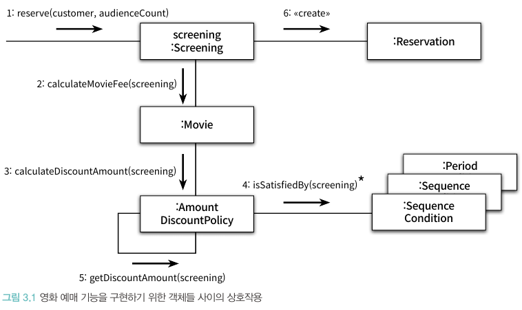
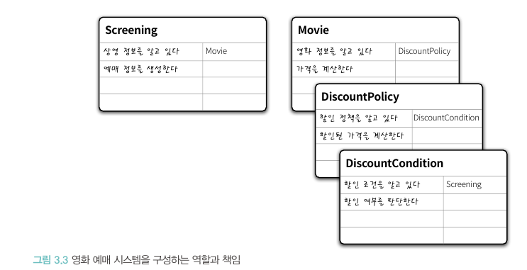
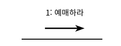
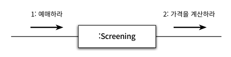
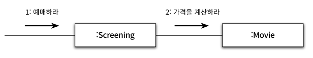
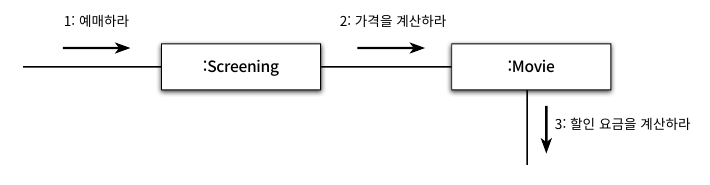
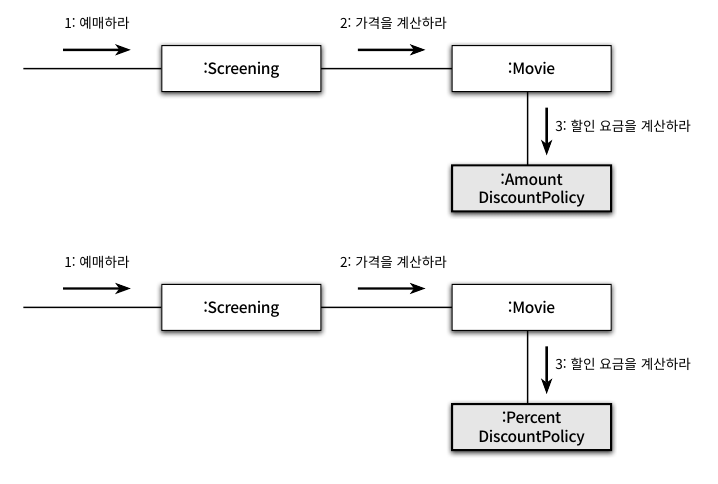
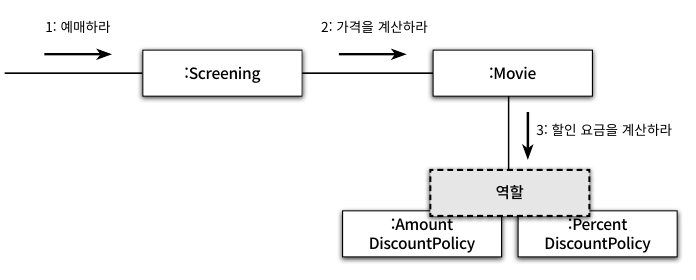
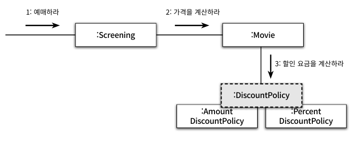

# 📚 3장 역할, 책임, 협력

객체지향 패러다임의 관점에서 핵심은 **역할(role), 책임(responsibility), 협력(collaboration)**이다.

## 📖 3.1 협력

### 🔖 3.1.1 영화 예매 시스템 돌아보기

- 객체들이 애플리케이션의 기능을 구현하기 위해 수행하는 상호작용을 **협력** 이라 한다.
- 객체가 협력에 참여하기 위해 수행하는 로직은 **책임** 이라 한다.
- 객체들이 협력 안에서 수행하는 책임들이 모여 객체가 수행하는 **역할**을 구성한다.

### 🔖 3.1.2 협력

- 객체는 고립된 존재가 아니라 시스템의 기능이라는 더 큰 목표를 달성하기 위해 다른 객체와 협력하는 사회적인 존재
- **메시지 전송(message sending)**은 객체 사이의 협력을 위해 사용할 수 있는 유일한 커뮤니케이션 수단이다.

> 협력이란 어떤 객체가 다른 객체에게 무엇인가를 요청하는 것이다. 한 객체는 어떤 것이 필요할 때 다른 객체에게 전적으로 위임하거나 서로 협력한다. 즉, 두 객체가 상호작용을 통해 더 큰 책임을 수행하는 것이다.
> 객체 사이의 협력을 설계할 때는 객체를 서로 분리된 인스턴스가 아닌 협력하는 파트너로 인식해야한다.

- 메시지를 수신한 객체는 **메서드**를 실행해 요청에 응답한다.
- 외부의 객체는 오직 메시지만 전송할 수 있을 뿐이며 메시지를 어떻게 처리할지는 메시지를 수신한 객체가 직접 결정한다 -> 객체는 자율적인 존재

### 🔖 3.1.3 협력이 결정짓는 객체의 행동과 상태

- Movie 객체는 그냥 보기에는 play라는 행동을 수행할 것이라 생각되지만, 영화 예매 시스템에서는 요금을 계산하는 행동만이 존재
  - 이는 Movie가 **영화를 예매하기 위한 협력**에 참여하고 있고 그 안에서 **요금을 계산하는 책임**을 지고 있기 때문
  - 협력이라는 문맥을 고려하지 않고 객체의 행동을 결정하는 것은 아무런 의미가 없다 -> **협력이 존재하고 객체가 존재**
- 객체의 상태를 결정하는 것은 행동이다
  - 객체의 상태는 그 객체가 행동을 수행하는 데 필요한 정보가 무엇인지로 결정
  - Movie에 기본 요금인 fee와 할인 정책인 discountPolicy 를 포함하는 이뉴는 **요금 계산이라는 행동을 수행**하는 데 필요하기 때문 
- 협력은 행동을 결정하고, 행동은 상태를 결정 -> 협력이 객체의 행동과 상태를 결정 -> **협력은 객체를 설계하는 데 필요한 문맥을 제공**

## 📖 3.2 책임

### 🔖 3.2.1 책임이란 무엇인가

- 협력에 참여하기 위해 객체가 수행하는 행동을 **책임**이라 부른다.
- 책임이란 객체에 의해 정의되는 응집도 있는 행위의 집합
- 객체의 책임은 '무엇을 알고 있는가'(아는 것, knowing)과 '무엇을 할 수 있는가'(하는 것, doing) 두 가지 범주로 세분화함
  - 하는 것
    - 객체를 생성하거나 계산을 수행하는 등의 스스로 하는 것
    - 다른 객체의 행동을 시작시키는 것
    - 다른 객체의 활동을 제어하고 조절하는 것
  - 아는 것
    - 사적인 정보에 관해 아는 것
    - 관련된 객체에 관해 아는 것
    - 자신이 유도하거나 계산할 수 있는 것에 관해 아는 것
- 영화 예매 시스템을 구성하는 역할과 책임

- 책임의 관점에서 '아는 것'과 '하는 것'은 밀접히 연관돼 있다
  - 객체는 자신이 맡은 책임을 수행하는 데 필요한 정보를 알고 있을 책임이 있다
  - 객체는 자신이 할 수 없는 작업을 도와줄 객체를 알고 있을 책임이 있다.
  - 어떤 책임을 수행하기 위해서 그 책임을 수행하는 데 필요한 정보도 함께 알아야 할 책임이 있다.
- 책임은 객체지향 설계의 핵심이고, 협력은 책임을 할당하기 위해 필요한 문맥을 제공한다.

### 🔖 3.2.2 책임 할당

- 책임을 수행하는 데 필요한 정보를 가장 잘 알고 있는 전문가에게 책임을 할당하는 것 -> information expert(정보 전문가) 패턴
- 책임을 할당하기 위해 협력이라는 문맥을 정의하고, 협력을 설계하는 출발점은 시스템이 사용자에게 제공하는 기능을 시스템이 담당할 하나의 책임으로 바라보는 것
- 객체지향 설계는 책임을 완료하는 데 필요한 더 작은 책임을 찾아내고 이를 객체들에게 할당하는 반복적인 과정을 하는 것이다

#### 영화 예매 시스템으로 책임을 할당하는 방법 예제
1. 예매하라라는 이름의 메시지로 협력 시작

2. 메세지를 처리할 객체 선택

정보를 고유하고 있거나 해당 정보를 가장 잘 알고 있는 전문가는 Screening이다.
3. 가격을 계산하라 메시지 생성

4. 가격을 계산할 책임이 있는 Movie 생성

- 위와 같이 협력에 필요한 메시지를 찾고 메시지에 적절한 객체를 선택하는 반복적인 과정으로 객체지향 설계가 이루어짐
- 결정된 메시지는 객체의 **퍼블릭 인터페이스**를 구성한다

### 🔖 3.2.3 책임 주도 설계

- 책임을 찾고 책임을 수행할 적절한 객체를 찾아 책임을 할당하는 방식의 설계를 책임 주도 설계라 함(Responsibility-Driven Design, RDD)
- 책임 주도 설계 과정
  - 시스템이 사용자에게 제공해야 하는 기능인 시스템 책임을 파악한다.
  - 시스템 책임을 더 작은 책임으로 분할
  - 분할된 책임을 수행할 수 있는 적절한 객체 또는 역할을 찾아 책임을 할당
  - 객체가 책임을 수행하는 도중 다른 객체의 도움이 필요할 경우 이를 책임질 객체 또는 역할을 찾음
  - 해당 객체 또는 역할에게 책임을 할당함으로써 두 객체가 협력하게 된다

### 🔖 3.2.4 메시지가 객체를 결정한다

- 책임을 할당하는 데 필요한 메시지를 먼저 식별하고 처리할 객체를 선택해야한다
  - 이유1. 객체가 최소한의 인터페이스를 가질 수 있게 됨
    - 필요한 메시지가 식별될 때 까지 어떠한 인터페이스를 추가하지 않기 때문이다
  - 이유2. 객체는 충분히 추상적인 인터페이스를 가질 수 있게 됨
    - 객체가 무엇(what)을 하는지는 표현하지만 어떻게 수행(how)하는지는 메시지에 담겨 있지 않기 때문이다

### 🔖 3.2.5 행동이 상태를 결정한다

- 객체가 존재하는 이유는 협력에 참여하기 위함 -> 객체의 행동은 객체가 협력에 참여할 수 있는 유일한 방법
- 객체의 행동이 아니라 상태에 초점을 맞추면 캡슐화를 저해하기에, 구현에 대한 결정을 뒤로 미루는 것이 응집도가 높고 결합도가 낮은 객체를 창조하는 방법이다

## 📖 3.3 역할

### 🔖 3.3.1 역할과 협력

- 객체가 어떤 특정한 협력 안에서 수행하는 책임의 집합을 **역할**이라 부름
- 책임 할당 과정은 메시지를 처리할 역할을 찾고, 역할을 수행할 객체를 선택하는 두 가지 독립적인 단계가 합쳐진 것
- 그렇다면 역할이라는 개념을 사용해서 설계 과정을 번거롭게 만드는 이유는 무엇일까?

### 🔖 3.3.2 유연하고 재사용 가능한 협력

- 역할을 통해 유연하고 재사용 가능한 협력을 얻을 수 있기 때문
- 역할이라는 개념이 없을 경우 협력을 생성하는 방법

- 역할은 다른 것으로 교체할 수 있는 책임의 집합

- 이러한 역할에 추상적인 이름을 부여한다면

- 요점은 동일한 책임을 수행하는 역할을 기반으로 두 개의 협력을 하나로 통합할 수 있다
  - 역할로 협력이 유연해짐에 따라 새로운 할인 정책을 추가하기 위해 새로운 협력을 추가할 필요가 없어짐

### 🔖 3.3.3 객체 대 역할

- 협력에 적합한 책임을 수행하는 대상이 한 종류라면 객체로 간주하고 여러 종류의 객체들이 참여할 수 있다면 역할이라 부르면 된다
- 대부분의 경우 어떤 것이 역할이고 어떤 것이 객체인지 또렷하게 드러나지 않을 수 있다(특히 설계 초반)
  - 설계 초반에는 적절한 책임과 협력의 큰 그림을 탐색하느 것이 중요한 목표이고 역할과 객체를 명확히 구분하는 것은 중요하지 않다
  - 반복적으로 책임과 협력을 정제해가며 필요한 순간 객체로부터 역할을 분리하는 것이 가장 좋은 방법

### 🔖 3.3.4 역할과 추상화

- 추상화의 장점
  - 추상화 계층만을 이용하여 중요한 정책을 상위 수준에서 단순화 할 수 있음
  - 설계가 유연해짐
- 역할은 객체의 추상화로 볼 수 있기에 추상화의 장점은 곧 역할의 장점

### 🔖 3.3.5 배우와 배역
- 배역과 배우의 관계
  - 배역은 연극 배우가 특정 연극에서 연기하는 역할
  - 배역은 연극이 사용되는 동안에만 존재하는 일시적인 개념
  - 연극이 끝나면 연극 배우는 배역이라는 역할을 벗어 버리고 원래의 연극 배우로 돌아옴
  - 서로 다른 배우들이 동일한 배역을 연기할 수 있다
  - 하나의 배우가 다양한 연극안에서 서로 다른 배역을 연기할 수 있다
- 여기서 협력을 연기로, 객체는 배우로, 역할은 배역으로 치환하면 된다

> 협력이라는 문맥안에서 역할은 특정한 협력에 참여해서 책임을 수행하는 객체의 일부다