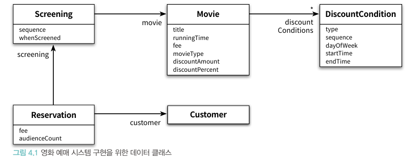
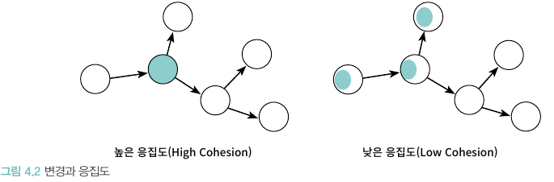
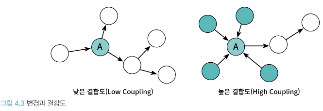
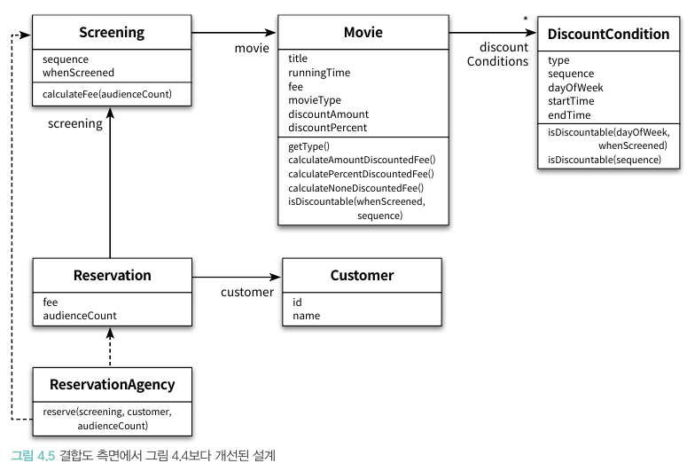

# 📚 4장 설계 품질과 트레이드 오프

- 객체지향 설계의 핵심은 역할, 책임, 협력이며 그 중 책임이 객체지향 애플리케이션 전체의 품질을 결정
- 객체지향 설계란 올바른 객체에게 올바른 책임을 할당하면서 낮은 결합도와 높은 응집도를 가진 구조를 창조하는 활동
- 결합도와 응집도를 합리적인 수준으로 유지할 수 있는 중요 원칙: 객체의 상태가 아니라 객체의 행동에 초점

## 📖 4.1 데이터 중심의 영화 예매 시스템

- 해당 정리에서 '상태'와 '데이터'는 동일한 의미
- 데이터 중심의 관점은 객체의 상태에 초점을 맞추고 책임 중심의 관점은 객체의 행동에 초점을 맞춤
- 훌륭한 객체 지향 설계는 변경에 강한 책임 중심의 관점
- 상태는 구현에 속하며 책임은 인터페이스에 속함

### 🔖 4.1.1 데이터를 준비하자

- 데이터 중심의 설계는 객체가 내부에 저장해야 하는 '데이터가 무엇인가' 부터 시작
- 데이터 중심으로 설계된 클래스는 object-project/src/main/java/chapter4/domain에 위치
- 

## 📖 4.2 설계 트레이드오프

- 좋은 설계의 특징을 판단할 수 있는 기준으로 캡슐화, 응집도, 결합도 사용

### 🔖 4.2.1 캡슐화

- 객체지향 설계의 가장 중요한 원리는 불안정한 구현 세부사항을 안정적인 인터페이스 뒤로 캡슐화하는 것
- 변경 가능성이 높은 부분(구현)은 내부에 숨기고 외부에서는 상대적으로 안정적인 부분(인터페이스)만 공개함으로써 변경의 여파를 통제
- 설계가 필요한 이유는 요구사항이 변경되기 때문이고, **캡슐화**가 중요한 이유는 불안정한 부분과 안정적인 부분을 분리해서 변경의 영향을 통제

### 🔖 4.2.2 응집도와 결합도

- **응집도**는 모듈에 포함된 내부 요소들이 연과돼 있는 정도를 나타냄. 객체지향의 관점에서 응집도는 객체 또는 클래스에 얼마나 관련 높은 책임들을 할당했는지 나타냄
- **결합도**는 의존성의 정도를 나타내며 다른 모듈에 대해 얼마나 많은 지식을 갖고 있는지를 나타내는 척도

- 좋은 설계란 오늘의 기능을 수행하며 내일의 변경을 수용할 수 있어야 하고 이는 즉 변경에 관련된 것
- 변경의 관점에서 응집도란 **변경이 발생할 때 모듈 내부에서 발생하는 변경의 정도**로 측정
  
- 결합도란 **한 모듈이 변경되기 위해서 다른 모듈의 변경을 요구하는 정도**로 측정
  

## 🔖 4.3 데이터 중심의 영화 예매 시스템의 문제점

- 데이터 중심 설계가 가진 대표적인 문제점: 캡슐화 위반, 높은 결합도, 낮은 응집도

### 🔖 4.3.1 캡슐화 위반

```java
public class Movie {
    @Getter
    @Setter
    private Money fee;
}

```

- getFee 메서드와 setFee 메서드는 Movie 내부에 Money 타입의 fee라는 이름의 인스턴스 변수가 존재한다는 사실을 노골적으로 노출(캡슐화하지 못함)
- 설계할 때 협력에 관해 고민하지 않으면 캡슐화를 위반하는 과도한 접근자와 수정자를 가지게 되는 경향이 있음
- 접근자와 수정자에 과도하게 의존하는 설계 방식 -> **추측에 의한 설계 전략(design-by-guessing strategy)**

### 🔖 4.3.1 높은 결합도

```java
public class ResercationAgency {
    public Reservation reserve(Screening screening, Customer customer, int audienceCount) {
        ...
        Money fee;
        if (discountable) {
            ...
            fee = movie.getFee().minus(discountedAmount).times(audienceCount);
        } else {
            fee = movie.getFee();
        }
        ...
    }
}

```

- ReservationAgency는 한 명의 예매 요금을 계산하기 위해 Movie와 Money 타입에 결합되어 있다
- fee의 타입이 변경되면 연관된 모든 클래스의 수정이 필요하고 캡슐화가 잘 이루어지지 않았기에 발생하는 문제
- 제어 객체인 ReservationAgency가 모든 데이터 객체에 의존하기에 어떤 변경이 있던 ReservationAgency도 함께 수정해야 함

### 🔖 4.3.2 낮은 응집도

- 데이터 중심으로 설계하였기에 응집도가 낮아지고 그에 따라 발생하는 문제는 다음과 같다
    - 변경의 이유가 서로 다른 코드들을 하나의 모듈 안에 뭉쳐놓았기 때문에 변경과 아무 상관이 없는 코드들이 영향을 받게 됨
    - 어떤 코드를 수정한 후에 아무런 상관도 없던 코드에 문제가 발생하는 것은 모듈의 응집도가 낮을 때 발생하는 대표적 증상
    - 하나의 요구사항 변경을 반영하기 위해 동시에 여러 모듈의 수정이 필요

## 🔖 4.4 자율적인 객체를 향해

### 🔖 4.4.1 캡슐화를 지켜라

- 객체는 스스로의 상태를 책임져야 하며 외부에서는 인터페이스에 정의된 메서드를 통해서만 상태에 접근할 수 있어야 한다.
- 메서드는 단순히 접근자나 수정자가 아닌 객체가 책임져야 하는 무언가를 수행하는 것

```java

@Getter
@Setter
class Rectangle {
    private int left;
    private int top;
    private int right;
    private int bottom;
}
```

- 위와 같이 구현되었다면 하나의 필드가 수정되더라도 동시다발적인 수정이 필요함

```java
class Rectangle {
    private int left;
    private int top;
    private int right;
    private int bottom;

    public void enlarge(int multiple) {
        right *= multiple;
        bottom *= multiple;
    }
}
```

- Rectangle을 변경하는 주체를 외부의 객체에서 내부로 이동하여 캡슐화를 강화

### 🔖 4.4.2 스스로 자신의 데이터를 책임지는 객체

- 객체 내부에 저장되는 데이터보다 객체가 협력에 참여하면서 수행할 책임을 정의하는 오퍼레이션이 중요
- 객체 설계시 다음 두 가지 사항 고려
    - 이 객체가 어떤 데이터를 포함해야 하는가?
    - 이 객체가 데이터에 대해 수행해야 하는 오퍼레이션은 무엇인가?
- 이를 고려해 ReservationAgency로 새어나간 데이터에 대한 책임을 실제 데이터를 포함하고 있는 객체로 옮길 필요가 있음
  

## 🔖 4.5 하지만 여전히 부족하다

- 위의 사항을 고려하여 전체적인 설계 품질은 올라갔지만 여전히 문제가 많음

### 🔖 4.5.1 캡슐화 위반

```java
import java.time.DayOfWeek;
import java.time.LocalTime;

public class DiscountCondition {
    private DiscountConditionType type;
    private int sequence;
    private DayOfWeek dayOfWeek;
    private LocalTime startTime;
    private LocalTime endTime;

    public DiscountConditionType getType() {...}

    ;

    public boolean isDiscountable(DayOfWeek dayOfWeek, LocalTime time) {...}

    ;

    public boolean isDiscountable(int sequence) { ...}
}
```

- 객체지향이 자신의 상태를 스스로 관리하는 자율적인 객체를 지향하는 것이라고 한다면 위의 설계가 언뜻 보면 맞아보임
- 기간 조건을 판단하는 isDiscountable(DayOfWeek dayOfWeek, LocalTime time) 해당 클래스가 어떤 필드를 가졌는지 노출
- DiscountCondition의 속성을 변경할 경우 isDiscountable 메서드 역시 수정되고 외부로 문제가 퍼져나가기에 캡슐화가 부족하다는 명백한 증거

캡슐화의 진정한 의미

- 캡슐화는 단순히 내부 속성을 외부로부터 감추는 '데이터 캡슐화' 보다 큰 개념. 캡슐화란 변할 수 있는 어떤 것이라 감추는 것!(유추할 수 있는 메서드 또한 포함)

### 🔖 4.5.2 높은 결합도

```java
public class Movie {
    public boolean isDiscountable(LocalDaeTime whenScreened, int sequence) {
        for (DiscountCondition condition : discountConditions) {
            if (codition.getType() == DiscountConditionType.PERIPD) {
        ...
            } else {
        ...
            }
        }
    }
}
```

- 위의 코드 역시 Movie와 DiscountCondition이 설계를 변경했음에도 높은 결합도를 보임을 알 수 있음
    - DiscountCondition의 기간 할인 조건의 명칭이 PERIOD에서 다른 값으로 변경된다면 Movie를 수정해야 함
    - DiscountCondition의 종류가 추가되거나 삭제되면 if ~else 구분을 수정해야 함
    - DiscountCondition의 만족 여부를 판단하는 데 필요한 정보가 변경된다면 Movie의 isDiscountable 메서드로 전달할 파라미터가 변경되야함
- 이 역시 캡슐화 원칙을 잘 지키지 않았기에 높은 결합도를 보임

### 🔖 4.5.3 낮은 응집도

- 할인 조건의 종류를 변경하기 위해선 DiscountCondition, Move, Screening등 여러 곳을 수정해야 함
- 데이터 중심 설계는 리팩토링을 하여도 여전히 문제를 가지고 있음. 왜 이런 문제점을 유발하는 것일까?

## 🔖 4.6 데이터 중심 설계의 문제점

데이터 중심의 설계가 변경에 취약한 이유

- 데이터 중심의 설계는 본질적으로 너무 이른 시기에 데이터에 관해 결정하도록 강요한다.
- 데이터 중심의 설계에서는 협력이라는 문맥을 고려하지 않고 객체를 고립시킨 채 오퍼레이션을 결정한다.

### 🔖 4.6.1 데이터 중심 설계는 객체의 행동보다는 상태에 초점을 맞춘다

- 데이터 중심 설계 방식은 데이터와 기능을 분리하는 절차적 프로그래밍 방식을 따름
- 이는 상태와 행동을 하나의 단위로 캡슐화하는 객체지향 패러다임에 반하는 것
- 접근자와 수정자를 과도하게 추가하게 되고 데이터 객체를 사용하는 절차를 분리된 별도의 객체 안에 구현하게 됨 -> 캡슐화가 무너짐
- 데이터를 먼저 결정하고 데이터를 처리하는 데 필요한 오퍼레이션을 나중에 결정하는 방식은 데이터에 관한 지식이 객체의 인터페이스에 고스란히 드러나가 된다

### 🔖 4.6.2 데이터 중심 설계는 객체를 고립시킨 채 오퍼레이션을 정의하도록 만든다

- 올바른 객체지향 설계의 무게 중심은 항상 객체의 내부가 아니라 외부에 맞춰져 있어야 함
- 객체의 내부에 어떤 상태를 가지고 관리하는지는 부가적인 문제고 다른 객체와의 협력에 초점을 맞춤
- 데이터 중심 설계의 초점은 객체의 내부로 향하기에 실행 문맥에 대한 깊이 있는 고민 없이 객체가 관리할 데이터의 세부 정보를 먼저 결정한다
