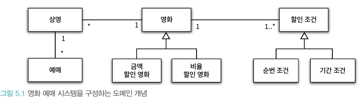
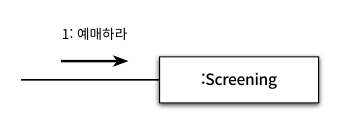
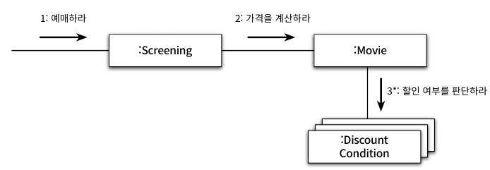
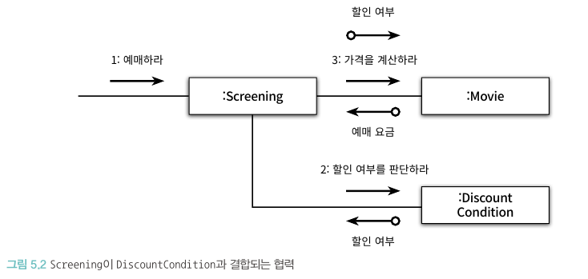
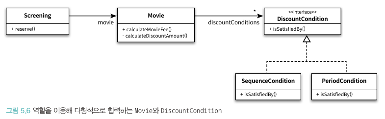
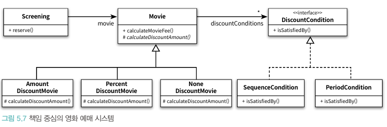
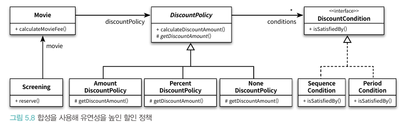
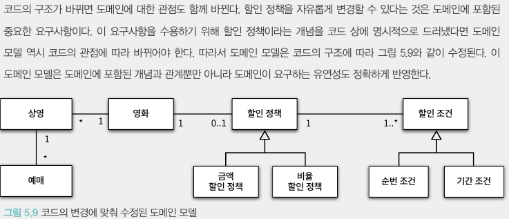

# 📚 5장 책임 할당하기

- 책임 할당 과정은 일종의 트레이드오프 활동
- GRASP 패턴을 통해 응집도와 결합도, 캡슐화 같은 다양한 기준에 따라 책임을 할당하고 결과를 트레이드오프 하는 기준을 배운다

## 📖 5.1 책임 주도 설계를 향해

- 데이터보다 행동을 먼저 결정하라
- 협력이라는 문맥 안에서 책임을 결정하라

### 🔖 5.1.1 데이터보다 행동을 먼저 결정하라

- 객체에게 중요한 것은 데이터가 아니라 외부에 제공하는 행동
- 책임 중심의 설계를 위해 필요한 질문: 데이터를 처리하는 데 필요한 오퍼레이션은 무엇인가?

### 🔖 5.1.2 협력이라는 문맥 안에서 책임을 결정하라

- 객체의 입장에서는 책임이 조금 어색해 보이더라도 협력에 적합하다면 좋은 책임(객체의 입장이 아닌 협력의 입장에서 바라봄)
- 객체가 메시지를 선택하는 것이 아닌 메시지가 객체를 선택
    - 이 클래스가 필요하다는 점은 알겠는 이 클래스는 무엇을 해야 하지? (X)
    - 메시지를 전송해야 하는데 누구에게 전송해야 하지? (O)
- 메시지를 먼저 결정하기에 메시지 송신자는 메시지 수신자에 대한 어떠한 가정도 할 수 없다

### 🔖 5.1.3 책임 주도 설계

- 책임 주도 설계의 흐름
    - 시스템이 사용자에게 제공해야 하는 기능인 시스템 책임을 파악
    - 시스템 책임을 더 작은 책임으로 분할
    - 분할된 책임을 수행할 수 있는 적절한 객체 또는 역할을 찾아 책임을 할당
    - 객체가 책임을 수행하는 도중 다른 객체의 도움이 필요할 경우 이를 책임질 적절할 객체 또는 역할을 찾는다
    - 해당 객체 또는 역할에게 책임을 할당함으로써 두 객체가 협력하게 한다.

## 📖 5.2 책임 할당을 위한 GRASP 패턴

- General Reponsibility Assignment Software Pattern

### 🔖 5.2.1 도메인 개념에서 출발하기

- 설계를 시작하기 전에 도메인에 대한 개략적인 모습을 그려 보는 것은 유용
  
- 도메인 개념을 완벽하게 정리하는데 많은 시간을 들이지 않고 빠르게 설계와 구현을 진행하라

### 🔖 5.2.2 정보 전문가에게 책임을 할당하라

- 책임 주도 설계 방식의 첫 단계: 애플리케이션이 제공해야 하는 기능을 책임으로 생각
- 사용자에게 제공해야 하는 기능: 영화를 예매한다
    - 첫 번째 질문: 메시지를 전송할 객체는 무엇을 원하는가? -> 메시지: 예매하라
    - 두 번째 질문: 메시지를 수신할 적합한 객체는 누구인가?
        - 두 번째 질문을 답하기 위해 객체가 상태와 행동을 통합한 캡슐화의 단위라는 사실에 집중
        - 객체에게 책임을 할당하는 첫 번째 원칙: 책임을 수행할 정보를 알고 있는 객체에게 할당(**INFORMATION EXPERT** pattern)
- 여기에서 정보는 데이터와 다른 개념. 즉, 정보를 '알고' 있다고 해서 정보를 '저장' 하고 있을 필요는 없음
- 예매하라라는 메시지를 처리하기에 상영(Screening)이라는 도메인 개념이 적합
  
- Screening이 수행해야하는 작업의 흐름을 고려하고 스스로 처리할 수 없는 작업이 있다면 외부에 도움을 요청 -> 이는 즉 새로운 메시지
- 이를 반복한 최종 형태
  

### 🔖 5.2.3 높은 응집도와 낮은 결합도

- 설계는 항상 트레이드 오프의 활동이며 올바른 책임 할당을 위해 정보 전문가 패턴 외 다른 패턴을 고려할 필요가 있음
- 다른 설계의 예시
  
- 위 설계는 기능적 측면에서는 동일하지만 높은 응집도와 낮은 결합도를 선택하는 것이 좋다
- GRASP에서는 이를 LOW COUPLING(낮은 결합도) 패턴과 HIGH COHESION(높은 응집도) 패턴이라 부름
- LOW COUPLING 패턴 관점에서 설계 평가
    - 도메인 설계에서 Movie는 DiscountCondition의 목록을 속성으로 포함하고 이 둘은 이미 결합돼 있기에 협력을 하여도 결합도가 추가되지 않음
    - 하지만 Screening이 DiscountCondition과 협력할 경우 새로운 결합도가 추가
- HIGH COHESION 패턴 관점에서 설계 평가
    - Screening의 가장 중요한 책임은 예매를 생성하는 것
    - 만약 Screening이 DiscountCondition과 협력해야한다면 영화 요금 계산과 관련된 책임 일부를 떠안게 됨
    - 반면 Movie의 주된 책임은 영화 요금을 계산하는 것이기에 DiscountCondition과 협력하는 것은 응집도에 아무런 해를 끼치지 않음

### 🔖 5.2.4 창조자에게 객체 생성 책임을 할당하라

- 영화 예매 협력의 최종 결과물은 Reservation 인스턴스를 생성하는 것
- CREATOR 패턴은 객체를 생성할 책임을 어떤 객체에게 할당할지에 대한 지침을 제공한다
- Reservation을 생성할 책임이 있는 객체는 Screening이다

## 📖 5.3 구현을 통한 검증

```java
public class Movie {
    private Money calculateDiscountAmount() {
        switch (movieType) {
            case AMOUNT_DISCOUNT:
                return calculateAmountDiscountAmount();
            case PERCENT_DISCOUNT:
                return calculatePercentDiscountAmount();
            case NONE_DISCOUNT:
                return calculateNoneDiscountAmount();
        }

        throw new IllegalAccessException();
    }

    private Money calculateAmountDiscountAmount() {
        return discountAmount;
    }

    private Mondy calculatePercentDiscountAmount() {
        return fee.times(discountPercent);
    }

    private Money calculateNoneDiscountAmount() {
        return Money.ZERO;
    }


}
```

```java
import chapter4.domain.Screening;
import chapter4.domain.enumeration.DiscountConditionType;

import java.time.DayOfWeek;
import java.time.LocalTime;

public class DiscountCondition {
    private DiscountConditionType type;
    private int sequence;
    private DayOfWeek dayOfWeek;
    private LocalTime startTime;
    private LocalTime endTime;

    public boolean isSatisfiedBy(Screening screening) {
        if (type == DiscountConditionType.PERIPD)
            return isSatisfiedByPeriod(screening);

        return isSatisfiedBySequence(screening);
    }

    private boolean isSatisfiedByPeriod(Screening screening) {
    ...
    }

    private boolean isSatisfiedBySequence(Screening screening) {
        return sequence == screening.getSequence();
    }
}
```

### 🔖 5.3.1 DiscountCondition 개선하기

- 변경에 취약한 클래스란 코드를 수정해야 하는 이유를 하나 이상 가지는 클래스
- DiscountCondition이 수정될 수 있는 이유
    - 새로운 할인 조건 추가
    - 순번 조건을 판단하는 로직 변경
    - 기간 조건을 판단하는 로직 변경
- DiscountCondition은 하나 이상의 변경 이유를 가지기에 응집도가 낮음 -> 해결을 위해 변경의 이유에 따라 클래스를 분리
- 설계를 개선하기 위해 변경이 이유가 하나 이상인 클래스를 찾는 것으로부터 시작하며 이를 몇 가지 패턴으로 찾아낼 수 있음
    - **패턴1. 응집도가 높은 클래스는 인스턴스를 생성할 때 모든 속성을 함께 초기화**
        - 응집도를 높이기 위해 함께 초기화 되는 속성을 기준으로 코드를 분리한다
    - **패턴2. 모든 메서드가 객체의 모든 속성을 사용한다면 클래스의 응집도는 높다고 볼 수 있다**
        - 응집도를 높이기 위해 속성 그룹과 해당 그룹에 접근하는 메서드 그룹을 기준으로 코드를 분리한다

### 🔖 5.3.2 타입 분리하기

- DiscountCondition의 가장 큰 문제는 순번 조건과 기간 조건이라는 두 개의 독립적 타입이 하나의 클래스 안에 공존한다는 점
- PeriodCondition과 SequenceCondition으로 분리하면 위에서 발견된 문제점들이 모두 해결됨
- 하지만 Movie와 협력하는 클래스는 DiscountCondition 하나 뿐이였던 이전과 달리 새로운 두 개의 인스턴스와 모두 협력이 필요해짐
- 응집도가 높아졌지만 변경과 캡슐화라는 관점에서 전체적인 설계 품질이 나빠졌으며 이를 극복하기 위해 다형성 사용
  

### 🔖 5.3.3 변경으로부터 보호하기

- DiscountCondition이라는 역할이 Movie로부터 PeriodCondition과 SequenceCondition의 존재를 감춤
- 이처럼 변경을 캡슐화하도록 책임을 할당하는 것을 PROTECTED VARIATIONS 패턴이라 부름

### 🔖 5.3.4 Movie 클래스 개선하기

- Movie 클래스 역시 POLYMORPHISM 패턴과 PROTECTED VARIATIONS 패턴을 통해 개선 가능
  

### 🔖 5.3.5 변경과 유연성

- 설계를 주도하는 것은 변경이다
- 변경에 대비할 수 있는 두 가지 방법
  - 코드를 이해하고 수정하기 쉽도록 단순하게 설계하는 방법
  - 코드를 수정하지 않고도 변경을 수용할 수 있도록 유연하게 만드는 것
- 대부분의 경우 전자가 좋은 방법이지만 유사한 변경이 반복적으로 발생한다면 복잡성이 상승하더라도 두 번째 방법이 좋다
- 예) 영화에 설정된 할인 정책을 실행 중에 변경할 수 있어야 한다는 요구사항이 추가할 경우
  - 새로운 할인 정책이 추가될 때마다 인스턴스를 생성하고, 상태를 복사하고 식별자를 관리하는 코드를 추가하는 일은 번거롭고 오류가 발생하기 쉽다
  - 이를 해결하기 위해 상속 대신 **합성**을 사용
  - Movie의 상속 계층안에 구현된 할인 정책을 독립적인 DiscountPolicy로 분리한 후 Movie에 합성시키면 유연한 설계가 완성(2장과 같은 설계)

> 코드의 구조가 도메인의 구조에 대한 새로운 통찰력을 제공한다


## 📖 5.4 책임주도 설계의 대안

- 책임과 객체 사이에서 방황할 때 돌파구를 찾기 위해 선택하는 방법은 최대한 빠르게 목적한 기능을 수행하는 코드를 작성하는 것
- 아무것도 없는 상태에서 책임과 협력에 관해 고민하기 보다는 코드를 얻고 난 후 명확히 드러나는 책임들을 올바른 위치로 이동
- 겉으로 보이는 동작은 바꾸지 않은 채 내부 구조를 변경하는 것을 리팩터링이라 부른다

### 🔖 5.4.1 메서드 응집도

- 데이터 중심으로 설계된 영화 예매 시스템에서 ReservationAgency의 reserve 메서드는 너무 길고 이해하기 어렵다
  - 어떤 일을 수행하는지 한눈에 파악하기 어렵기 때문에 코드를 전체적으로 이해하는 데 너무 많은 시간이 걸린다
  - 하나의 메서드 안에서 너무 많은 작업을 처리하기 때문에 변경이 필요할 때 수정해야 할 부분을 찾기 어렵다
  - 메서드 내부의 일부 로직만 수정하더라도 메서드의 나머지 부분에서 버그가 발생할 확률이 높다
  - 로직의 일부만 재사용하는 것이 불가능하다
  - 코드를 재사용하는 유일한 방법은 원하는 코드를 복사해서 붙여넣는 것뿐이므로 코드 중복을 초래하기 쉽다

## 📖 부록. GRASP 패턴 정리

### 🔖 INFORMATION EXPERT 패턴

- 책임을 정보 전문가, 즉, 책임을 수행하는 데 필요한 정보를 가지고 있는 객체에게 할당하라
-

### 🔖 LOW COUPLING 패턴

- 어떻게 하면 의존성을 낮추고 변화의 영향을 줄이며 재사용성을 증가시킬 수 있을까? 설계의 전체적인 결합도가 낮게 유지되도록 책임을 할당하라

### 🔖 HIGH COHESION 패턴

- 어떻게 복장성을 관리할 수 있는 수준으로 유지할 것인가? 높은 응집도를 유지할 수 있게 책임을 할당하라

### 🔖 CREATOR 패턴

- 객체 A를 생성해야 할 때 어떤 객체에게 객체 생성 책임을 할당해야 하는가?
    - B가 A 객체를 포함하거나 참조한다.
    - B가 A 객체를 기록한다.
    - B가 A 객체를 긴밀하게 사용한다.
    - B가 A 객체를 초기화하는 데 필요한 데이터를 가지고 있다
- CREATOR 패턴의 의도는 어떤 방식으로든 생성되는 객체와 연결되거나 관련될 필요가 있는 객체에 해당 객체를 생성할 책임을 맡기는 것

### 🔖 POLYMORPHISM 패턴

- 객체의 타입에 따라 변하는 로직이 있을 때 책임을 어떻게 할당해야 하는가? 타입을 명시적으로 정의하고 각 타입에 다형적으로 행동하는 책임을 할당하라

### 🔖 PROTECTED VARIATIONS 패턴

- 변화가 예상되는 불안정한 지점들을 식별하고 그 주위에 안정된 인터페이스를 형성하도록 책임을 할당하라