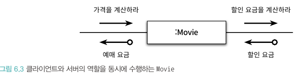
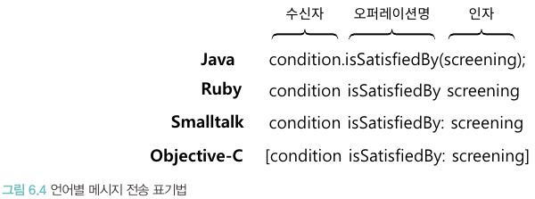
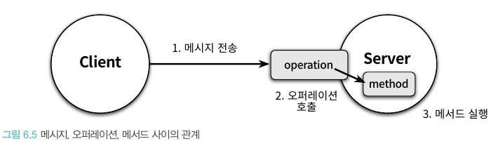
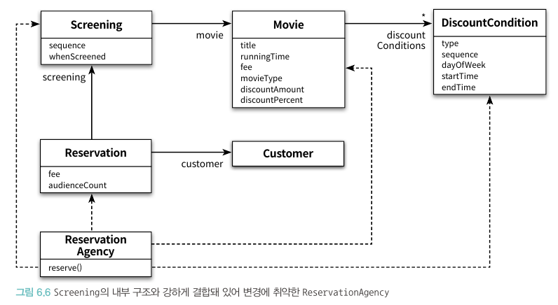

# 📚 6장 메시지와 인터페이스

- 객체지향 애플리케이션은 클래스의 집합이 아닌 메시지를 기반으로 객체의 책임에 초점을 맞춰야 한다
- 객체가 수신하는 메시지들이 퍼블릭 인터페이스로 구성

## 📖 6.1 협력과 메시지

### 🔖 6.1.1 클라이언트-서버 모델

- 협력 안에서 메시지를 전송하는 객체를 클라이언트, 메시지를 수신하는 객체를 서버라 부름
- 협력은 클라이언트가 서버의 서비스를 요청하는 단뱡향 상호작용이다
- 협력의 관점에서 객체는 수신하는 메시지 집합과 전송하는 메시지의 집합으로 구성된다
- 

### 🔖 6.1.2 메시지와 메시지 전송

- 메시지: 객체들이 협력하기 위해 사용할 수 있는 유일한 의사소통 수단
- 메시지 전송, 메시지 패싱: 한 객체가 다른 객체에게 도움을 요청하는 것
- 메시지는 **오퍼레이션명**, **인자**로 구성되며 메시지 전송은 여기에 **메시지 수신자**를 추가한 것
- 

### 🔖 6.1.3 메시지와 메서드

- 메시지를 수신했을 때 실제로 실행되는 함수 또는 프로시저를 **메서드**라 부름
- 객체지향에서는 메시지 전송과 메서드 호출을 명확하게 구분함 -> 실행 시점에 실제로 실행되는 코드는 메시지를 수신하는 객체의 타입에 따라 달라지기 때문
- 메시지 전송자는 어떤 메시지를 전송해야 하는지만 알면 되고, 메시지 수신자는 메시지를 처리하기 위해 필요한 메서드를 스스로 결정만 하면 된다 -> 느슨한 결합
- 실행 시점에 메시지와 메서드를 바인딩하는 메커니즘은 두 객체 사이의 결합도를 낮춰 유연하고 확장 가능한 코드를 작성할 수 있게 만든다

### 🔖 6.1.4 퍼블릭 인터페이스와 오퍼레이션

- 객체가 의사소통을 위해 외부에 공개하는 메시지의 집합: **퍼블릭 인터페이스**
- 퍼블릭 인터페이스에 포함된 메시지: 오퍼레이션
- 오퍼레이션은 내부의 구현 코드는 제외하고 메시지와 관련된 시그니처를 가리키며 인터페이스에 정의된 메서드 이름이 오퍼레이션에 해당
- 메서드는 메시지를 수신했을 때 실제로 실행되는 코드
- 프로그래밍 언어의 관점에서 메시지를 전송하면 런타임 시스템은 오퍼레이션 호출로 해석하고 메시지를 수신한 객체의 실제 타입을 기반으로 적절한 메시지를 실행
- 퍼블릭 인터페이스와 메시지의 관점에서 보면 '메서드 호출'보다는 '오퍼레이션 호출'이 더 적절한 용어
- 

### 🔖 6.1.5 시그니처

- 시그니처: 오퍼레이션의 이름과 파라미터 목록을 합친 것(명세)

## 📖 6.2 인터페이스와 설계 품질

- 좋은 인터페이스: 최소한의 인터페이스와 추상적인 인터페이스
- 좋은 인터페이스를 설계하기 위해선 책임 주도 설계 방법을 따른다
- 퍼블릭 인터페이스 품질에 영향을 미치는 원칙과 기법
    - 디미터 법칙
    - 묻지 말고 시켜라
    - 의도를 드러내는 인터페이스
    - 명령-쿼리 분리

### 🔖 6.2.1 디미터 법칙



- 디미터 법칙: 객체의 내부 구조에 강하게 결합되지 않도록 협력 경로를 제한하라는 법칙
    - 다른 말로는 낯선 자에게 말하지 말라, 오직 인접한 이웃하고만 말하라, 오직 하나의 도트만 사용하라 등이 있음
- 클래스 내부의 메서드가 메시지를 전송해도 무방한 인스턴스 목록
    - this 객체
    - 메서드의 매개변수
    - this의 속성
    - this의 속성인 컬렉션의 요소
    - 메서드 내에서 생성된 지역 객체
- 안좋은 ReservationAgency 코드

```java
public class ReservationAgency {
    public Reservation reserve(Screening screening, Customer customer, int audienceCount) {
        Movie movie = screening.getMovie();

        boolean discountable = false;
        for (DiscountCondition condition : movie.getDiscountConditions()) {
            if (condition.getType() == DiscountConditionType.PERIOD) {
                ...
            } else {
                ...
            }
        }
    }
}
```

- 위의 코드는 인자로 넘겨받은 screening 인스턴스에서 movie를 꺼내고 movie 인스턴스에서 condition을 꺼내는 매우 강한 결합도를 가짐

### 🔖 6.2.2 묻지 말고 시켜라

- 훌륭한 메시지는 객체의 상태에 관해 묻지 말고 원하는 것을 시켜야 한다
- 메시지 전송자는 메시지 수신자의 상태를 기반으로 결정을 내린 후 메시지 수신자의 상태를 바꿔서는 안된다
- 객체지향의 기본은 함께 변경될 확률이 높은 정보와 행동을 하나의 단위로 통합하는 것
- 내부의 상태를 묻는 오퍼레이션을 인터페이스에 포함시키고 있다면 더 나은 방법은 없는지 고민이 필요

### 🔖 6.2.3 의도를 드러내는 인터페이스

```java
public class PeriodCondition {
    public boolean isSatisfiedByPeriod(Screening screening) {
    }

    ;
}

public class SequenceCondition {
    public boolean isSatisfiedBySequence(Screening screening) {
    }

    ;
}
```

- 메서드를 명명하는 방법 중 작업을 어떻게 수행하는지 나타내는 스타일은 좋지 않다
    - 이유 1. 메서드에 대해 제대로 커뮤니케이션하지 못한다. 클라이언트 관점에서 isSatisfiedByPeriod와 isSatisfiedBySequence는 모두 할인 조건을 할당하는 동일 로직이다
      하지만 메서드의 이름이 다르기에 두 메서드의 내부 구현을 정확히 이해하지 못하면 두 메서드가 동일한 작업을 수행하다는 사실을 알아채기 어렵다.
    - 이유 2. 메서드 수준에서 캡슐화를 위반한다. 해당 메서드들은 클라이언트로 하여금 협력하는 객체의 종류를 알도록 강요한다. 만약 할인 여부를 판단하는 방법이
      변경되면 메서드의 이름 역시 변경되며 메시지를 전송하는 클라이언트의 코드도 함께 변경됨을 의미한다. 따라서 책임을 수행하는 방법을 드러내는 메서드를 사용한 설계는 변경에 취약해진다.

- 메서드의 이름을 짓는 두 번째 방법은 '어떻게'가 아니라 '무엇을' 하는지를 드러내는 것
- 무엇을 하느냐에 따라 메서드의 이름을 짓는 패턴을 **의도를 드러내는 선택자(Intention Revealing Selector)** 라고 부름

> 하나의 구현을 가진 메시지의 이름을 일반화하도록 도와주는 간단한 훈련 방법은 매우 다른 두 번째 구현을 상상하고 해당 메서드에 동일한 이름을 붙여보는 것.
> 그 순간 우리가 할 수 있는 가장 추상적인 이름을 메서드에 붙일 것이다.

- 객체에게 묻지 말고 시키되 구현 방법이 아닌 클라이언트의 의도를 드러내는 것 이것이 이해하기 쉽고 유연하며 협력적인 객체를 만드는 가장 기본적인 요구사항이다.

### 🔖 6.2.4 함께 모으기

#### 디미터 법칙을 위반하는 티켓 판매 도메인

```java
public class Theater {
    private TicketSeller ticketSeller;

    public Theater(TicketSeller ticketSeller) {
        this.ticketSeller = ticketSeller;
    }

    public void enter(Audience audience) {
        if (audience.getBag().hasInvitation()) {
            Ticket ticket = ticketSeller.getTicketOffice().getTicket();
            audience.getBag().setTicket(ticket);
        } else {
            Ticket ticket = ticketSeller.getTicketOffice().getTicket();
            audience.getBag().minusAmount(ticket.getFee());
            ticketSeller.getTicketOffice().plusAmount(ticket.getFee());
            audience.getBag().setTicket(ticket);
        }
    }
}
```

- 위의 코드는 Theater가 audience와 ticketSeller 내부에 포함된 객체에도 직접 접근하는 문제

```java
// 기차 충돌 스타일의 전형적인 모습
audience.getBag().minusAmount(ticket.getFee());
```

#### 묻지 말고 시켜라

1. Theater가 TicketSeller에게 자신이 원하는 일을 시키도록 수정

```java
public class TicketSeller {

    public void setTicket(Audience audience) {
        if (audience.getBag().hasInvitation()) {
            Ticket ticket = ticketOffice.getTicket();
            audience.getBag().setTicket(ticket);
        } else {
            Ticket ticket = ticketOffice.getTicket();
            audience.getBag().minusAmount(ticket.getFee());
            ticketOffice.plusAmount(ticket.getFee());
            audience.getBag().setTicket(ticket);
        }
    }
}

public class Theater {
    private TicketSeller ticketSeller;

    public void enter(Audience audience) {
        ticketSeller.setTicket(audience);
    }
}
```

2. TicketSeller가 원하는 것은 Audience가 Ticket을 보유하도록 만드는 것

```java
public class Audience {

    public Long setTicket(Ticket ticket) {
        if (bag.hasInvitation()) {
            bag.setTicket(ticket);
            return 0L;
        } else {
            bag.setTicket(ticket);
            bag.minusAmount(ticket.getFee());
            return ticket.getFee();
        }
    }
}

public class TicketSeller {

    public void setTicket(Audience audience) {
        ticketOffice.plusAmount(audience.setTicket(ticketOffice.getTicket()));
    }
}
```

3. 아직 Audience에서 Bag에게 원하는 일을 시키기 전 상태를 묻는 코드가 있기에 제외

```java
public class Bag {
    
    public Long setTicket(Ticket ticket) {
        if (hasInvitation()) {
            this.ticket = ticket;
            return 0L;
        } else {
            this.ticket = ticket;
            minusAmount(ticket.getFee());
            return ticket.getFee();
        }
    }
}

public class Audience {

    public Long setTicket(Ticket ticket) {
        return bag.setTicket(ticket);
    }
}
```

#### 인터페이스에 의도를 드러내자

- 미묘하게 다른 의미를 가진 퍼블릭 인터페이스명이 setTicket으로 모두 동일하여 클라이언트에 혼란을 줌
- Theater는 Audience에게 티켓을 판매하라는 의미기에 sellTo
- TicketSeller가 Audience에게 원하는 메시지는 buy
- Audience가 Bag에게 원하는 메시지는 hold

```java
public class TicketSeller {
  public void sellTo(Audience audience) {};
}

public class Audience {
  public Long buy(Ticket ticket) {};
}

public class Bag {
  public Long hold(Ticket ticket) {};
}
```

## 📖 6.3 원칙의 함정

- 설계는 트레이드 오프의 산물이기에 원칙이 현재 상황에 부적합하다 판단된다면 과감히 원칙을 무시하라
- 원칙을 아는 것보다 원칙이 언제 유용하고 아닌지를 판단하는 능력이 더 중요하다

### 🔖 6.3.1 디미터 법칙은 하나의 도트를 강제하는 규칙이 아니다

- 대표적으로 자바 Stream의 경우 동일한 클래스의 인스턴스를 반환하기에 디미터 법칙을 위반하는 것이 아니다
- 디미터 법칙은 결합도와 관련된 것이며, 객체의 내부 구조가 외부로 노출되는 것에 한정

### 🔖 6.3.2 결합도와 응집도의 충돌

- 모든 상황에서 맹목적으로 위임 메서드를 추가하면 객체는 상관 없는 책임들을 한꺼번에 떠안아 응집도가 낮아지는 결과를 초래할 수 있다

1. 영화 예매 시스템 PeriodCondition
```java
public class PeriodCondition implements DiscountCondition {

  public boolean isSatisfiedBy(Screening screening) {
    return screening.getStartTime().getDayOfWeek().equals(dayOfWeek) &&
            startTime.compareTo(screening.getStartTime().toLocalTime()) <= 0 &&
            endTime.compareTo(screening.getStartTime().toLocalTime()) >= 0;
  }
}
```
2. Screening의 내부 상태를 가져와서 사용한다고 판단하여 로직을 옮기면 다음과 같이 된다.
```java
public class Screening {
  public boolean isDiscountable(Screening screening) {
    return whenScreened.getDayOfWeek().equals(dayOfWeek) &&
            startTime.compareTo(whenScreened.toLocalTime()) <= 0 &&
            endTime.compareTo(whenScreened.toLocalTime()) >= 0;
  }
}

public class PeriodCondition implements DiscountCondition {

  public boolean isSatisfiedBy(Screening screening) {
    return screening.isDiscountable(dayOfWeek, startTime, endTime);
  }
}
```
- 위의 코드가 되면 Screening이 기간에 따른 할인 조건을 판단하는 책임을 떠안게 됨
- 그렇기에 내부 구현을 감춰 Screening의 캡슐화를 향상시키는 것보다 Screening의 응집도를 높이고 PeriodCondition 사이의 결합도를 낮추는 것이 더 좋은 방법
-  소프트웨어 설계에 존재하는 몇 안되는 법칙 중 하나 **"경우에 따라 다르다"**

## 📖 6.4 명령-쿼리 분리 원칙

- 루틴: 어떤 절차를 묶어 호출 가능하도록 이름을 부여한 기능 모듈
- 프로시저(명령): 정해진 절차에 따라 내부의 상태를 변경하는 루틴의 한 종류. 부수효과를 발생시킬 수 있지만 값을 반환할 수 없다.
- 함수(쿼리): 절차에 따라 필요한 값을 계산해서 반환하는 루틴의 한 종류. 값을 반환할 수 있지만 부수효과를 발생시킬 수 없다.
- 명령-쿼리 분리 원칙에 따라 작성된 객체의 인터페이스를 명령-쿼리 인터페이스라 함

### 🔖 6.4.1 반복 일정의 명령과 쿼리 분리하기

```java
public class Event {
    private String subject;
    private LocalDateTime from;
    private Duration duration;

    public boolean isSatisfied(RecurringSchedule schedule) {
        if (from.getDayOfWeek() != schedule.getDayOfWeek() ||
                !from.toLocalTime().equals(schedule.getFrom()) ||
                !duration.equals(schedule.getDuration())) {
            reschedule(schedule);
            return false;
        }

        return true;
    }

    private void reschedule(RecurringSchedule schedule) {
        from = LocalDateTime.of(from.toLocalDate().plusDays(daysDistance(schedule)),
                schedule.getFrom());
        duration = schedule.getDuration();
    }

    private long daysDistance(RecurringSchedule schedule) {
        return schedule.getDayOfWeek().getValue() - from.getDayOfWeek().getValue();
    }
}
```
```java
@Getter
public class RecurringSchedule {
  private String subject;
  private DayOfWeek dayOfWeek;
  private LocalDateTime from;
  private Duration duration;
}
```

- isSatisfied 메서드를 살펴보면 Event가 RecurringSchedule 조건에 부합하는지 판단하고 boolean을 반환하는 개념적으로 쿼리다
- 하지만 Event가 RecurringSchedule의 조건에 부합하지 않을 경우 Event의 상태를 조건에 부합하도록 변경하는 부수효과를 가지는 명령이다
- 최초 구현시 reschedule 메서드 호출을 없었으나 요구사항이 추가되어 개발자가 별 생각없이 기존에 있던 isSatisfied 메서드에 호출하도록 변경했다는 예시
- 위의 코드 예시처럼 명령과 쿼리를 뒤섞으면 실행 결과를 예측하기 어려워져 프로그램에 버그를 발생시키는 치명적 원인이 될 수 있다.
- reschedule 메서드를 public으로 변경하여 명령과 쿼리를 명확히 분리할 수 있다

### 🔖 6.4.2 명령-쿼리 분리와 참조 투명성

- 명령과 쿼리를 엄격히 분류하면 쿼리의 결과를 예측하기 쉬워지고 쿼리의 순서를 자유롭게 변경할 수 있다.
- 명령과 쿼리를 분리함으로써 명령형 언어의 틀안에서 참조 투명성의 장점을 제한적이나마 누릴 수 있다.
- 컴퓨터의 세계와 수학의 세계를 나누는 가장 큰 특징은 부수효과(side effect)의 존재 유무
- 수학의 경우 x 값을 초기화한 후 값을 변경하는 것이 불가능하지만 프로그램에서는 가능하다
- 참조 투명성: 어떤 표현식 e가 있을 때 e의 값으로 e가 나타나는 모든 위치를 교체하더라도 결과가 달라지지 않는 특성
- 참조 투명성이 제공하는 장점
  - 모든 함수를 이미 알고 있는 하나의 결과값으로 대체할 수 있기에 쉽게 계산할 수 있다
  - 모든 곳에서 함수의 결과값이 동일하기 때문에 식의 순서를 변경하더라도 각 식의 결과는 달라지지 않는다.


