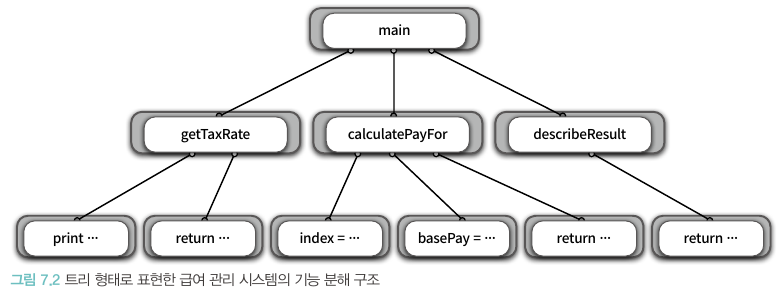
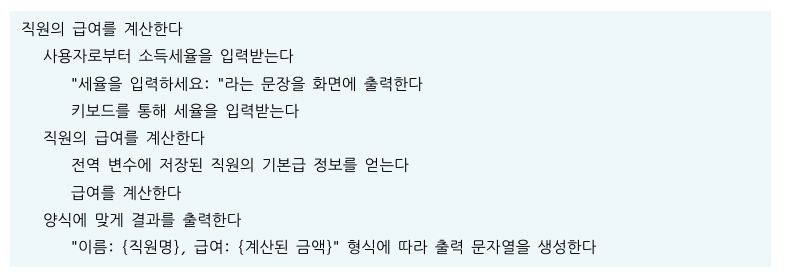

# 📚 7장 객체 분해

- 불필요한 정보를 제거하고 현재의 문제 해결에 필요한 핵심만 남기는 작업을 추상화라 부른다
- 큰 문제를 해결 가능한 작은 문제로 나누는 작업을 분해라고 부른다

## 📖 7.1 프로시저 추상화와 데이터 추상화

- 모든 프로그래밍 패러다임은 추상화와 분해의 관점에서 설명할 수 있다
- 현대적인 프로그래밍 언어를 특정 짓는 중요한 두 가지 추상화 매커니즘: 프로시저 추상화, 데이터 추상화
- 프로시저 추상화를 중심으로 시스템을 분해
  - 기능 분해(알고리즘 분해)
- 데이터 추상화를 중심으로 시스템을 분해
  - 타입을 추상화(추상 데이터 타입)
  - 프로시저를 추상화(객체지향)

## 📖 7.2 프로시저 추상화와 기능 분해

### 🔖 7.2.1 메인 함수로서의 시스템

- 프로시저는 반복적 작업을 하나의 장소에 모아 로직을 재사용하는 추상화 방법
- 전통적인 기능 분해 방법은 하향식 접근법

### 🔖 7.2.2 급여 관리 시스템

### 🔖 7.2.3 하향식 기능 분해의 문제점

- 시스템은 하나의 메인 함수로 구성돼 있지 않다
- 기능 추가나 요구사항 변경으로 인해 메인 함수를 빈번하게 수정해야 한다
- 비즈니스 로직이 사용자 인터페이스와 강하게 결합된다
- 하향식 분해는 너무 이른 시기에 함수들의 실행 순서를 고정시키기 때문에 유연성과 재사용성이 저한된다
- 데이터 형식이 변경될 경우 파급효과를 예측할 수 없다

### 🔖 7.2.4 언제 하향식 분해가 유용한가?

- 작은 프로그램과 개별 알고리즘을 위해서 유용한 패러다임
- 특히 프로그래밍 과정에서 이미 해결된 알고리즘을 문서화하고 서술하는 데 훌륭한 기법

## 📖 7.3 모듈

### 🔖 7.3.1 정보 은닉과 모듈

- 시스템 변경을 관리하는 기본전략: 함께 변경되는 부분을 하나의 구현 단위로 묶고 퍼플릭 인터페이스를 통해서만 접근
- 정보은닉: 시스템에서 자주 변경되는 부분을 상대적으로 덜 변경되는 안정적인 인터페이스 뒤로 감춰야 한다는 것이 핵심
- 모듈은 다음과 같은 두 가지 비밀을 감춰야 한다
  - 복잡성: 모듈이 너무 복잡한 경우 이해하고 사용하기가 어렵다. 외부에 모듈을 추상화할 수 있는 간단한 인터페이스를 제공해서 모듈의 복잡도를 낮춘다
  - 변경 가능성: 변경 가능한 설계 결정이 외부에 노출될 경우 실제로 변경이 발생했을 때 파급효과가 커진다. 변경 발생 시 하나의 모듈만 수정하면 되도록 변경 가능한 설계 결정을 모듈 내부로 감추고 외부에는 쉽게 변경되지 않을 인터페이스를 제공한다

### 🔖 7.3.2 모듈의 장점과 한계

- 장점
  - 모듈 내부의 변수가 변경되더라도 모듈 내부에만 영향을 미친다
  - 비즈니스 로직과 사용자 인터페이스에 대한 관심사를 분리한다
  - 전역 변수와 전역 함수를 제거함으로써 네임스페이스 오염을 방지한다
- 한계점
  - 모듈의 가장 큰 단점은 인스턴스의 개념을 제공하지 않는다는 점
  - 좀 더 높은 수준의 추상화를 위해서 직원 전체가 아니라 개별 직원을 독립적인 단위로 다룰 수 있어야 한다

## 📖 7.4 데이터 추상화와 추상 데이터 타입

### 🔖 7.4.1 추상 데이터 타입

- 추상 데이터 타입을 구현하려면 다음과 같은 특성을 위한 프로그래밍 언어의 지원이 필요
  - 타입 정의를 선언할 수 있어야 한다
  - 타입의 인스턴스를 다루기 위해 사용할 수 있는 오퍼레이션의 집합을 정의할 수 있어야 한다
  - 제공된 오퍼레이션을 통해서만 조작할 수 있도록 데이터를 외부로부터 보호할 수 있어야 한다
  - 타입에 대해 여러 개의 인스턴스를 생성할 수 있어야 한다

## 📖 7.5 클래스

### 🔖 7.5.1 클래스는 추상 데이터 타입인가?

- 대개 클래스를 추상 데이터 타입으로 설명하지만 명확한 의미에서 동일하지 않다
- 가장 핵심적인 차이는 클래스는 상속과 다형성을 지원하는데 비해 추상 데이터 타입은 지원하지 못한다는 점
