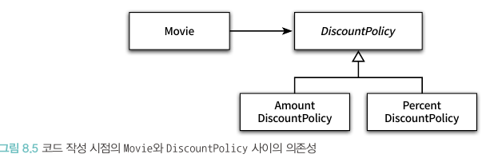
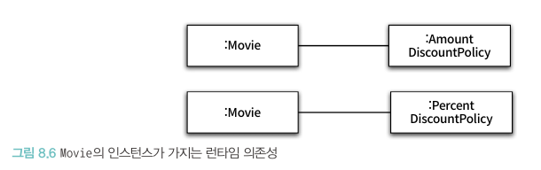

# 📚 8장 의존성 관리하기

- 협력은 필수적이지만 다른 객체에 대해 알아야 할 것을 강요하기에 설계에 난관이 된다
- 객체지향 설계의 핵심은 협력을 위해 필요한 의존성은 유지하면서도 변경을 방해하는 의존성을 제거하는 데 있다

## 📖 8.1 의존성 이해하기

### 🔖 8.1.1 변경과 의존성

- 의존성은 실행 시점과 구현 시점에 서로 다른 의미를 가짐
    - 실행시점: 의존하는 객체가 정상적으로 동작하기 위해서는 실행 시에 의존 대상 객체가 반드시 존재해야 한다
    - 구현시점: 의존 대상 객체가 변경될 경우 의존하는 객체도 함께 변경된다

```java
public class PeriodCondition implements DiscountCondition {
    private DayOfWeek dayOfWeek;
    private LocalTime startTime;
    private LocalTime endTime;
    
  ...

    public boolean isSatisfiedBy(Screening screening) {
        return screening.getStartTime().getDayOfWeek().equals(dayOfWeek) &&
                startTime.compareTo(screening.getStartTime().toLocalTime()) <= 0 &&
                endTime.compareTo(screening.getStartTime().toLocalTime()) >= 0;
    }
}
```

- PeriodCondition이 정상 동작하려면 실행 시점에 Screening의 인스턴스가 존재해야함
- 어떤 객체가 작업을 정상 수행하기 위해 다른 객체를 필요할 경우 두 객체 사이에 의존성이 존재한다고 말함
- 의존성은 방향성을 가지며 항상 단방향
- 위의 예제에서 PeriodCondition은 Screening에 의존

### 🔖 8.1.2 의존성 전이

- 의존성은 전이될 수 있다
- PeriodCondition이 Screening에 의존할 경우 Screening이 의존하는 대상에 대해서도 자동적으로 의존하게 된다는 것
- 의존성은 함꼐 변경될 수 있는 가능성을 의미하기에 모든 경우에 의존성이 전이되는 것은 아니다
- 의존성이 실제로 전이될지 여부는 Screening의 캡슐화 정도에 따라 달라짐
- 의존성은 전이될 수 있기에 직접 의존성과 간접 의존성으로 나눔

### 🔖 8.1.3 런타임 의존성과 컴파일타임 의존성

- 런타임은 애플리케이션이 실행되는 시점을 가리킴
- 컴파일타임은 코드를 컴파일하는 시점을 가리키지만 문맥에 따라 코드 그 자체를 가리키기도 함
- 중요한 것은 런타임 의존성과 컴파일타임 의존성은 다를 수 있으며 유연하고 재사용 가능한 코드를 설계하기 위해서 두 종류의 의존성을 다르게 만들어야 함
- 런타임의 주인공은 객체, 컴파일타임의 주인공은 클래스이다
- Movie 예제를 통한 의존성의 변화
  
  

- 코드 작성 시점의 Movie 클래스는 할일 정책을 구현한 두 클래스의 존재를 모르지만 실행 시점의 Movie 객체는 두 클래스의 인스턴스와 협력할 수 있게 됨

### 🔖 8.1.4 컨텍스트 독립성

- Movie 클래스가 추상 클래스인 DiscountPolicy에 대한 컴파일타임 의존성을 명시하는 것은 할인요금을 계산하지만 어떤 정책을 따르는지는 결정하지 않았다고 선언하는 것
- 클래스가 특정한 문맥에 강하게 결합될수록 다른 문맥에서 사용하기는 더 어려워짐
- 클래스가 사용될 특정한 문맥에 대해 최소한의 가정만으로 이뤄져 있다면 재사용이 수월해지고 이를 **컨텍스트 독립성**이라 부름
- 컨텍스트 독립적이라는 말은 각 객체를 실행하는 시스템에 관해 아무것도 알지 못한다는 의미다

### 🔖 8.1.5 의존성 해결하기

- 컴파일 타임 의존성을 실행 컨텍스트에 맞는 적절한 런타임 의존성으로 교체하는 것을 **의존성 해결**이라고 부른다.
- 의존성 해결을 위한 방법
    - 객체를 생성하는 시점에 생성자를 통해 의존성 해결 -> 안정적인 객체를 생성하지만 경직된 코드
    - 객체 생성 후 setter 메서드를 통해 의존성 해결 -> 유연하지만 시스템 상태가 불안정
    - 메서드 실행시 인자를 이용해 의존성 해결 -> 인자로 객체를 넘겨 일시적으로만 사용
- 생성자와 setter를 결합하여 안정적이고 유연한 방법으로 의존성을 해결할 수 있다

## 📖 8.2 유연한 설계

### 🔖 8.2.1 의존성과 결합도

- 의존성이 나쁜 것은 아니며 객체들의 협력을 가능하게 만드는 매게체라는 관점에서 바람직함
- 하지만 과한 의존성은 문제가 될 수 있다

```java
public class Movie {
  ...
    private PercentDiscountPolicy percentDiscountPolicy;

    public Movie(String title, Duration runningTime, Money fee, PercentDiscountPolicy percentDiscountPolicy) {
    ...
        this.percentDiscountPolicy = percentDiscountPolicy;
    }
}
```

- Movie는 PercentDiscountPolicy 라는 구체적인 클래스에 의존하기에 다른 할인 정책이 필요한 문맥에서 Movie를 재사용할 수 없게됨
- 바람직한 의존성은 **재사용성**과 관련이 있다
- 두 요소 사이에 존재하는 의존성이 바람직할 때 두 요소가 느슨한 결합도 또는 약한 결합도를 가진다고 말함
- 반대는 단단한 결합도 또는 강한 결합도

### 🔖 8.2.2 지식이 결합을 낳는다

- Movie는 PercentDiscountPolicy 라는 클래스에 많은 지식을 갖고 있기에 결합도가 강해지는 문제가 발생
- 추상화를 통해 해결

### 🔖 8.2.3 추상화에 의존하라

- 추상화와 결합도의 관점에서 의존 대상을 다음과 같이 구분하는 것이 유용. 아래일수록 지식의 양이 적어짐
    - 구체 클래스 의존성
    - 추상 클래스 의존성
    - 인터페이스 의존성

### 🔖 8.2.3 명시적인 의존성

- 문제가 되는 코드

```java
public class Movie {
  ...
    private DiscountPolicy discountPolicy;

    public Movie(String title, Duration runningTime, Money fee) {
    ...
        this.discountPolicy = new AmountDiscountPolicy();

    }
}
```

- 당연하게도 느슨한 결합도를 위해 클래스 안에서도 구체 클래스에 대한 모든 의존성을 제거해야함

```java
public class Movie {
  ...
    private DiscountPolicy discountPolicy;

    public Movie(String title, Duration runningTime, Money fee, DiscountPolicy discountPolicy) {
    ...
        this.discountPolicy = discountPolicy;

    }
}
```

- 두 번째와 같이 구현한 코드를 명시적 의존성이라 하고 첫 번째처럼 구현한 코드를 숨겨진 의존성이라 함
- 의존성이 명시적이지 않으면 내부 구현을 직접 살펴봐야하기에 버그의 원인이 될 수 있다

### 🔖 8.2.4 new는 해롭다

- new를 잘못 사용하면 클래스 사이의 결합도가 극단적으로 높아진다
    - new 연산자를 사용하기 위해선 구체 클래스의 이름을 직접 기술해야하기에 추상화 클래스를 이용할 수 없다
    - new 연산자는 생성하려는 구체 클래스 뿐 아니라 어떤 인자를 이용해 클래스의 생성자를 호출해야 하는지도 알아야 함
- 사용과 생성의 책임을 분리하여 객체의 결합도를 낮추면 설계를 유연하게 만들 수 있다
- 클라이언트가 DiscountPolicy의 구체 인스턴스를 생성하고 사용하는 Movie 클래스에서는 직접 생성하지 않음

### 🔖 8.2.5 가끔은 생성해도 무방하다

- 클래스 안에서 객체의 인스턴스를 직접 생성하는 방식이 유용한 경우도 있다
- 협력하는 기본 객체를 설정하고 싶은 경우가 여기에 속함
- Movie가 대부분의 경우 AmountDiscountPolicy와 협력하고 PercentDiscountPolicy와 가끔 협력한다면 클라이언트에서 생성하는 방식은 중복 코드가 늘어나고 Movie 사용성이 나빠짐

```java
public class Movie {
  ...
    private DiscountPolicy discountPolicy;

    public Movie(String title, Duration runningTime, Money fee) {
        this(title, runningTime, fee, new AmountDiscountPolicy());

    }

    public Movie(String title, Duration runningTime, Money fee, DiscountPolicy discountPolicy) {
    ...
        this.discountPolicy = discountPolicy;

    }
}
```

- 이 기법은 메서드 오버로딩에서도 사용할 수 있다

```java
public class Movie {
  ...

    public Money calculateMovieFee(Screening screening) {
        return calculateMovieFee(screening, new AmountDiscountPolicy());
    }

    public Money calculateMovieFee(Screening screening, DiscountPolicy discountPolicy) {
        return fee.minus(discountPolicy.calculate(screening));
    }
}
```

- 위의 예시는 결합도와 사용성을 트레이드오프하여 클래스 사용성이 더 중요하다면 결합도를 높이는 방향으로 코드를 작성하는 방법

### 🔖 8.2.6 표준 클래스에 대한 의존은 해롭지 않다

- 표준 클래스는 변경될 확률이 거의 없기에 의존성을 가져도 변경 걱정이 없기에 해롭지 않다
