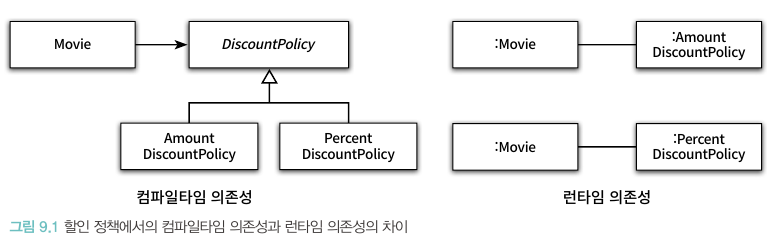
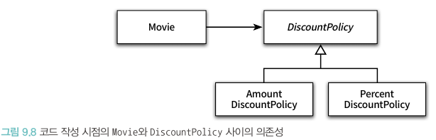
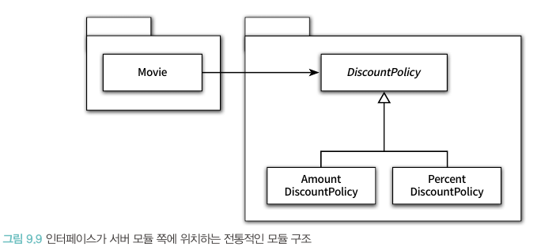
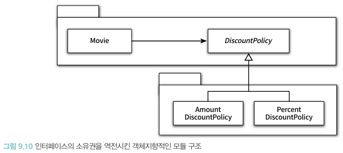

# 📚 9장 유연한 설계

## 📖 9.1 개방-폐쇄 원칙

- 소프트웨어 개체는 확장에 열려 있어야 하고, 수정에 대해서는 닫혀 있어야 한다
    - 확장에 열려있다: 애플리케이션의 요구사항이 변경될 때 이변경에 맞게 새로운 '동작'을 추가해서 애플리케이션의 기능을 확장할 수 있다
    - 수정에 대해 닫혀 있다: 기존의 '코드'를 수정하지 않고도 애플리케이션의 동작을 추가하거나 변경할 수 있다

### 🔖 9.1.1 컴파일타임 의존성을 고정시키고 런타임 의존성을 변경하라

- OCP는 런타임 의존성과 컴파일타임 의존성에 관한 이야기
  

### 🔖 9.1.2 추상화가 핵심이다

- OCP의 핵심은 추상화에 의존하는 것
- 주의할 점은 추상화를 했다고 해서 모든 수정에 대해 설계가 폐쇄되는 것은 아니다
- 변경에 의한 파급효과를 피하기 위해 변하는 것과 변하지 않는 것이 무엇인지를 이해하고 추상화의 목적으로 삼아야 함

## 📖 9.2 생성 사용 분리

- 동일한 클래스 안에서 객체 생성과 사용이라는 이질적인 목적을 가진 코드가 공존하는 것이 문제
- 유연하고 재사용 가능한 설계를 원한다면 객체를 생성하고 사용하는 책임을 분리해야 한다
- 생성을 분리하는 가장 보편적인 방법은 클라이언트로 생성 책임을 옮기는 것

### 🔖 9.2.1 FACTORY 추가하기

- 객체 생성과 관련된 책임만 전담하는 별도의 객체를 추가하고 클라이언트가 이 객체를 사용하도록 만드는 것을 FACTORY라 함

### 🔖 9.2.2 순수한 가공물에게 책임 할당하기

- 책임 할당의 가장 기본이 되는 원칙은 책임을 수행하는 데 필요한 정보를 가장 많이 알고 있는 information expert에게 책임을 할당하는 것
- factory는 도메인 모델에 속하지 않으며 도메인 개념과는 아무런 관련이 없는 기술적인 결정
- 시스템을 객체로 분해하는 두 가지 방식
    - 표현적 분해
        - 도메인에 존재하는 사물 또는 개념을 표현하는 객체들을 이용해 시스템을 분해하는 것
        - 도메인과 소프트웨어 사이의 표현적 차이를 최소화하는 것을 목적으로 함
    - 행위적 분해
        - 도메인 모델은 설계를 위한 중요한 출발점이지만 단지 출발점일 뿐이며 모든 책임을 할당하는 것이 부족할 수 있다
        - 예를 들어 데이터베이스 접글을 위한 객체와 같이 도메인 개념을 초월하는 기계적 개념이 필요할 수 있음
        - 모든 책임을 도메인 객체에게 할당하면 낮은 응집도, 높은 결합도, 재사용성 저하와 같은 심각한 문제점에 봉착
        - 설계자의 편의를 위해 도메인과 무관한 임의의 인공적인 객체를 **순수한 가공물(pure fabrication)**이라 함
        - 어떤 행동을 책임질 마땅한 도메인 개념이 존재하지 않는다면 pure fabrication을 추가하라
- 객체지향이 실세계에 모방이라는 말이 틀린 이유는 이렇게 도메인과 관련없는 인공 객체가 더 많은 비중을 차지하는 것이 일반적이기 때문
- 애플리케이션 구축 시 도메인 개념이 만족스럽지 못하다면 주저말고 인공적인 객체를 창조하라

> 우리가 애플리케이션을 구축하는 것은 사용자들이 원하는 기능을 제공하기 위해서지 실세계를 모방하거나 시뮬레이션하기 위한 것이 아니다.

## 📖 9.3 의존성 주입

- 생성과 사용을 분리하면 Movie에는 오리지 인스턴스를 사용하는 책임만 남음. 이는 즉, 외부의 다른 객체가 Movie에게 생성된 인스턴스를 전달해야 한다는 것을 의미
- 사용하는 객체가 아닌 외부의 독립적인 객체가 인스턴스를 생성한 후 이를 전달해서 의존성을 해결하는 방법을 의존성 주입이라 부름

### 🔖 9.3.1 숨겨진 의존성은 나쁘다

- 의존성 주입 이외 의존성을 해결하는 방법 중 하나로 **SERVICE LOCATOR** 패턴이 있다
- service locator는 의존성을 해결할 객체을 보관하는 일종의 저장소이며 객체가 직접 service locator에게 의존성을 해결해줄 것을 요청한다
- Service locator 예제코드

```java
public class Movie {
  ...
    private DiscountPolicy discountPolicy;

    public Movie(String title, Duration runningTime, Money fee) {
    ...
        this.discountPolicy = ServiceLocator.discountPolicy();
    }
}
```

```java
public class ServiceLocator {
    private static ServiceLocator soleInstance = new ServiceLocator();
    private DiscountPolicy discountPolicy;

    public static DiscountPolicy discountPolicy() {
        return soleInstance.discountPolicy;
    }

    public static void provide(DiscountPolicy discountPolicy) {
        soleInstance.discountPolicy = discountPolicy;
    }
}
```

- 클라이언트에게 ServiceLocator에 AmountDiscountPolicy나 PercentDiscountPolicy를 provide로 등록해두면 이후 생성되는 모든 Movie 인스턴스는 현재 등록된
  DiscountPolicy가 적용된다
- Service locator 패턴은 의존성을 해결할 수 있는 가장 쉽고 간단한 도구처럼 보이지만, 의존성을 감춘다는 큰 단점이 있다
- 만약 코드 내에서 Movie 인스턴스를 생성했다면 현재 ServiceLocator에 무엇이 제공되었는지 알아야한다
- 이는 의존성과 관련된 문제가 컴파일타임이 아닌 런타임에 발견된다는 치명적인 결함
- 이와 달리 의존성 주입은 필요한 의존성은 클래스의 퍼블릭 인터페이스에서 명시적으로 드러나기에 컴파일 타임에서 에러를 잡아낼 수 있다

## 📖 9.4 의존성 역전 원칙

### 🔖 9.4.1 추상화와 의존성 역전

- 객체 사이의 협력이 존재할 때 그 협력의 본질을 담고 있는 것은 상위 수준의 정책
- 즉, 하위 수준의 AmountDiscountPolicy를 PercentDiscountPolicy로 변경한다고 해서 상위 수준의 Movie가 영향을 받아서는 안 된다
  
- 이 경우에도 해결사는 추상화이며 유연하고 재사용 가능한 설계를 원한다면 모든 의존성의 방향이 추상 클래스나 인터페이스와 같은 추상화를 따른다
- 다시 말해서 상위 수준의 클래스와 하위 수준의 클래스 모두 추상화에 의존한다
  
- 이를 정리하면 **의존성 역전 원칙**이 나옴
    - 상위 수준의 모듈은 하위 수준의 모듈에 의존해서는 안 된다. 둘 모두 추상화에 의존해야 한다
    - 추상화는 구체적인 사항에 의존해서는 안 된다. 구체적인 사항은 추상화에 의존해야 한다.
- 여기서 역전(inversion) 이란 단어는 의존성의 방향이 전통적인 절차형 프로그래밍과는 반대 방향으로 나타나기 떄문

### 🔖 9.4.2 의존성 역전 원칙과 패키지

- 역전은 의존성의 방향뿐만 아니라 인터페이스의 소유권에도 적용된다는 것
- 객체지향 프로그래밍 언어에서 어떤 구성 요소의 소유권을 결정하는 것은 모듈(자바에서는 패키지)이다
  
- 위의 그림에서 Movie를 다양한 컨텍스트에서 재사용하기 위해선 DiscountPolicy가 필요하기에 불필요한 클래스들이 Movie와 함께 배포되어야 한다
- 의존성의 정의에 따라 Movie는 DiscountPolicy를 수정하지 않을 경우에는 영향을 받지 말아야 함
  
- 위와 같이 추상화를 별도의 독립적인 패키지가 아닌 클라이언트가 속한 패키지에 포함시켜야 함
- 재사용될 필요가 없는 클래스(Amount, Percent)는 별도의 독립적인 패키지에 모음
- 해당 기법을 separated interface 패턴이라 부름
- 의존성 역전 원칙에 따라 상위 수준의 협력 흐름을 재사용하기 위해서는 추상화가 제공하는 인터페이스의 소유권 역시 역전시켜야 한다

## 📖 9.5 유연성에 대한 조언

### 🔖 9.5.1 유연한 설계는 유연성이 필요할 때만 옳다

- 유연한 설계라는 말의 이면에는 복잡한 설계라는 의미가 숨어 있다
- 유연하지 않은 설계는 단순하고 명확하며 유연한 설계는 복잡하고 암시적이다
- 불필요한 유연성은 불필요한 복잡성을 낳기에 이 또한 트레이프오프의 과정

### 🔖 9.5.2 협력과 책임이 중요하다

- 중요한 비즈니스 로직을 처리하기 위해 책임을 할당하고 협력의 균현을 맞추는 것이 객체 생성에 관한 책임을 할당하는 것보다 우선!
- 객체를 생성하는 방법에 대한 책임 결정은 모든 책임이 자리잡힌 후 가장 마지막 시점에 내리는 것