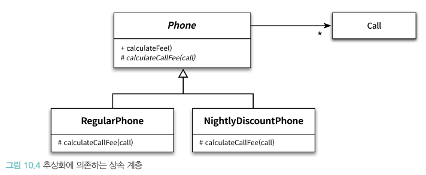

# 📚 10장 상속과 코드 재사용

## 📖 10.1 상속과 중복 코드

- 중복 코드는 우리를 주저하게 만들뿐만 아니라 동료들을 의심하게 만든다. 이것만으로도 중복 코드를 제거 할 충분한 이유가 되지만 결정적 이유는 따로 있다.

### 🔖 10.1.1 DRY 원칙

- 결정적 이유: 중복 코드는 변경을 방해한다
- 중복 여부를 판단하는 기준은 변경이다. 요구사항이 변경됐을 때 함께 수정이 필요하다면 중복 코드이다.
- DRY 원칙: Don't Repeat Yourself 동일한 지식을 중복하지 말라

### 🔖 10.1.2 중복과 변경

- 개별 통화 기간을 저장하는 Call 클래스
  - Call은 통화 시작 시간과 통화 종료 시간을 인스턴스 변수로 포함

```java
@AllArgsConstructor
public class Call {
    private LocalDateTime from;
    private LocalDateTime to;
    
}
```

- Call 목록을 관리할 정보 전문가 클래스 Phone
  - 단위요금을 저장하는 amount, 단위시간을 저장하는 seconds, 전체 통화 목록을 저장하는 Call 리스트를 인스턴스 변수로 포함

```java
@AllArgsConstructor
@Getter
public class Phone {
    private Money amount;
    private Duration seconds;
    private List<Call> calls = new ArrayList<>();
    
    public void Call(Call call) {
        calls.add(call);
    }
    
    public Money calculateFee() {
        Money result = Money.ZERO;
        
        for(Call call: calls) {
            result = result.plus(amount.times(call.getDuration().getSeconds() / seconds.getSeconds()));
        }
        
        return result;
    }
}
```

- 요구사항이 변해서 '심야 할인 요금제' 가 추가
  - 심야 할인 요금제: 밤 10시 이후의 통화에 대한 요금 할인

```java
@AllArgsConstructor
@Getter
public class NightlyDiscountPhone {
    private static final int LATE_NIGHT_HOUR = 22;

    private Money nightlyAmount;
    private Money regularAmount;
    private Duration seconds;
    private List<Call> calls = new ArrayList<>();
    

    public Money calculateFee() {
        Money result = Money.ZERO;
        
        // ... 심야 할인 요금제 로직
        
        return result;
    }
}
```

#### 중복 코드 수정

```java
@AllArgsConstructor
@Getter
public class Phone {
    private Money amount;
    private Duration seconds;
    private List<Call> calls = new ArrayList<>();
    private double taxRate;
    
    public void Call(Call call) {
        calls.add(call);
    }
    
    public Money calculateFee() {
        Money result = Money.ZERO;
        
        for(Call call: calls) {
            result = result.plus(amount.times(call.getDuration().getSeconds() / seconds.getSeconds()));
        }
        
        return result.plus(result.times(taxRate));
    }
}
```

- 위처럼 세금이 추가되면 NightlyDiscountPhone 도 수정이 같이 들어감
  - 코드의 일괄성이 무너져 변경에 취약해지고 버그가 발생할 가능성이 높아짐

#### 타입 코드 사용하기

- 타입 코드를 사용해 Phone과 NightlyDiscountPhone을 합칠 수는 있지만 낮은 응집도와 높은 결합도의 문제에 시달리게 된다

### 🔖 10.1.3 상속을 이용해서 중복 코드 제거하기

```java
@AllArgsConstructor
@Getter
public class NightlyDiscountPhone extends Phone {
    private static final int LATE_NIGHT_HOUR = 22;

    private Money nightlyAmount;    

    public Money calculateFee() {
        Money result = super.calculateFee();
        
        Money nightlyFee = Money.ZERO;
        for(Call call: getCalls()) {
            if(call.getFrom().getHour() >= LATE_NIGHT_HOUR) {
                nightlyFee = nightlyFee.plus(
                        getAmount().minus(nightlyAmount).times(
                                call.getDuration().getSeconds() / getSeconds().getSeconds()));
            }
        }
        
        return result.minus(nightlyFee);
    }
}
```

- 위의 코드와 같이 구현할 경우 도메인 지식을 필요로 함. 개발자가 Phone 코드를 재사용하기 위해 세운 가정을 이해해야하고 10시 이전의 요금은 Phone에서 10시 이후의 통화 요금을 계산하는 경우에 대해서만 Night 요금을 적용하는 점을 알아야 한다.
- 위의 예시 처럼 상속을 염두에 두고 설계되지 않은 클래스를 상속에 이용하면 무수한 가정과 도메인 지식이 필요할 수 있는 문제를 떠안을 수 있따

#### 강하게 결합된 Phone과 NightlyDiscountPhone

- NightlyDiscountPhone은 부모 클래스인 Phone의 calculateFee를 오버라이딩하고 안에서 super 참조를 이용해 부모 클래스를 호출한다
- 하지만 여기서 새로운 요구사항이 생긴다면 똑같이 중복 코드 문제가 발생된다
- `자식 클래스의 메서드 안에서 super 참조를 이용해 부모 클래스의 메서드를 직접 호출할 경우 두 클래스는 강하게 결합된다. super 호출을 제거할 수 있는 방법을 찾아 결합도를 제거하라.`

## 📖 10.2 취약한 기반 클래스 문제

- 상속은 자식 클래스와 부모 클래스의 결합도를 높이고 강한 결합도로 인해 불필요한 세부사항에 엮이게 된다
- 이처럼 부모 클래스의 변경에 의해 자식 클래스가 영향을 받는 현상을 **취약한 기반 클래스 문제**라고 부른다.
- 객체를 사용하는 이유는 구현과 관련된 세부사항을 퍼블릭 인터페이스 뒤로 캡슐화할 수 있기 때문이지만 상속는 이를 방해한다
- 상속 계층의 상위에 위치한 클래스에 가해지는 작은 변경만으로도 상속 계층에 속한 모든 자손들이 급격히 요동친다
- 상속은 코드의 재사용을 위해 캡슈화의 장점을 희석시키고 결합도를 높여 객체지향이 가진 강력함을 반감시킨다

### 🔖 10.2.1 불필요한 인터페이스 상속 문제

- 자바 초기 버전에서 상속을 잘못 사용한 대표적 사례는 java.util.Properties와 java.util.Stack이다
- 부모의 퍼블릭 인터페이스가 자식에서 합쳐지기에 원하지 않는 동작이 이루어짐
- `상속받은 부모 클래스의 메서드가 자식 클래스의 내부 구조에 대한 규칙을 깨뜨릴 수 있다`

### 🔖 10.2.2 메소드 오버라이딩의 오작용 문제

- 이펙티브 자바에서 HashSet에 강하게 결합된 InstrumentedHashSet
```java
public class InstrumentedHashSet<E> extends HashSet<E> {
    private int addCount = 0;
    
    public boolean add(E e) {
        addCount++;
        return super.add(e);
    }
    
    public boolean addAll(Collection<? extends  E> c) {
        addCount += c.size();
        return super.addAll(c);
    }
}
```

- 위의 코드는 문제가 없어 보이지만 다음 코드를 실행하면 문제 발생

```java
InstrumentedHashSet<String> languages = new InstrumentedHashSet<>();
languages.addAll(Arrays.asList("Java", "Ruby", "Scala"));
```

- HashSet 클래스의 addAll 내부 구현은 add를 호출하는 방식이기에 count가 3이 아닌 6이 되버리고 만다
- 이 문제의 해결법은 addAll 을 수정하는 것이지만 만약 부모 클래스 addAll에서 add를 호출하지 않도록 수정된다면 추가 문제가 발생할 수 있다
- 미래까지 고려했을 때 addAll에서 super를 사용하는 않도록 수정해야 영향도 문제가 없어지지만 HashSet의 addAll과 중복 코드를 생성하는 문제가 또 발생
- `자식 클래스가 부모 클래스의 메서드를 오버라이딩할 경우 부모 클래스가 자신의 메서드를 사용하는 방법에 자식 클래스가 결합될 수 있다`

### 🔖 10.2.3 부모 클래스와 자식 클래스의 동시 수정 문제

- 음악 목록을 추가할 수 있는 플레이리스트 구현

```java
@AllArgsConstructor
@Getter
public class Sone {
    private String singer;
    private String title;
}
```

```java
@AllArgsConstructor
@Getter
public class Playlist {
    private List<Song> traks = new ArrayList<>();
    
    public void append(Song song) {
        getTraks().add(song);
    }
}
```

```java
@AllArgsConstructor
@Getter
public class PersonalPlaylist extends Playlist {
    public void remove(Song song) {
        getTraks().remove(song);
    }
}
```

- 요구사항의 변경으로 Playlist에서 노래 목록뿐만 아니라 가수별 노래의 제목도 함께 관리

```java
@AllArgsConstructor
@Getter
public class Playlist {
    private List<Song> traks = new ArrayList<>();
    private Map<String, String> singers = new HashMap<>();
    
    public void append(Song song) {
        getTraks().add(song);
        singer.put(song.getSinger(), song.getTitle());
    }
}
```

```java
@AllArgsConstructor
@Getter
public class PersonalPlaylist extends Playlist {
    public void remove(Song song) {
        getTraks().remove(song);
        getSingers.remove(song.getSinger());
    }
}
```

- 위의 예제는 자식 클래스가 부모 클래스의 메서드를 오버라이딩하거나 불필요한 인터페이스를 상속받지 않았음에도 자식 클래스에 영향도가 전파되는 문제를 보여줌
- 상속은 결합도를 높이기에 위와 같은 문제를 피할 수 없다
- `클래스를 상속하면 결합도로 인해 자식 클래스와 부모 클래스의 구현을 영원히 변경하지 않거나, 자식 클래스와 부모 클래스를 동시에 변경하거나 둘 중 하나를 선택할 수밖에 없다.`

## 📖 10.3 Phone 다시 살펴보기

### 🔖 10.3.1 추상화에 의존하자

- 결합도를 낮추기 위해선 추상화에 의존하도록 만들자
- 상속을 도입할 때 따르는 두 가지 원칙
  - 두 메서드가 유사하게 보인다면 차이점을 메서드로 추출하라. 메서드 추출을 통해 두 메서드가 동일한 형태로 보이도록 만들 수 있다
  - 부모 클래스의 코드를 하위로 내리지 말고 자식 클래스의 코드를 상위로 올려라. 부모 클래스의 구체적인 메서드를 자식 클래스로 내리는 것보다 자식 클래스의 추상적인 메서드를 부모 클래스로 올리는 것이 재사용성과 응집도 측면에서 더 뛰어난 결과를 얻을 수 있다.

### 🔖 10.3.2 차이를 메서드로 추출하라

- Phone과 NightlyDiscountPhone 예제

```java
@AllArgsConstructor
@Getter
public class Phone {
private Money amount;
private Duration seconds;
private List<Call> calls = new ArrayList<>();
private double taxRate;

    public void Call(Call call) {
        calls.add(call);
    }
    
    public Money calculateFee() {
        Money result = Money.ZERO;
        
        for(Call call: calls) {
            result = result.plus(calculateCallFee(call));
        }
        
        return result.plus(result.times(taxRate));
    }
    
    private Money calculateCallFee(Call call) {
        return amount.times(call.getDuration().getSeconds() / seconds.getSeconds());
    }
}
```

```java
@AllArgsConstructor
@Getter
public class NightlyDiscountPhone extends Phone {
    private static final int LATE_NIGHT_HOUR = 22;

    private Money nightlyAmount;    

    public Money calculateFee() {
        Money result = super.calculateFee();
        
        Money nightlyFee = Money.ZERO;
        for(Call call: getCalls()) {
          result = result.plus(calculateCallFee(call));
        }
        
        return result.minus(nightlyFee);
    }
    
    private Money calculateCallFee(Call call) {
      if(call.getFrom().getHour() >= LATE_NIGHT_HOUR) {
          return nightlyAmount.times(call.getDuration().getSeconds() / getSeconds().getSeconds());
      } else {
          return regularAmount.times(call.getDuration().getSeconds() / seconds.getSeconds());
      }
    }
}
```

### 🔖 10.3.3 중복 코드를 부모 클래스로 올려라

```java
public abstract class AbstractPhone {
  private List<Call> calls = new ArrayList<>();

  public Money calculateFee() {
    Money result = Money.ZERO;

    for (Call call : calls) {
      result = result.plus(calculateCallFee(call));
    }

    return result.plus(result.times(taxRate));
  }
  
  abstract protected Money calculateCallFee(Call call);
}
```

- 위로 올리기 전략은 실패했더라도 수정하기 쉬운 문제를 발생시킨다. 문제를 쉽게 찾을 수 있고 쉽게 고칠 수 있다.

### 🔖 10.3.4 추상화가 핵심이다

- 공통 코드를 이동시킨 후에 각 클래스는 서로 다른 변경의 이유를 가진다
- Phone을 보게 되면 의존성 역전 원칙을 준수함을 알 수 있다
- 새로운 요금제를 추가하기도 쉬워진다

### 🔖 10.3.5 의도를 드러내는 이름 선택하기

- 위와 같이 리팩토링 하였다면 클래스명도 이해하기 쉽게 바꿔주자


## 📖 10.4 차이에 의한 프로그래밍

- 상속을 사용하면 이미 존재하는 클래스의 코드를 기반으로 새로운 기능을 쉽고 빠르게 추가할 수 있다
- 이와 같이 확장하는 방식을 **차이에 의한 프로그래밍**이라 부른다.
- 상속은 강력하지만 그렇기에 위험한 방법이다
- 상속은 코드 재사용과 관련된 대부분의 경우에 우아한 해결방법이 아니다. 능숙한 객체지향 개발자라면 상속대신 합성을 사용한다