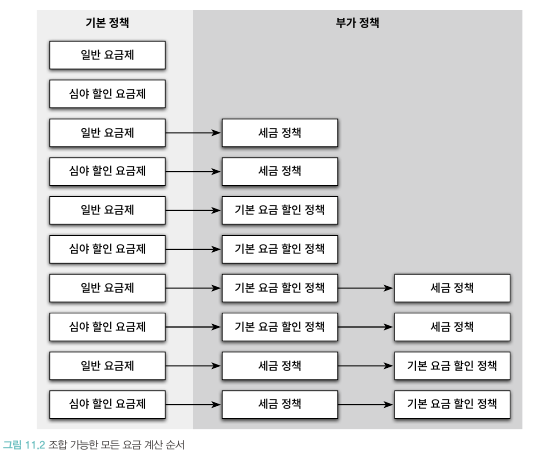
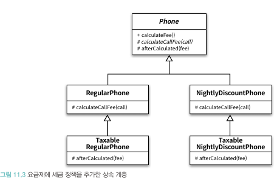
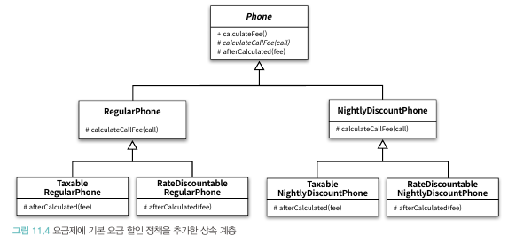
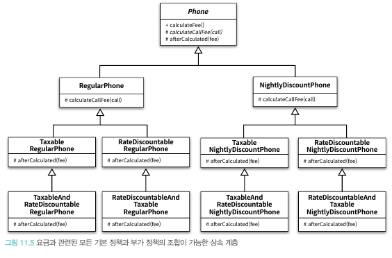
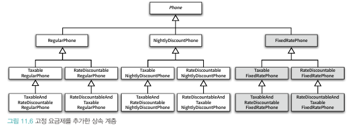
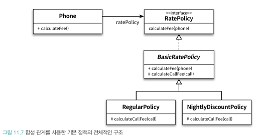
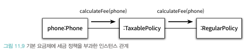
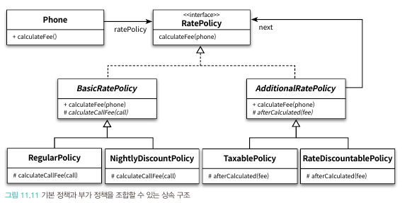
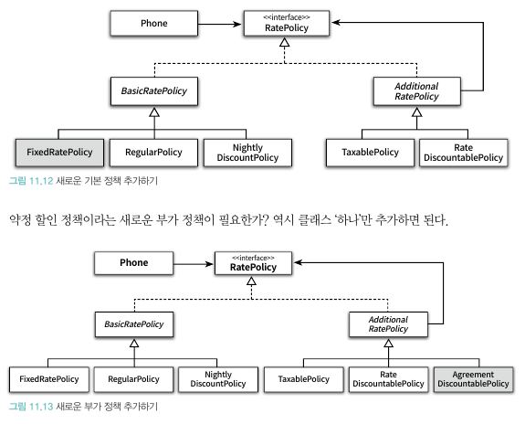

# 📚 11장 합성과 유연한 설계

- 상속과 합성의 차이
  - 상속
    - 부모 클래스와 자식 클래스를 연결해서 부모 클래스의 코드를 재사용
    - 컴파일타임에 의존성 해결
    - 기존 코드를 쉽게 확장할 수 있음
    - 부모 클래스와 자식 클래스 사이의 결합도가 높아짐
    - 정적 관계
  - 합성
    - 전체를 표현하는 객체가 부분을 표현하는 객체를 포함해서 부분 객체의 코드를 재사용
    - 런타임에 의존성 해결
    - 객체의 내부 구현이 변경되더라도 영향을 최소화할 수 있음
    - 동적 관계
    - 변경에 유연하게 대처할 수 있는 설계가 대부분의 경우 정답일 가능성이 높기에 코드 재사용에 더 좋은 방법

## 📖 11.1 상속을 합성으로 변경하기

- 10장에서 나온 상속의 문제점
  - 불필요한 인터페이스 상속 문제
  - 메서드 오버라이딩의 오작용 문제
  - 부모 클래스와 자식 클래스의 동시 수정 문제

- 상속을 합성으로 바꾸는 방법
  - 자식 클래스의 선언된 상속 관계를 제거하고 부모 클래스의 인스턴스를 자식 클래스의 인스턴스 변수로 선언


### 🔖 11.1.1 불필요한 인터페이스 상속 문제

```java
public class Properties {
    private Hashtable<String, String> properties = new Hashtable<>();
    
    public String setProperty(String key, String value) {
        return properties.put(key, value);
    }
    
    public String getProperty(String key) {
        return properties.get(key);
    }
}
```

```java
public class Stack<E> {
    private Vector<E> elements = new Vector<>();
    
    public E push(E item) {
        elements.addElemet(item);
        return item;
    }
    
    public E pop() {
        if(elements.isEmpty()) {
            throw new EmptyStackException();
        }
        
        return elements.remove(elements.size() - 1);
    }
}
```

- 위와 같은 방법을 통해 불필요한 인터페이스를 포함되지 않도록 구현할 수 있다

### 🔖 11.1.2 메서드 오버라이딩의 오작용 문제

```java
public class InstrumentedHashSet<E> {
    private int addCount = 0;
    private Set<E> set;
    
    public InstrumentedHashSet(Set<E> set) {
        this.set = set;
    }
    
    @Override
    public boolean add(E e) {
        addCount++;
        return set.add(e);
    }
    
    @Override
    public boolean addAll(Collection<? extends E> c) {
        addCount += c.size();
        return set.addAll(c);
    }
    
    public int getAddCount() {
        return addCount;
    }
    
    @Override public boolean remove(Object o) { return set.remove(o); }
  /// .......
}
```

- 위와 같은 구현을 통해 Set의 오퍼레이션을 오버라이딩한 인스턴스 메서드에서 내부의 HashSet 인스턴스에게 동일한 메서드 호출을 그대로 전달
- 이를 **포워딩**이라 부르고 메서드를 호출하기 위해 추가된 메서드를 **포워딩 메서드**라고 부른다.

### 🔖 11.1.3 부모 클래스와 자식 클래스의 동시 수정 문제

- Playlist의 경우 합성으로 변경하더라도 동시에 수정되는 문제가 해결되지 않는다
- 하지만 여전히 상속보다는 합성을 사용하는 것이 더 좋음 Why? -> 향후에 Playlist 내부 구현을 변경하더라도 파급효과를 최대한 PersonalPlaylist 내부로 캡슐화할 수 있기 때문

## 📖 11.2 상속으로 인한 조합의 폭발적인 증가

- 상속으로 인해 결합도가 높아지게 되면 코드 수정이 필요할 시 필요한 작업의 양이 과도하게 늘어나는 경향이 있음
- 가장 일반적인 상황은 작은 기능들을 조합해서 더 큰 기능을 수행하는 객체를 만들어야 하는 경우
  - 하나의 기능을 추가거나 수정하기 위해 불필요하게 많은 수의 클래스를 추가하거나 수정해야 한다.
  - 단일 상속만 지원하는 언어에서는 상속으로 인해 오히려 중복 코드의 양이 늘어날 수 있다.

### 🔖 11.2.1 기본 정책과 부가 정책 조합하기

- 핸드폰 정책의 기본 정책과 부가 정책
  - 기본 정책: 한달 통화량을 기준으로 부과할 요금을 계산
  - 부가 정책: 통화량과 무관하게 기본 정책에 선택적으로 추가할 수 있는 요금 방식


- 부가 정책의 특성 정의
  - 기본 정책의 계산 결과에 적용된다
  - 선택적으로 적용할 수 있다
  - 조합 가능하다
  - 부가 정책은 임의의 순서로 적용 가능하다



### 🔖 11.2.2 상속을 이용해서 기본 정책 구현하기

```java
public abstract class Phone {
  private List<Call> calls = new ArrayList<>();

  public Money calculateFee() {
    Money result = Money.ZERO;

    for (Call call : calls) {
      result = result.plus(calculateCallFee(call));
    }

    return result;
  }
  
  abstract protected Money calculateCallFee(Call call);
}

@AllArgsConstructor
@Getter
public class RegularPhone extends Phone {
  private Money amount;
  private Duration seconds;

  public RegularPhone(Money amount, Duration seconds) {
      this.amount = amount;
      this.seconds = seconds;
  }

  private Money calculateCallFee(Call call) {
    return amount.times(call.getDuration().getSeconds() / seconds.getSeconds());
  }
}


@AllArgsConstructor
@Getter
public class NightlyDiscountPhone extends Phone {
    private static final int LATE_NIGHT_HOUR = 22;

    private Money nightlyAmount;    
    private Money regularAmount;
    private Duration seconds;
    
    private Money calculateCallFee(Call call) {
      if(call.getFrom().getHour() >= LATE_NIGHT_HOUR) {
          return nightlyAmount.times(call.getDuration().getSeconds() / getSeconds().getSeconds());
      } else {
          return regularAmount.times(call.getDuration().getSeconds() / seconds.getSeconds());
      }
    }
}
```

### 🔖 11.2.3 기본 정책에 세금 정책 조합하기

```java
@AllArgsConstructor
public class TaxableRegularPhone extends RegularPhone {
    private double taxRate;
    
    public Money calculateFee() {
        Money fee = super.calculateFee();
        return fee.plus(fee.times(taxRate));
    }
}
```

- 부코 클래스의 메서드를 재사용하기 위해 super 호출을 사용하면 원하는 결과를 쉽게 얻을 수 있지만 결합도가 높아짐
- 이를 막으려면 부모 클래스에 추상 메서드를 제공

```java
public abstract class Phone {
  private List<Call> calls = new ArrayList<>();

  public Money calculateFee() {
    Money result = Money.ZERO;

    for (Call call : calls) {
      result = result.plus(calculateCallFee(call));
    }

    return afterCalculated(result);
  }
  
  abstract protected Money calculateCallFee(Call call);
  abstract protected Money afterCalculated(Money fee);
  
}
```

- 위와 같은 추상 메서드를 추가하면 모든 자식 클래스들(RegularPhone, NightlyDiscountPhone)에서 다음과 같은 오버라이딩 수행이 필요해짐

```java
protected Money afterCalculated(Money fee) {
    return fee;
} 
```

- 이는 아주 번거로운 작업이기에 유연성은 유지하면서도 중복 코드를 제거하려면 Phone에서 afterCalculated 메서드에 대한 기본 구현을 함께 제공하면 됨

```java
public abstract class Phone {
  // ......  
  protected Money afterCalculated(Money fee) {
      return fee;
  };

  abstract protected Money calculateCallFee(Call call);
}
```

- 이제 해당 메소드가 필요했던 TaxableRegularPhone 수정

```java
@AllArgsConstructor
public class TaxableRegularPhone extends RegularPhone {
    private double taxRate;
    
    public Money afterCalculated(Money fee) {
        return fee.plus(fee.times(taxRate));
    }
}
```

- 마찬가리로 NightlyDiscountPhone도 구현하면 다음과 같은 클래스 다이어그램이 생성



### 🔖 11.2.4 기본 정책에 기본 요금 할인 정책 조합하기

- 세금과 유사한 방법으로 구현하면 아래와 같은 클래스 다이어그램 생성



### 🔖 11.2.5 중복 코드의 덫에 걸리다

- 이처럼 모든 케이스에 대해 구현을 해나간다면 다음처럼 끝없이 클래스는 증가해나감



- 또한 새로운 요금제가 추가되면 더 끔찍한 결과 초래



- 위와 같이 상속의 남용으로 하나의 기능을 추가하기 위해 필요 이상으로 많은 수의 클래스를 추가해야하는 경우를 가리켜 **클래스 폭발** 문제 또는 **조합의 폭발** 문제라고 부름
- 이 문제를 해결할 수 있는 최선의 방법은 상속을 포기하는 것

## 📖 11.3 합성 관계로 변경하기

- 합성을 사용하면 구현 시점에 정책들의 관계를 고정시킬 필요가 없으며 실행 시점에 정책들의 관계를 유연하게 변경할 수 있게 된다
- 상속이 조합의 결과를 개별 클래스 안으로 밀어 넣는 방법이라면 합성은 조합을 구성하는 요소들을 개별 클래스로 구현한 후 실행 시점에 인스턴스를 조립하는 방법을 사용하는 것이라 할 수 있다
- 물론 컴파일타임 의존성과 런타임 의존성의 거리가 멀면 멀수록 설계의 복잡도가 상승하기 때문에 코드 이해가 어렵다는 트레이드 오프 존재

### 🔖 11.3.1 기본 정책 합성하기

- 각 정책을 별도의 클래스로 구현
- 기본 정책과 부가 정책을 포괄하는 RatePolicy 인터페이스 추가
```java
public interface RatePolicy {
    Money calculateFee(Phone phone);
}
```

- 기본 정책 구현. 로직이 거의 동일한 중복 코드를 담을 추상 클래스 추가

```java
public abstract class BasicRatePolicy implements RatePolicy {

    @Override
    public Money calculateFee(Phone phone) {
        Money result = Money.ZERO;
        
        for(Call call: phone.getCalls()) {
            result.plus(calculateCallFee(call));
        }
        
        return result;
    }
    
    protected abstract Money calculateCallFee(Call call);
}
```

- 일반 요금제 구현

```java
@AllArgsConstructor
public class RegularPolicy extends BasicRatePolicy {
    private Money amount;
    private Duration seconds;
    
    @Override
    protected Money calculateCallFee(Call call) {
        return amount.times(call.getDuration().getSeconds() / seconds.getSeconds());
    }
}
```

- 심야 요금제 구현

```java
@AllArgsConstructor
@Getter
public class NightlyDiscountPolicy extends BasicRatePolicy {
  private static final int LATE_NIGHT_HOUR = 22;

  private Money nightlyAmount;
  private Money regularAmount;
  private Duration seconds;

  private Money calculateCallFee(Call call) {
    if(call.getFrom().getHour() >= LATE_NIGHT_HOUR) {
      return nightlyAmount.times(call.getDuration().getSeconds() / getSeconds().getSeconds());
    }
    
    return regularAmount.times(call.getDuration().getSeconds() / seconds.getSeconds());
  }
}
```

- 기본 정책을 이용해 요금을 계산할 수 있도록 Phone 수정

```java
public class Phone {
    private RatePolicy ratePolicy;
    private List<Call> calls = new ArrayList<>();
    
    public Phone(RatePolicy ratePolicy) {
        this.ratePolicy = ratePolicy;
    }
    
    public List<Call> getCalls() {
        return Collections.unmodifiableList(calls);
    }
    
    public Money calculateFee() {
        return ratePolicy.calculateFee(this);
    }
}
```

- Phone 내부에 RatePolicy에 대한 참조자가 포함돼 있음 -> 이것이 합성
- Phone이 다양한 요금 정책과 협력할 수 있어야 하므로 요금 정책의 타입이 RatePolicy라는 인터페이스로 정의



- 일반 요금제의 규칙이나 심야 할인 요금제의 규칙으로 계산하고 싶으면 다음과 같이 Phone을 합성

```java
Phone phone = new Phone(new RegularPolicy(Money.wons(10), Duration.ofSeconds(10)));
Phone phone = new Phone(new NightlyDiscountPolicy(Money.wons(5), Money.wons(10), Duration.ofSeconds(10)));
```

### 🔖 11.3.2 부가 정책 적용하기





- 위의 관계 그림에 따라 다음 제약이 걸려있음을 확인 할 수 있음
  - 부가 정책은 기본 정책이나 다른 부가 정책의 인스턴스를 참조할 수 있어야 한다. 다시 말해서 부가 정책의 인스턴스는 어떤 종류의 정책과도 합성될 수 있어야 한다.
  - Phone의 입장에서는 자신의 기본 정책의 인스턴스에게 메시지를 전송하고 있는지, 부가 정책의 인스턴스에게 메시지를 전송하고 있는지를 몰라야 한다. 다시 말해 기본 정책과 부가 정책은 협력 안에서 동일한 '역할'을 수행해야 한다. 이것은 부가 정책이 기본 정책과 동일한 RatePolicy 인터페이스를 구현해야 한다는 것을 의미한다.

- 부가 정책 구현

```java
public abstract class AdditionalRatePolicy implements RatePolicy {
    // 다른 요금 정책과 조합될 수 있도록 RatePolicy 타입의 next라는 이름을 가진 인스턴스 변수를 내부에 포함
    private RatePolicy next;
    
    public AdditionalRatePolicy(RatePolicy next) {
        this.next = next;
    }
    
    public Money calculateFee(Phone phone) {
        Money fee = next.calculateFee(phone);
        return afterCalculated(fee);
    }
    
    abstract private Money afterCalculated(Money fee);
}
```

- 세금 정책 구현

```java
public class TaxablePolicy extends AdditionalRatePolicy {
    private double taxRatio;
    
    public TaxablePolicy(double taxRatio, RatePolicy next) {
        super(next);
        this.taxRatio = taxRatio;
    }
    
    protected Money afterCalculated(Money fee) {
        return fee.plus(fee.times(taxRatio));
    }
}
```

- 기본 요금 할인 정책 추가

```java
public class RateDiscountablePolicy extends AdditionalRatePolicy {
    private Money discountAmount;
    
    public TaxablePolicy(Money discountAmount, RatePolicy next) {
        super(next);
        this.discountAmount = discountAmount;
    }
    
    protected Money afterCalculated(Money fee) {
        return fee.minus(discountAmount);
    }
}
```

- 클래스 다이어그램



### 🔖 11.3.3 기본 정책과 부가 정책 합성하기

```java
// 일반 요금제에 세금 정책 조합
Phone phone = new Phone(new TaxablePolicy(0.05, new RegularPolicy(...)));

// 일반 요금제에 세금 정책 적용 후 기본 요금 할인 정책 적용
Phone phone = new Phone(new RateDiscountablePolicy(Money.wons(1000),
        new TaxablePolicy(0.05, 
        new RegularPolicy(...))));
```

- 훨씬 간단하고 일관성 있는 구조를 가져갈 수 있다
- 또한 새로운 클래스를 추가하거나 수정할 시점에 더욱 합성의 진가가 발휘됨


### 🔖 11.3.4 새로운 정책 추가하기



### 🔖 11.3.5 객체 합성이 클래스 상속보다 더 좋은 방법이다

- 상속은 코드 재사용을 위한 우아한 해결책이 아니다 -> 높은 결합도로 코드의 진화를 방해
- 그러면 상속을 사용해야하는 경우는 없는가?
  - 이를 대답하기 위해서는 구현 상속과 인터페이스 상속 두 가지로 상속을 분류해야함
  - 상속의 모든 단점은 구현 상속에 국한된다